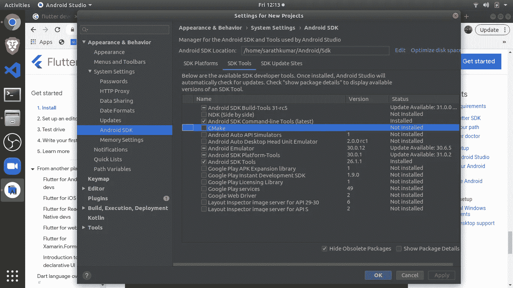

# 夏季训练计划| Flutter | Vimal Daga | LW | Sara th Kumar

> 原文：<https://medium.com/nerd-for-tech/summer-training-program-flutter-vimal-daga-lw-sarath-kumar-18fa093c555e?source=collection_archive---------35----------------------->

## 主题:颤振入门(安装)

众所周知，flutter 是一个用于开发移动应用的框架。为什么我们想学习移动应用程序开发，因为我们可以给我们的想法赋予生命，有很多框架，但我们使用 flutter 是因为它的简单性和快速开发。我们都有想法，我每天都有想法，很长一段时间我甚至不知道如何让我的想法生活！这就是为什么我学习了 flutter 并且还在学习，我将分享我最快最简单的方法来更快地学习它。这将是你的所有在一个颤振媒体文章，我会尽我所能做到这一点。

**简介**

我们都知道移动应用程序安装在操作系统之上，我们有 Android、iOS、Windows、Linux 等。当有一个想法时，它需要转换为移动应用程序，并且在很长一段时间内，公司需要为不同的操作系统和相同的移动应用程序雇用不同的开发人员，这导致不同操作系统的用户界面和用户体验(UI/UX)不同，雇用不同的开发人员对公司来说成本很高。从公司的角度来看，他们很难管理。这是他们面临的挑战。如果两个不同的开发者为不同的操作系统开发相同的应用，这是很难实现的。就是这个原因，谷歌开发了 Flutter。一个框架，你只需写一次代码，应用程序就可以运行了。

> 单一代码库

**颤振工具是如何工作的？**

它不是一种语言，而是一种工具，我们有一种叫做 Dart 的语言，我们用它来编写基于 flutter 的代码。Dart 很简单，而 flutter 附带了许多预构建小部件。正如他们所说，“更快地设计漂亮的应用程序”。

**安装**

我将把安装步骤一步一步，这将是 Windows 的安装。如果你正在使用任何其他操作系统，你知道怎么做。(对，谷歌一下！)

1.  转到 [flutter.dev](https://flutter.dev/) ，然后点击右上角的开始按钮。
2.  选择[窗口](https://flutter.dev/docs/get-started/install/windows)选项
3.  获取 [flutter SDK](https://storage.googleapis.com/flutter_infra_release/releases/stable/windows/flutter_windows_2.2.1-stable.zip) —下载 zip 文件
4.  下载完成后，双击解压文件夹，解压出 zip 文件，将包含的`flutter`放在所需的 Flutter SDK 安装位置(例如`C:\Users\<your-user-name>\Documents`)，**C:\ Flutter setup \ Flutter 2 \->我使用的安装文件夹**
5.  从提取的 flutter 文件夹中复制 bin 地址
6.  转到环境变量，用 bin 地址(c:\ fluttersetup \ flutter 2 \ flutter \ bin)设置颤动路径
7.  打开命令提示符并运行

> 颤动—版本

8.我们需要为 android 安装 SDK—[Android Studio](https://developer.android.com/studio)

9.安装时复制 Android Studio 安装位置。(示例-c:\program\c\AndroidStudio)

10.现在打开工作室，进入配置-> SDK 管理器

检查是否在你的 androdid 工作室中检查了相同的包。我们需要告诉 flutter Android studio SDK 在哪里，我们也需要复制这个地址。

11.转到命令行并键入

> 颤振配置— android-sdk =" <paste the="" sdk="" path="" here="">"</paste>
> 
> 颤振配置— android-studio-dir =" <paste the="" android="" studio="" path="" here="">"</paste>
> 
> **注:-** 我们用 dart 语言写代码，然后 flutter 用 android sdk 把它转换成 android app，所以 flutter 需要知道 Android SDK 和 android studio 在哪里，这就是我们在这里配置的。同样，我们需要 iOS 工具包将其转换为 iOS 应用程序。

12.你需要一个 IDE 来写代码，安装 [**Visual Studio 代码**](https://code.visualstudio.com/download)

13.检查所有的东西都工作正常运行

> 颤振医生

**让我们创建一个移动应用**

在 flutter 中，创建一个新项目/应用程序很容易。只需运行命令

> 颤动产生

应用程序创建后，有几种方法可以运行它，

1.  我们可以在真实设备上运行应用程序
2.  在虚拟设备或 AVD 上
3.  在网络浏览器上

在这里运行应用程序，我们将使用 AVD(Android 虚拟设备)，要使用它，我们需要打开 android studio >配置> AVD 管理器并运行虚拟设备

如果虚拟设备在后台运行，我们可以运行应用程序。

> cd
> 
> 颤动运行

从选项中选择我们的设备，这就完成了！，我们的应用程序将被安装，我们成功运行了我们的第一个应用程序！感觉好吗？关注我即将发布的文章。

干杯！

萨拉特·库马尔