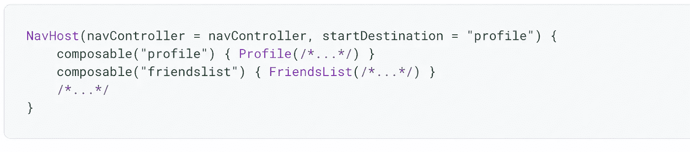

# Jetpack Compose 中可组合组件之间的超级简单导航

> 原文：<https://medium.com/nerd-for-tech/super-easy-navigation-between-composables-in-jetpack-compose-a36d2637895b?source=collection_archive---------1----------------------->

图片来自谷歌

大家好，😀
请进行第一天的说明为 [**介绍撰写&设置**](https://gondhalesatyam-28082.medium.com/1st-day-of-learning-jetpack-compose-db3865bc5ca4) [🏗️](https://emojipedia.org/building-construction/) 如果你还没有设置一个基本的合成项目。

**可组合组件之间的导航**

在实现之前，每个人都熟悉术语`Navigation`,它允许用户在应用程序的不同部分之间来回导航。整个功能由组件调用处理，因为`Navigation Component.`最好的部分是导航组件提供了对组合应用程序的支持。

在设计作为用户体验核心部分的不同屏幕和应用程序之间的导航之前，应该考虑一些导航的基本原则。请阅读[👇](https://emojipedia.org/backhand-index-pointing-down/)继续前进之前

[https://developer . Android . com/guide/navigation/navigation-principles](https://developer.android.com/guide/navigation/navigation-principles)

> **注意:**即使你没有在项目中使用导航组件，你的应用程序也应该遵循这些设计原则

**实施步骤**

1.  像往常一样，在`build.gradle`做这件事。无需解释[😁](https://emojipedia.org/beaming-face-with-smiling-eyes/)

2.掌握[😎](https://emojipedia.org/smiling-face-with-sunglasses/)，导航你只需要理解在整个导航功能中非常重要的两个概念
**导航控制器**:它是导航的核心 Api。它会跟踪组成应用程序屏幕的可组合组件的堆栈以及每个屏幕的状态。简单来说，它是导航控制器和导航图之间的桥梁，导航图指定了您应该能够在其中导航的可组合目的地。
但是导航图在哪里？？？[🤔🤔🤔🤔🤔🤔🤔](https://emojipedia.org/thinking-face/)
在这里，

来自 Google Source 的示例

哪里**路线**没什么特别的，只是通往你的可组合之路。你可以把它想象成一条通往目的地的独特路线。
爽[😎](https://emojipedia.org/smiling-face-with-sunglasses/)。我假设你对理论&基础知识很清楚。
让我们完成最后 3 个重要但非常简单的步骤，结束实施。

**1。创建 NavController** `val navController = rememberNavController()`
超级简单。请记住，在层次结构中创建控制器，所有需要引用的可组合组件都可以在需要时使用它来执行其他导航操作。
就这样。超级简单[😄](https://emojipedia.org/grinning-face-with-smiling-eyes/)

**2。创建 NavHost** 创建 NavHost 需要之前使用 rememberNavController()生成的 NavController 和您的图的初始目的地的路线。
导航 Kotlin DSL 中的 lambda 语法在 NavHost 构建期间用于构建您的导航图。通过使用 composable()函数，您可以扩展您的导航结构。
为了使这种方法有效，您必须提供一条路线和应该连接到目的地的组件。

**3。导航到可组合的** 必须使用 Navigate()方法在导航图中导航到可组合的目的地。navigate()函数的工作只需要一个字符串参数。在导航图中，调用 navigate 从可组合的()中导航

**避免的几件重要事情**
1。仅在**回调**中调用导航方法，即按钮点击等。如果你将内部调用作为 composable 的一部分，那么它将在每次重组时调用 navigate，并导致应用程序进入不确定状态。
2。默认情况下，navigate()方法会不断添加新的目的地，并将其导航到后台堆栈。但是，通过附加额外的导航选项，您可以修改这种行为。

太好了。这就是关于使用 Compose 导航的所有基础知识。
但这还不够[😑](https://emojipedia.org/expressionless-face/)😐

你会遇到一些高级用例，你会在日常应用中遇到这些用例。也就是[👇](https://emojipedia.org/backhand-index-pointing-down/) [👇](https://emojipedia.org/backhand-index-pointing-down/) [👇](https://emojipedia.org/backhand-index-pointing-down/) [👇](https://emojipedia.org/backhand-index-pointing-down/)(必读)

**用参数导航** 这也不是复杂的过程。只要再遵循 3 个步骤，你就完成了 [✅](https://emojipedia.org/check-mark-button/)

**指定参数&类型**
导航组合也支持在可组合目的地之间传递参数。为此，您必须在路线中添加参数占位符。
默认情况下，所有参数都被解析为字符串。设置类型时，arguments 参数允许您选择不同的类型。
[支持的参数类型](https://developer.android.com/guide/navigation/navigation-pass-data#supported_argument_types)(如有兴趣请勾选)

**提取值**
应该使用出现在 composable()函数的 lambda 中的 NavBackStackEntry 来提取导航参数

**将参数传递到目的地** 为了将参数传递到目的地，您必须用值替换调用中的占位符以进行导航。

还有一个部分是 Compos **e** 中传递的 [**附加参数，我把它留给你去探索。享受学习。**](https://developer.android.com/jetpack/compose/navigation#optional-args)**[😀](https://emojipedia.org/grinning-face/)。**

以上就是**撰写导航**的基础知识。本文可能不会涵盖基于您的复杂实现&用例的所有内容，但是您可以从这里开始。万事如意。[😃](https://emojipedia.org/grinning-face-with-big-eyes/)
您可以克隆这个库进行基本设置。此外，源代码中所有概念都可以根据相同内容进行更新。(切换到分支**导航不完整**)
[**https://github.com/SatyamGondhale/LearnCompose**](https://github.com/SatyamGondhale/LearnCompose)

如果你认为这对你有帮助，请随意[👏🏻](https://emojipedia.org/clapping-hands-light-skin-tone/)(鼓掌)&分享。谢了。😄