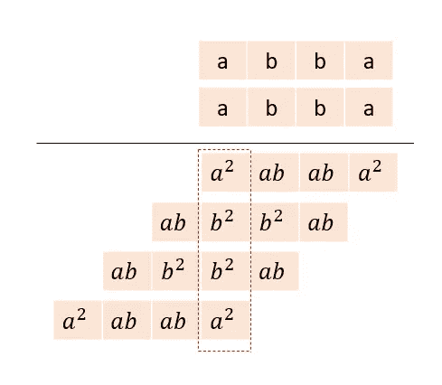

# 超级回文——谷歌面试问题

> 原文：<https://medium.com/nerd-for-tech/super-palindrome-daily-challenge-may-c77eda18ed0f?source=collection_archive---------16----------------------->


今天的问题来自每日 Leetcode 编码挑战赛——五月版。这是一个难以回答的问题。在过去的六个月里，这个问题已经被谷歌采访了 10 次。

## [906。](https://leetcode.com/problems/super-palindromes/)超级回文

假设一个正整数如果是回文，就是一个**超回文**，也是一个回文的平方。

给定两个正整数`left`和`right`表示为字符串，返回*包含范围* `[left, right]`内 ***超级回文*** *整数的个数。*

## 示例:

```
**Input:** left = "4", right = "1000"
**Output:** 4
**Explanation**: 4, 9, 121, and 484 are superpalindromes.
Note that 676 is not a superpalindrome: 26 * 26 = 676, but 26 is not a palindrome.
```

## 理解问题:

回文不那么频繁。所以我们不是找到它们，而是建造它们。这有助于降低时间复杂度。对于任何给定的数字，我们都可以从中构建 11 个回文。例如，使用 24，我们可以构建 2442 或 24 个{0..9}42.所以一个回文有偶数个数字，另外 10 个有奇数个数字。在生成回文的过程中，我们检查回文是否超出了 sqrt 的范围(上限)。

代码实现:

```
def check(n):
    return int(str(n)[::-1]) == n

def superpalindromesInRange(left, right):
    res = 0;
    l = int(left)
    r = int(right)
    palindrome = []
    for i in range(1, 10):
        palindrome.append(i)
    for i in range(1, 10000):
        s1 = str(i)
        s2 = str(i);
        s2 = "".join(reversed(s2))
        p = int(s1+s2)
        if p > math.sqrt(r):
            break
        else:
            palindrome.append(int(s1+s2))
        for j in range(10):
            temp = s1
            temp += str(j)
            temp += s2;
            if int(temp) > math.sqrt(r):
                break
            else:
                palindrome.append(int(temp))
    for item in palindrome:
        num = item * item
        if(num <= r and num >=l and check(num)):
            res += 1
    return res
```

## 复杂性分析:

时间复杂度:这个解决方案本质上是对数的。正如我们所看到的，对于范围 1-100，外部循环只运行一次。对于 10⁶，它运行 100 次。对于 10 ⁰它运行约 200 次。

当我们存储回文时，空间复杂度也是对数的。

## 洞察力

让我们从基础开始，做一个回文的垂直乘法。如果数字是 abba，那么下图解释了垂直乘法。



对于每个数字，平方值的位数将是(a，2ab，2ab+b，2a +2b，2ab+b，2ab，a)。所有数字中最大的是 2a +2b。只要这个数字小于 10，乘积就是一个回文。如果它大于 10，那么将有一个结转，两端的数字将不会相同。这将导致正方形不变色。

我们需要将数字空间减少到只有[0，1，2，3]，因为这些数字的平方不会导致进位。超级回文的平方根包含数字 3 的唯一情况是 3，因为否则，添加到 3 的平方的任何其他数字都将导致进位(3*3 + 1*1)。所以我们甚至可以把它的数字空间减少到[0，1，2]。

代码实现:

```
class Solution:
    def superpalindromesInRange(self, left, right):
        l, r, self.ans = int(left) ** 0.5, int(right) ** 0.5, 0
        def helper(s):
            if len(s) < 5:
                for d in '012': 
                    helper(s + d)
            elif s != '0' * 5:
                left = str(int(s))
                coeff = 2 * sum(int(x) ** 2 for x in left)
                if coeff < 10 and l <= int(left + left[::-1]) <= r:
                    self.ans += 1
                coeff -= int(left[-1]) ** 2
                if coeff < 10 and l <= int(left + left[-2::-1]) <= r:
                    self.ans += 1
            return self.ans
        return helper('') + (l <= 3 <= r)
s = Solution()
print(s.superpalindromesInRange(4, 1000 ))
```

编码快乐！！