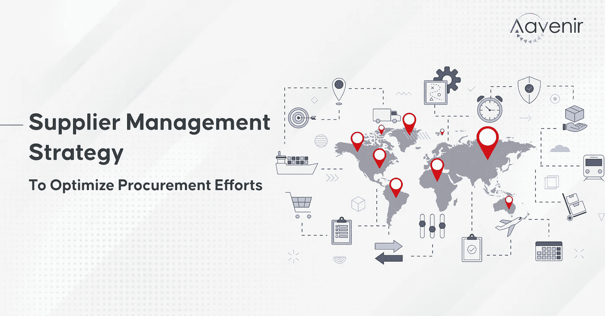
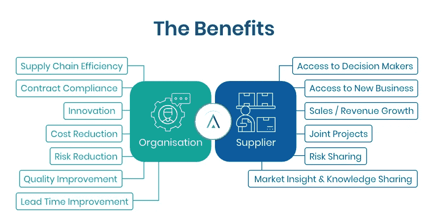

# 优化采购工作的供应商管理战略| Aavenir

> 原文：<https://medium.com/nerd-for-tech/supplier-management-strategy-that-optimizes-procurement-efforts-aavenir-c1eb775dbefc?source=collection_archive---------1----------------------->

对供应链的重新关注要求采购团队重新思考他们的基本角色，即高效的供应商管理。供应商管理是一个宽泛的术语，包括供应商绩效管理、供应商关系管理、供应商风险管理和整体供应商体验管理。

一个理想的供应商管理策略不仅能优化您的采购工作，还能提供如下双向好处:

但是，您知道供应商管理始于准确的供应商入职吗？大多数组织都忽略了这一功能，并发现自己陷入了困境。

## 72%的组织拥有手动供应商入职流程，而 36%的 CPO 表示供应商未能满足新的要求。

让我们来关注一下**在供应商入职**方面的最佳实践，这些实践可以在整个生命周期中带来更好的供应商管理(从而优化供应商管理策略)。

# 技巧 1 —评估和选择供应商

在入职前评估供应商时，了解供应商如何适应您组织的项目和价值观的整体环境非常重要。围绕您的业务目标建立评估标准和供应商评分。

[**尝试《供应商评估工作表》建立供应商评估标准，选择正确的供应商。**](https://aavenir.com/resource/vendor-evaluation-worksheet/)

# 技巧 2——建立和维护供应商关系

拥有一个详细和最新的供应商数据库将大大有助于规划、节省资金、选择新的供应商和维护强大的供应商关系。拥抱技术和自动化，构建强大的流程，弥合供应商沟通差距。

[**阅读更多关于供应商门户如何帮助加强您的供应商协作的信息**。](https://aavenir.com/how-do-vendor-portals-help-strengthen-vendor-collaboration/)

# 技巧 3——与供应商谈判合同和定价

在现代采购时代，与有影响力的供应商就合适的交易进行谈判是一项挑战，因为焦点已经从买家转移到供应商。无论您参与采购谈判的目的是什么，在与其中任何一家供应商进行谈判之前，最好通过向多家供应商发送征求建议书(RFP)来获得至少三家供应商的报价。

[**探索 3 种双赢策略与有实力的厂商谈判**](https://aavenir.com/3-win-win-strategies-to-negotiate-with-powerful-vendors/) 。

# 技巧 4——管理供应商绩效

绩效管理不仅仅是合规管理。但是，如果没有适当的衡量或管理，它可能会偏离供应商伙伴关系所创造的最终价值。分析供应商绩效(并采取纠正措施)的一个很好的方法是通过建立供应商记分卡来衡量采购 KPI。

[**使用此供应商 KPI 工作表来评定供应商的绩效**。](https://aavenir.com/resource/supplier-kpi-worksheet/)

# 技巧 5——解决供应商的问题

及时解决问题有助于大幅提升供应商参与度和体验。投资于与供应商的定期有效沟通。及时坦诚的讨论不仅能建立信任和尊重，还有助于防止问题恶化成更严重的问题。

[**了解如何简化与供应商在合同、提案管理、发票和付款方面的协作，并防患于未然**。](https://aavenir.com/webinar/drive-efficiency-and-manage-supplier-risk-with-streamlined-vendor-onboarding-and-collaboration-portals/)

# 你如何评价你的供应商管理策略？

*   你对自己与供应商合作的能力有多大信心？
*   您的供应商入职流程是否经过精简和简化？
*   你能找到你喜欢的供应商吗？

嗯，你的回答暴露了你的实际情况。你并不孤单；其他每个组织都面临着巨大的挑战，从**投标**到**供应商采购**和**供应商入职**到**供应商义务管理**。遵循上述提示，确保你的供应商管理策略一切正常。

如果您想深入了解如何最好地增强供应商在**从源头到支付**流程中的协作并提高效率，请不要错过这个机会。

点击此处注册直播课程[:](https://aavenir.com/webinar/drive-efficiency-and-manage-supplier-risk-with-streamlined-vendor-onboarding-and-collaboration-portals/)

*原载于 2022 年 8 月 25 日 https://aavenir.com***。**