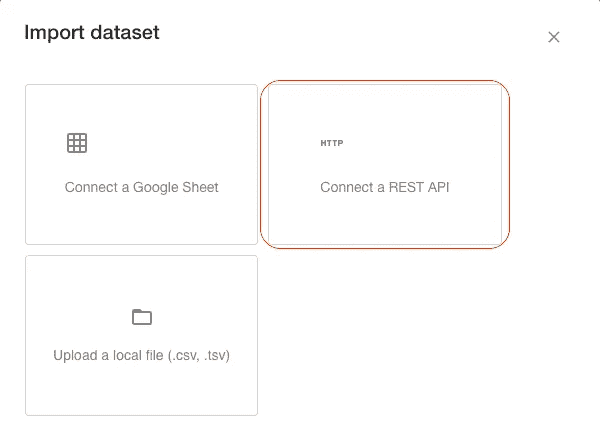
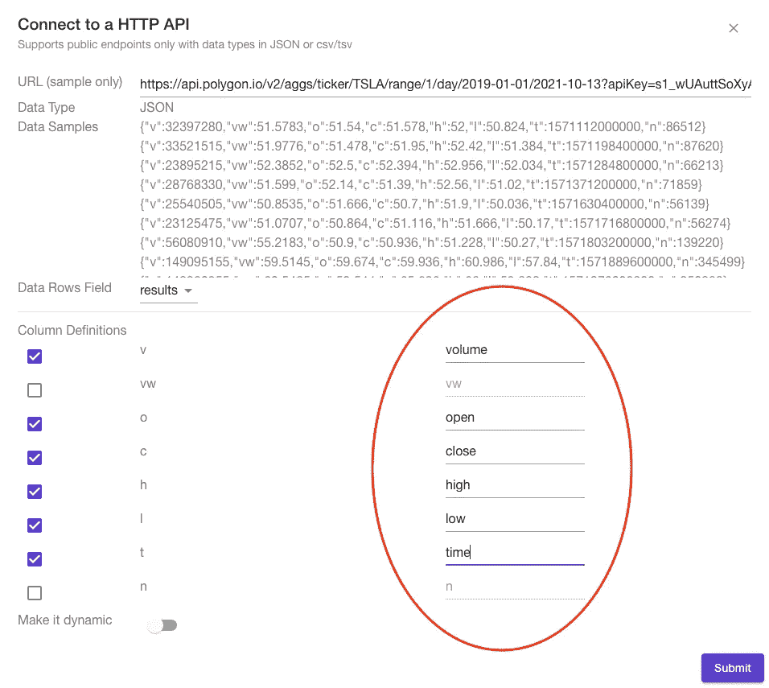
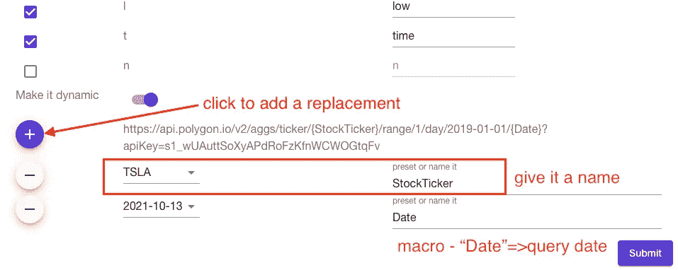
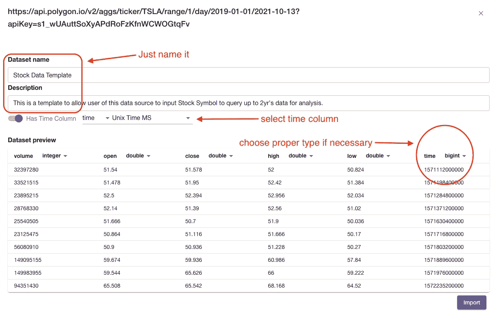
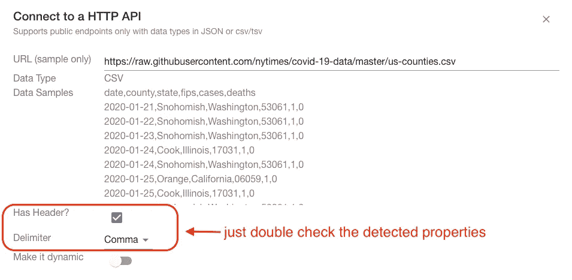
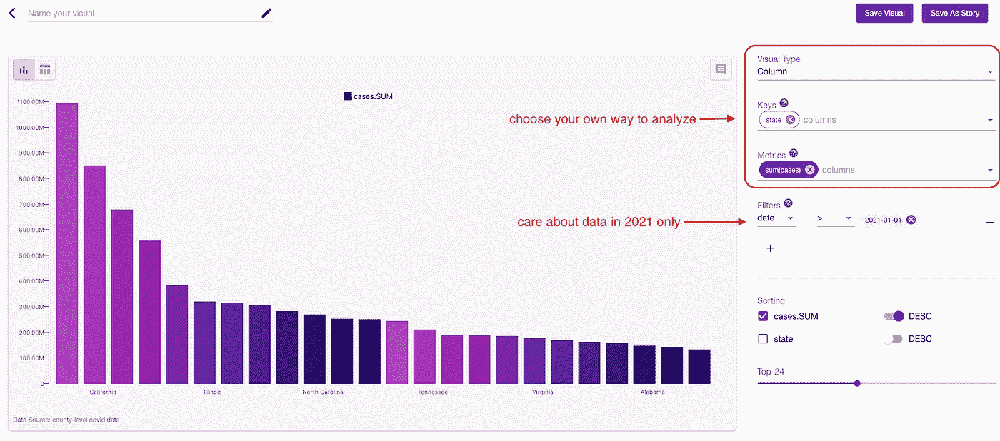
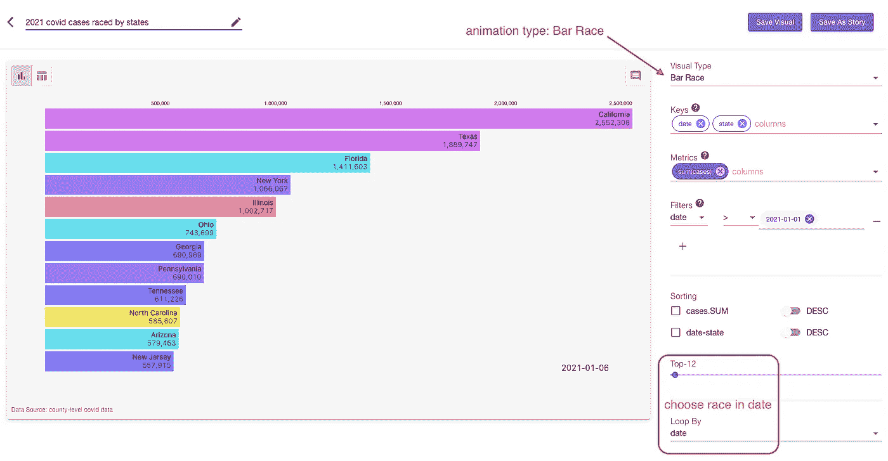

# 支持 Http 连接

> 原文：<https://medium.com/nerd-for-tech/support-http-data-source-c2244e605936?source=collection_archive---------13----------------------->

## 使用 columns.ai 构建简单的分析应用程序

列 Ai 的任务是让我们的用户能够分析和可视化他们看到的任何数据。因此，支持各种各样的数据连接是我们的建设者将持续努力的方向。

我们开始支持谷歌电子表格和 CSV 数据上传，现在我们有 **HTTP** 加入了增长的列表，目前公开/不公开。更进一步，把 columns.ai 想成一个平台，引入“模板”的概念很好，有了模板，columns.ai 就把一个 ***数据转化成一个 app！***

使用支持的格式(csv、json、…)连接到 HTTP 端点

现在，让我们快速浏览两个例子来演示这是多么有趣，第一个例子是连接到返回 json 有效负载的 REST API，另一个例子是连接到 Github 中托管的普通原始 csv 文件。

# 示例 1:分析股票数据的简单应用程序

在这个例子中，我们使用由 poly gon . io 提供的 REST api，您现在可以通过访问这个链接来体验它:[可视化一只股票](https://columns.ai/visual/unauth/75493b96-b7e3-42df-b9cf-6f6c01510851)，通过输入股票符号，它会在 columns.ai 服务器上显示 2 年的数据点，直到查询时间，供您分析和构建可视化。一个故事可能是这样的:

 [## Pinterest 股票历史的故事

### 专栏 Ai:与您的社区分享数据故事。

https://columns.ai](https://columns.ai/story/1b5fe999-5561-462c-ab4c-5341eb2d1aa3) 

现在，让我们看看将一个**数据创建为一个 app** 的步骤 1 → 2 →3:

*   步骤 1
    登录 columns.ai，导航到**仪表板/数据**页面，点击**+创建**并选择“HTTP”，粘贴一个示例 HTTP 链接:

粘贴 Http Url —检测行提取和列映射的有效负载

列预览有效载荷样本，并尝试提取数据行，它还列出了可选字段，供用户定义列映射，如上图所示。

在这个例子中，它发现有效负载中的“结果”包含所有行，对于每一行，我们将列定义为 v →volume，o → open (price)，c → close，h → high，l → low 和 t →time，未选中的“vw”和“n”被忽略。

*   步骤 2
    通过将 URL 中的一些段模板化为用户输入或预定义的宏来使其动态化——这是根据最终用户的输入使数据源动态化的方法！

打开“使其动态化”并尝试构建 URL 模板

*   步骤 3
    如有必要，通过选择适当的列类型保存数据源，并设置时间列(检查其值以匹配所选的时间定义)。还有“**进口**它。

从上一步继续—只需为这个新数据源键入一些元数据并导入

现在，这个新数据源应该在您的数据收集中可用，如下所示:

我分享了这个数据源，它现在是公开的

我分享了这个数据定义，这就是为什么你可以从我之前分享的可视化链接中访问它。

数据越开放，世界越互联！

# 示例 2:从 Github 导入原始 CSV 数据

第二个例子，我们来看看 NYTIMES 在 Github 上分享的一个 Covid 数据集，这是定期更新的 CSV dump，大约 100MB，这里是这个数据的[主页](https://github.com/nytimes/covid-19-data)。

与第一个示例类似，只需在数据导入页面中单击“HTTP”选项后粘贴数据链接，它就会检测到数据样本和数据格式为 CSV。

CSV 数据有非常基本的属性可以查看

点击“提交”,在填写基本数据源属性(如名称、描述)后，下一步点击“导入”。

我们已经准备好对它进行查询了！

我观察数据的一种方式是

> 2021 年按州排列的 covid 病例总数

Github 中托管的数据的一个例子

更奇特的是，我可以选择一个动画来形象化它，例如:

"**2021 年各州每日竞赛的 covid 病例总数**"

从纽约时报提供的 Github 中托管的最新 covid 数据构建一个动画酒吧竞赛

看这个在专栏上公开分享的动画故事:

 [## 各州竞赛的 2021 个 covid 案例的故事

### 专栏:向您的社区讲述数据故事。

https://columns.ai](https://columns.ai/story/6b5a174e-f522-460c-b7cc-c8dfcae7054b) 

# 结论

我希望您喜欢这两个演示了如何支持 HTTP 连接的例子。

通过支持 HTTP 连接，它解除了许多有趣的场景，当我们说 Columns Ai 是一个不断增长的灵活平台，我们的用户可以在其上以无限的能力构建广泛的应用程序时，这是在轨道上迈出的良好一步。干杯！

最后但同样重要的是，我们希望听到你们的意见，作为建设者，我们希望建造对我们的用户有意义的东西，所以请通过 [feedback@columns.ai](mailto:feedback@columns.ai) 联系我们，干杯！