# 支持向量机。

> 原文：<https://medium.com/nerd-for-tech/support-vector-machine-92fa3c57d33b?source=collection_archive---------1----------------------->

支持向量机是强大而灵活的监督机器学习算法，用于分类和回归。但一般都是用在分类问题上。

在 20 世纪 60 年代，支持向量机首次被引入，但后来在 1990 年得到了完善。与其他机器学习算法相比，支持向量机有其独特的实现方式。最近，它们非常受欢迎，因为它们能够处理多个连续和分类变量。

SVM 模型基本上是多维空间中超平面中不同类别的表示。超平面将由 SVM 以迭代的方式生成，从而可以最小化误差。SVM 的目标是将数据集分类以找到最大边际超平面(MMH)。

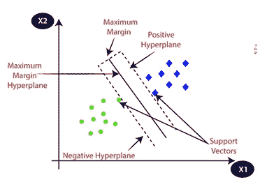

例子:SVM 可以用我们在 KNN 分类器中用过的例子来理解。假设我们看到一只奇怪的猫，它也具有狗的一些特征，那么如果我们想要一个能够准确识别它是猫还是狗的模型，那么这样的模型可以通过使用 SVM 算法来创建。

我们将首先用大量猫和狗的图像训练我们的模型，以便它可以学习猫和狗的不同特征，然后我们用这种奇怪的生物测试它。因此，当支持向量在这两个数据(猫和狗)之间创建决策边界并选择极端情况(支持向量)时，它将看到猫和狗的极端情况。在支持向量的基础上，它将把它归类为猫。考虑下图:

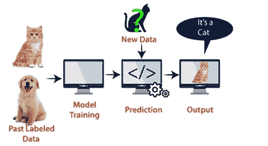

SVM 算法可用于人脸检测、图像分类、文本分类等。

# SVM 的类型

SVM 有两种类型:

线性 SVM:线性 SVM 用于线性可分数据，这意味着如果一个数据集可以用一条直线分成两类，那么这样的数据称为线性可分数据，使用的分类器称为线性 SVM 分类器。

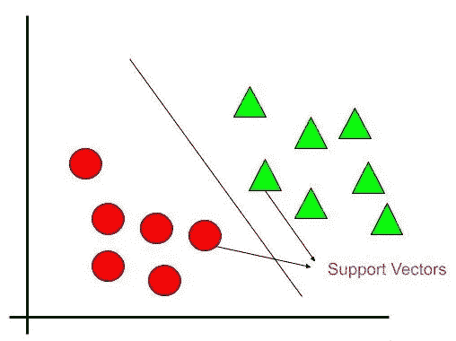

非线性 SVM:非线性 SVM 用于非线性分离的数据，这意味着如果数据集不能通过使用直线进行分类，那么这种数据被称为非线性数据，所使用的分类器被称为非线性 SVM 分类器。

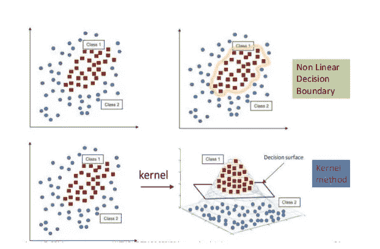

# 线性 SVM 对非线性 SVM

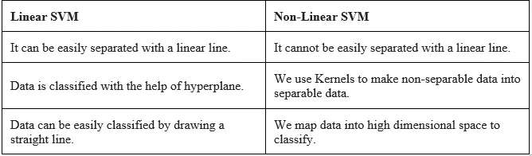

# SVM 的概念:

**支持向量**—最接近超平面的数据点称为支持向量。在这些数据点的帮助下，将定义一条分隔线。

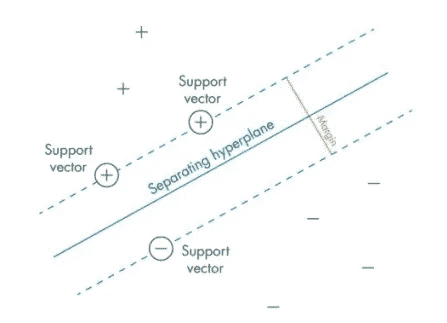

**超平面**——从上图中我们可以看出，它是一个决策平面或空间，在一组不同类别的对象之间进行划分。

**边距**——它可以定义为不同类别的最近数据点上的两条线之间的间隙。它可以计算为从直线到支持向量的垂直距离。大的边距被认为是好的边距，小的边距被认为是差的边距。

SVM 的主要目标是将数据集分类，以找到最大边际超平面(MMH ),它可以通过以下两步完成

首先，SVM 将迭代生成超平面，以最佳方式分离类。

然后，它将选择正确划分类别的超平面。

# SVM 内核:

SVM 算法通过将输入数据空间转换成所需形式的内核来实现。SVM 使用了一种称为内核技巧的技术，内核采用低维输入空间，将其转换到高维空间。简单来说，内核通过给不可分问题增加更多的维度，把不可分问题转化为可分问题。它使 SVM 更加强大、灵活和准确。以下是 SVM 使用的一些内核类型。

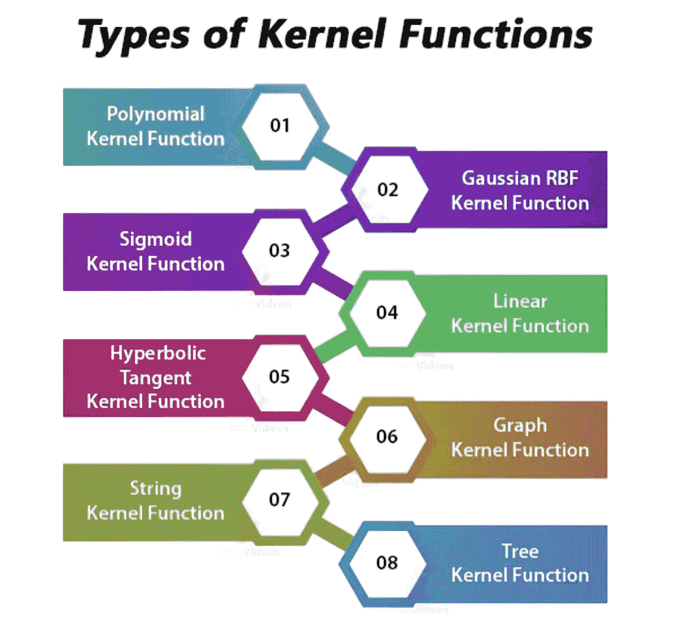

**线性核:**

它可以用作任意两个观察值之间的点积。线性核的公式如下

K(x，Xi)=总和(x÷Xi)

从上面的公式中，我们可以看到，两个矢量之间的乘积，比如𝑥 & 𝑥𝑖，是每对输入值的乘积之和。

**多项式内核:**

它是线性核的更一般化的形式，并区分弯曲或非线性输入空间。以下是多项式核的公式

k(X,Xi)=1+sum(X∗Xi)^d

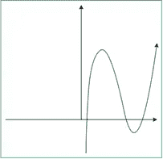

这里 d 是多项式的次数，我们需要在学习算法中手动指定。

**高斯核:**

它是一个通用内核；当没有关于数据的先验知识时使用。等式是:

高斯核方程:

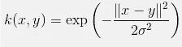

**径向基函数(RBF)核:**

RBF 核主要用于 SVM 分类，将输入空间映射到无限维空间。它是一个通用内核；当没有关于数据的先验知识时使用。

下面的公式从数学上解释了这一点

K(x，xi)=exp(伽玛总和(x Xi))

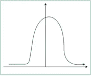

这里，伽玛的范围是从 0 到 1。我们需要在学习算法中手动指定。gamma 的一个很好的默认值是 0.1。

当我们为线性可分的数据实现 SVM 时，我们可以用 Python 为非线性可分的数据实现它。这可以通过使用内核来实现。

**拉普拉斯 RBF 核**

它是一个通用内核；当没有关于数据的先验知识时使用。

等式是:

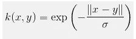

**双曲正切核:**

我们可以在神经网络中使用它。等式是:

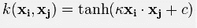

**乙状结肠内核:**

我们可以用它作为神经网络的代理。等式是:

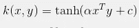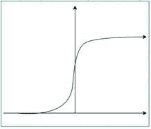

**第一类核的贝塞尔函数:**

我们可以用它来去除数学函数中的交叉项。等式是:

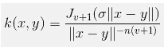

**方差分析径向基核:**

我们可以在回归问题中使用它。等式是:

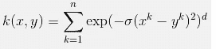

# SVM 的利与弊:

**优点:**

它工作得很好，有一个清晰的分离边界

在高维空间是有效的。

它在维数大于样本数的情况下是有效的。

它在决策函数中使用训练点的子集(称为支持向量)，因此它也是内存高效的。

**缺点:**

当我们拥有大数据集时，它的性能并不好，因为所需的训练时间更长。

当数据集有更多噪声时，即目标类重叠时，它的性能也不是很好

SVM 没有直接提供概率估计，这些是通过昂贵的五重交叉验证计算出来的。它包含在 Python scikit-learn 库的相关 SVC 方法中。

# SVM 的指标:

**1。混乱矩阵:**

混淆矩阵是一个 N×N 矩阵，其中 N 是被预测的类的数量。对于手头的问题，我们有 N=2，因此我们得到一个 2×2 矩阵。对于混淆矩阵，您需要记住以下几个定义:

准确性:正确预测总数的比例。

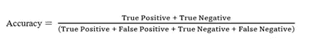

阳性预测值或精确度:被正确识别的阳性病例的比例。

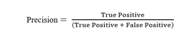

阴性预测值:被正确识别的阴性病例的比例。

敏感性或回忆:被正确识别的实际阳性病例的比例。

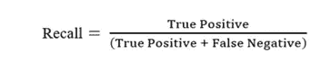

特异性:被正确识别的实际阴性病例的比例。

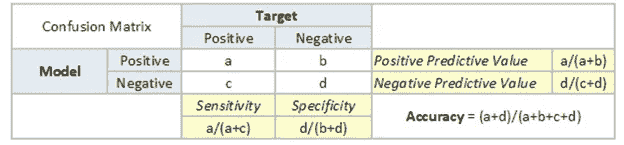

**2。F1 得分:**

这是精度和召回率的调和平均值，并且给出了比精度度量更好的错误分类情况的度量。

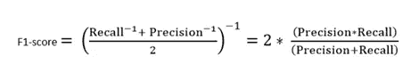

我们使用调和平均值，因为它不利于极值。

总结 F1 分数和准确性之间的差异，

当真阳性和真阴性更重要时使用准确度，而当假阴性和假阳性至关重要时使用 F1 分数。

当类别分布相似时，可以使用精确度，而当存在不平衡的类别时，F1 分数是更好的度量，如上述情况。

在大多数现实生活的分类问题中，存在不平衡的类别分布，因此 F1-score 是评估我们的模型的更好的度量。

# SVM 的应用

*   情感分析。
*   垃圾邮件检测。
*   手写数字识别。
*   图像识别挑战

**参考:** [教程观点](https://www.tutorialspoint.com/machine_learning_with_python/machine_learning_with_python_classification_algorithms_support_vector_machine.htm)，[分析观点](https://www.analyticsvidhya.com/blog/2017/09/understaing-support-vector-machine-example-code/)，[数据观点](https://data-flair.training/blogs/svm-kernel-functions/)