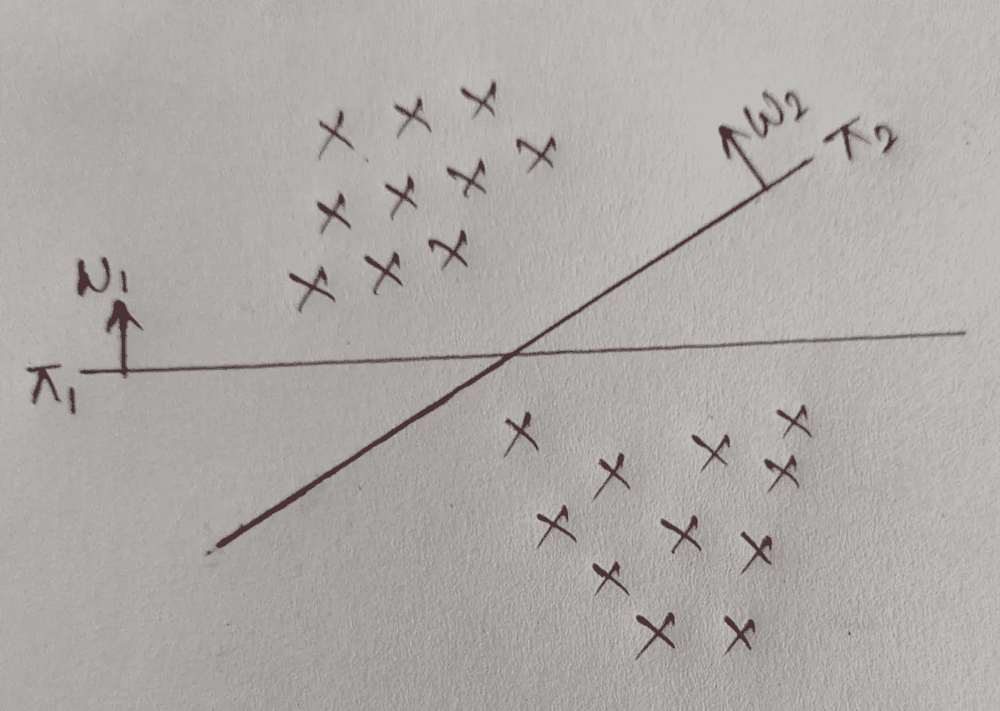
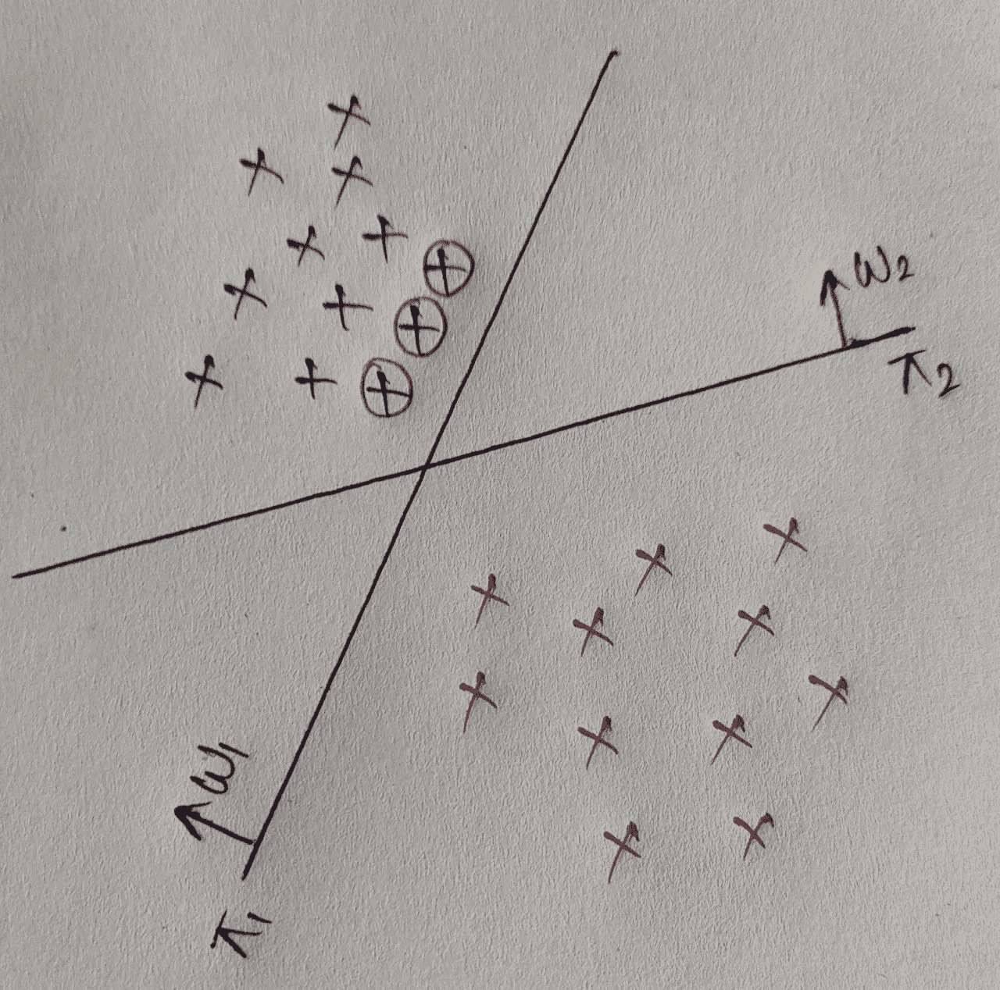
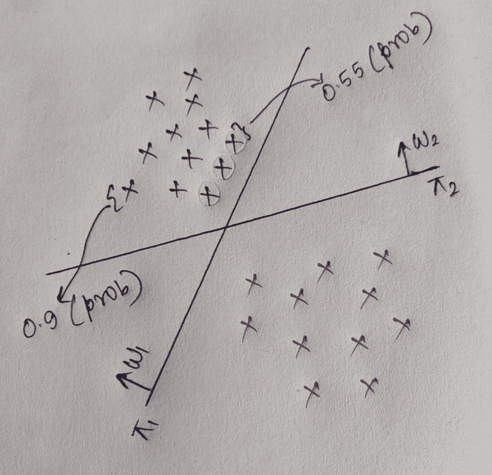
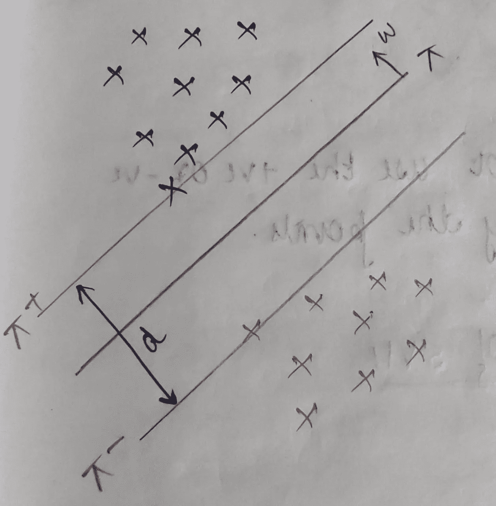

# 支持向量机:几何解释

> 原文：<https://medium.com/nerd-for-tech/support-vector-machines-geometrical-interpretation-27adc9a65dd7?source=collection_archive---------2----------------------->

SVM 是最流行的机器学习技术之一，可用于分类和回归任务。SVM 在 20 世纪 90 年代开始流行。简而言之，SVM 可以被认为是一个受监督的机器学习模型，它使用一个超平面来区分两个类别，其目标是最大化+ve 和-ve 点之间的距离(用于分类问题)。那么让我们来详细了解一下 SVM 的几何解释

# 几何解释:

## 1.介绍

假设我们有一些点，为了简单起见，假设数据是线性可分的

正如我们可以看到的，该数据是线性可分的，我们可以有多个超平面来分隔它们，但为了简单起见，这里我们只考虑这两个超平面。

现在让我们稍微改变一下数据，以便于理解-

现在出现的问题是，在两个超平面π1 和π2 中，我们应该选择哪个超平面？

如果我们选择π1，那么有许多点接近超平面(用圆圈标记)。由于这些点非常接近超平面，如果超平面稍微改变，那么这些点可能会被错误分类，这是我们必须努力避免的。

我们需要理解的另一个事实是，离超平面越近的点属于远离超平面的类的概率越小(不是在相反的方向上)

在上面的例子中，距离π1 较近的+ve 点属于某类的概率为 0.55，而距离较远的点属于该类的概率为 0.9。

因此，SVM 的目标是找到一个尽可能把+ve 点和-ve 点分开的超平面。所以我们会选择超平面π2 而不是π1。参考消息:试图将+ve 点与-ve 点尽可能分开的超平面称为 ***边缘最大化超平面*** 。所以这里的π2 是一个边际最大化超平面。

## 2.边缘最大化超平面

如果我们继续画平行于超平面π的超平面，那么过一段时间后，我们将得到一个与第一个+ve 点相交的平面，我们称之为π+。类似地，我们将得到一个点，它将与第一个点相交，我们称它为π-。π+和π-都是相互平行的。通过π+和π-的点称为支持向量(对于理解数学公式很重要)

设π+和π-之间的距离为 d，也叫裕度。

我们希望最大化 d 的值，因为 d 的值越大，意味着+ve 点和-ve 点彼此远离，差距越大，对我们越有利。因此，SVM 基本上试图最大化余量，即 dist(π+，π-)。

如果裕量增加= >错误分类减少= >概化精度增加(未来未知数据的精度)