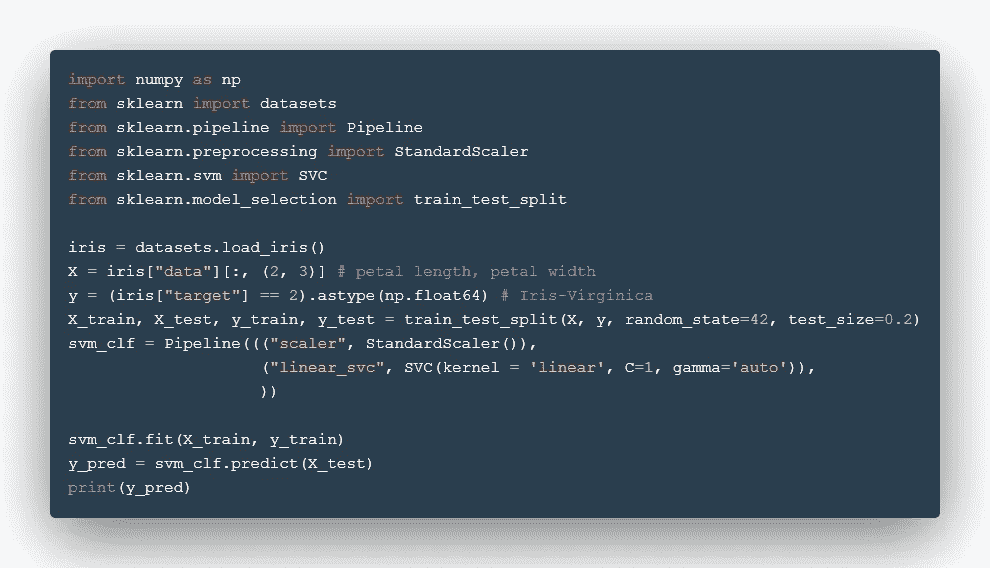
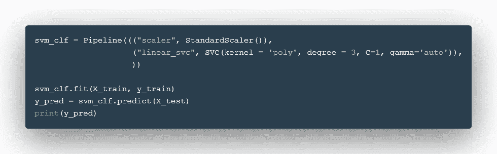
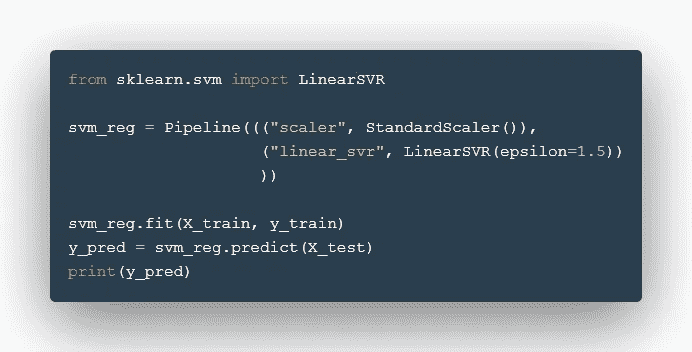

# 支持向量机:越快越好

> 原文：<https://medium.com/nerd-for-tech/support-vector-machines-quickly-as-possible-993c542e9ac4?source=collection_archive---------11----------------------->

## SVM 为人民着急

图片出自[https://pixabay.com/users/mohamed_hassan-5229782/?UTM _ source = link-attribute&amp；UTM _ medium = referral&amp；UTM _ campaign = image&amp；UTM _ content = 5702074](”<a)">Mohamed Hassan</a>from<a href = "【https://pixabay.com/?utm_source=link-attribution】amp；UTM _ medium = referral&amp；UTM _ campaign = image&amp；UTM _ content = 5702074">pix abay</a>

支持向量机(或 SVM)是一种流行的机器学习模型，可以对数据集执行线性或非线性分类、回归，甚至离群点检测。它们主要用于对复杂但小到中等大小的数据进行分类。

SVM 是机器学习中最强大的模型之一，任何对机器学习感兴趣的人都必须知道它背后的基础知识，以及如何在真实数据上实现它。

那么，让我们开始吧！

SVM 可分为线性和非线性 SVM 两部分。我们将探讨这两种类型的分类。

## 线性 SVM 分类:

假设我们有一个包含两个类的数据集，并且这两个类是线性可分的。SVM，通俗地说，就是在两个阶层中间划一条线，把他们线性分开。就是这样。

该模型试图拟合两个不同类别之间的超平面。对于两个特征的数据集，超平面将是一条线。但是对于更高维的数据，超平面是相应地适合的。

超平面是被软边包围的硬边，软边位于两个类的最近点上。这些软边界也被称为支持向量，因此该模型被称为支持向量机。

SVM 模型的 c 超参数确定软边界或支持向量之间的距离长度。如果 C 值较高，则软边距之间的距离较小，反之亦然。因此，C 参数决定了模型对数据的泛化能力。

> 内核绝招是什么？

顾名思义，核心技巧是利用一些复杂的数学技巧在低维非线性数据集中创建分类的快速解决方案。核方法试图在某个更高维度中找到两个特征之间的关系或非线性函数，而不实际为那些更高维度做繁重的数学计算。

*使用 Scikit Learn 实现 SVM:*

下面，你可以看到虹膜数据集符合线性 SVM 模型。我们传入了 kernel = 'linear '，C 参数为 1，gamma 为' auto '。

Gamma (γ)的作用类似于正则化超参数:如果你的模型过拟合，你应该减少它，如果过拟合，你应该增加它(类似于 C 超参数)。

## 非线性 SVM 分类:

非线性 SVM 更进一步，对不能线性分离的数据进行分类。

**一些非线性 SVM 核:**

> ***多项式内核:***

SVM 模型的多项式核生成一个非线性超平面，能够在一些更高维度中分离数据。它引入了另一个称为“度”的超参数，该参数随着值的增加而增加我们模型的灵活性，如果值低则降低灵活性。

*用 kernel = 'poly '实现 SVM:*

> ***高斯 RBF 核:***

高斯 rbf 核是通过使用“RBF”核作为 SVC()的超参数来实现的。这使用径向基函数在数据集上实现 SVM，并找到更适合数据的曲线(边距)。

*使用 kernel = 'rbf '实现 SVM:*

## SVM 回归:

就像我们对 SVM 分类所做的那样，我们只是改变了这里的目标。SVM 回归法不是对数据进行分类，而是创建一个边界，作为这些数据点的回归线。

这条回归线可用于预测对连续输入的响应。因此，SVM 也有助于对我们的数据进行线性回归。

*linear SVR()的实现:*

## **结论:**

因此，我们快速了解了支持向量机及其各种实现方法。我们看到 SVM 支持不同的选项来分类数据，具有可变的灵活性。

我们还看到了如何使用 Scikit Learn 实现 SVM。