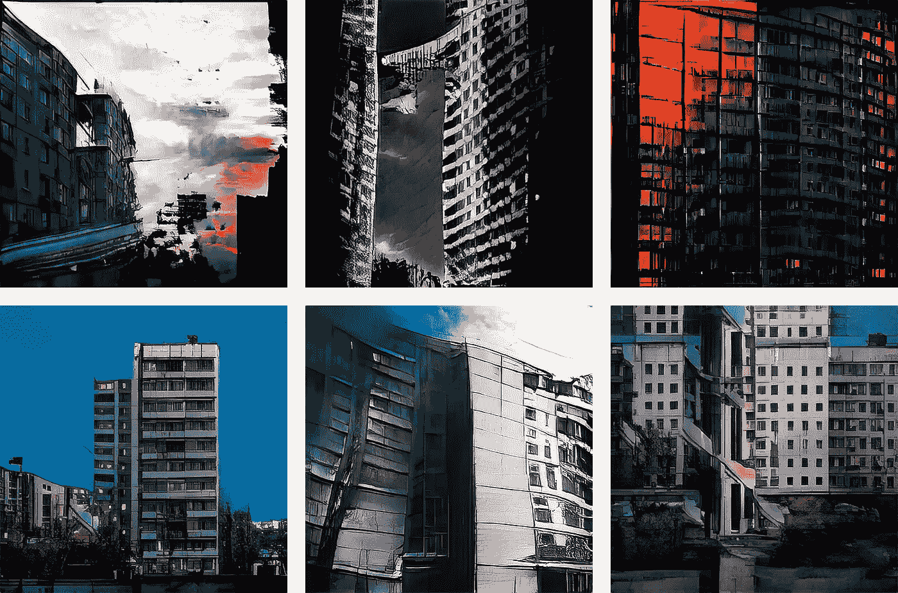
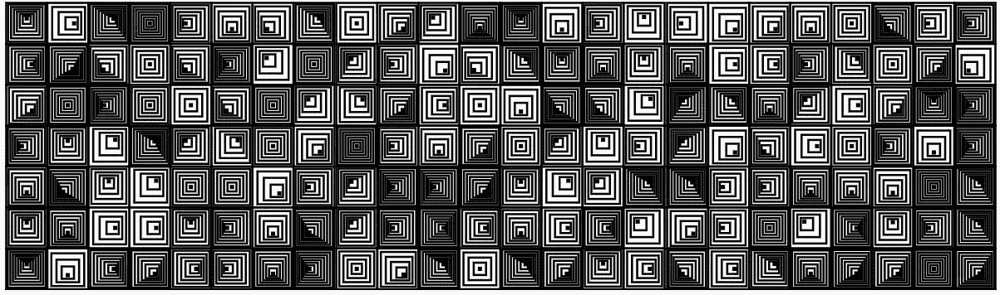
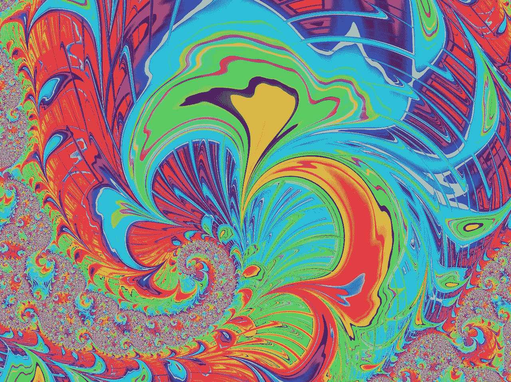
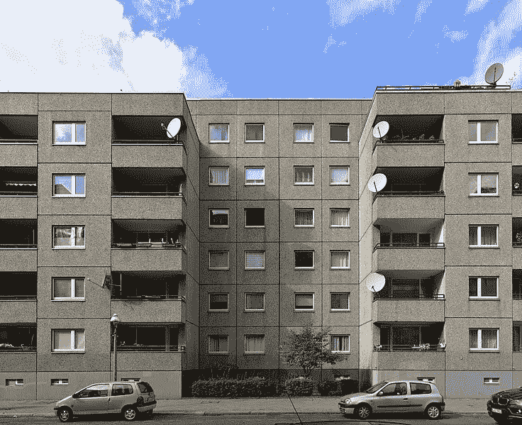
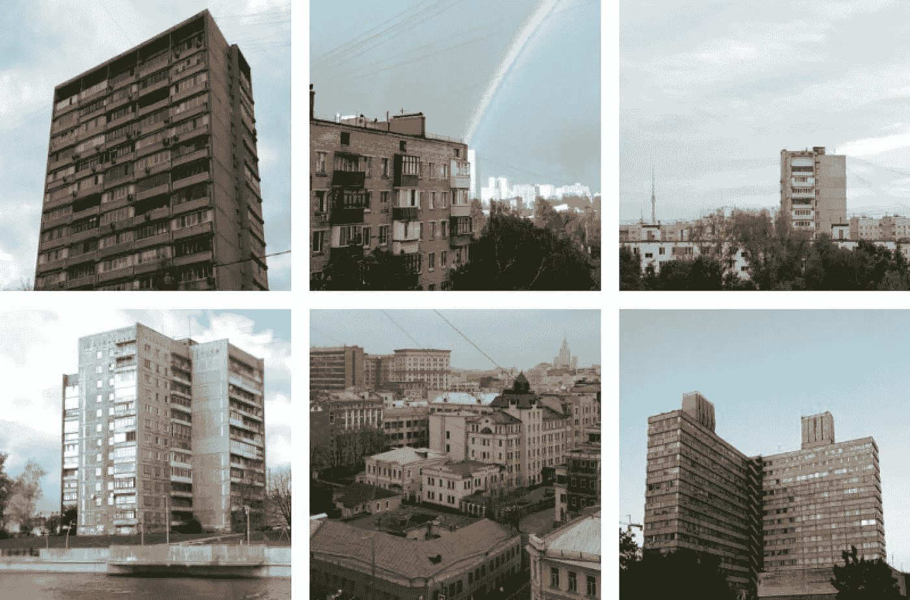
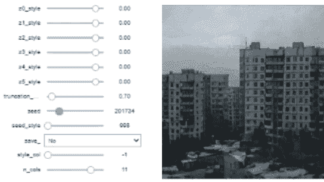
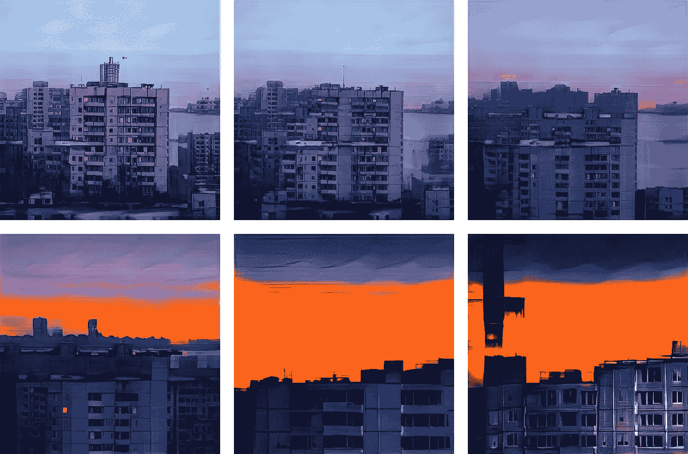
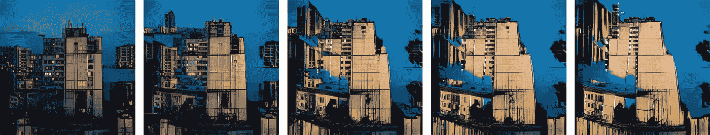
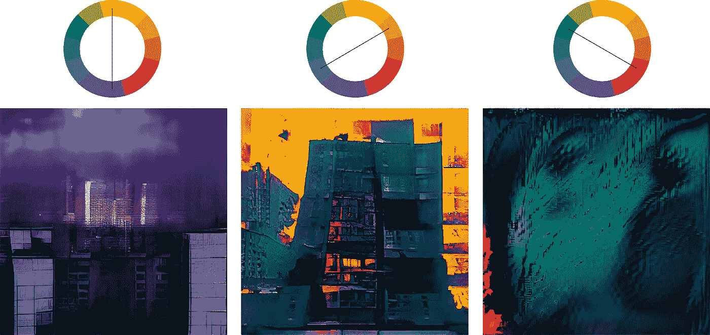
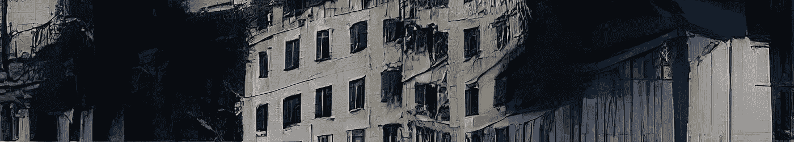

# 具有神经网络的(Sur)现实生成艺术

> 原文：<https://medium.com/nerd-for-tech/sur-realistic-generative-art-with-neural-networks-ef429e62522e?source=collection_archive---------3----------------------->

## 以及制作神经生成艺术与传统生成艺术有何不同？

视觉艺术家总是在寻找新的形式，并将技术进步创造的工具用于艺术目的。早在计算设备出现之前就存在的生成算法，随着计算机的发展得到了巨大的发展。从那时起，在生成神经网络发明之前，生成算法通常由人工编程设置。生成神经网络根据数据寻找生成规律，从而让你自动找到生成算法。它创建复杂的、类似图画的图像，而不是传统的手动编程生成算法的几何抽象。此外，神经网络生成的图像比其他算法生成的图像更加多样化和不可预测。在这篇文章中，我将展示传统生成算法和神经网络之间的一些差异，并展示神经方法开辟的可能性。

# 传统的生成算法是如何工作的

典型的生成艺术作品。许多相似元素的相互作用创造了一种模式。内部方块的数量和位置是随机设置的，因此每次运行该算法都会生成一个新的图案。然而，正方形的形状、内部元素的最大和最小数量以及绘制它们的网格都是手动设置的。用[制作的这个](https://generativeartistry.com/tutorials/hypnotic-squares/)教程。

要创建一个创成式作品，你需要描述作品生成的法则。作为法则，任何算法都可以产生一定数量(通常是无限数量)的选项，例如:

*   给定元素的绘图:正方形、圆形、任意形状……—带有可变参数:坐标、大小、颜色……；
*   将值映射到坐标的公式；
*   动态算法，在每一步检查指定的条件并改变跟随它们的元素的位置；
*   诸如此类…

算法艺术着迷于秩序，简单部分总和的复杂性，无限变化的游戏。即使经常在看到一代人的一个例子后，很清楚剩下的会是什么样子，他们中的每一个仍然是独一无二的。

分形可视化看起来像一种抽象。改变初始条件和调色板会产生无数独特但相似的变化。

## 为什么传统的生成算法是有限的？

生成艺术的美学大多基于几何抽象和模式。原因在于算法的本质。手动编写的算法无法反映复杂世界的各种形式和意外:为此，您将不得不寻找和编程无数的功能。

这种方法用于设计游戏世界的环境——用于创建一个物体的变体:有用，但可能太重复和太无聊。即使是现实世界的无尽变化:我们每天看到的人、建筑、风景都是理想的独特，但几乎不总是让我们兴奋。要让真正的生成艺术变得有趣，我们不仅要复制世界，还要以意想不到的方式组合世界的各个部分。

编写一个算法来生成相似的房子是很难的，但却是可能的。但是如何让它们变得有趣呢？

基于神经网络的算法允许您不手动设置特征、公式和约束，而是在训练和浏览数据期间自动找到它们。神经网络能够生成逼真的图像，同时为与熟悉图像的意外偏差留出空间。

# 生成神经网络如何工作

有几种类型的生成网络，但在本文中，我将着眼于不需要其他图像作为输入的生成网络。具体来说，我将看看 StyleGAN 架构。

作为一种基本的直觉，神经网络可以被表示为一个黑盒，在黑盒内，到达输入的数字被乘以/加到该盒的参数，将输入数据转换为输出的其他数字。训练神经网络意味着找到这样的参数，即通过将某些值输入到输入端，在输出端获得有用的处理过的数字。在生成网络的情况下，输入数据可以是随机数，输出数据可以是图像。其他随机数将对应于另一个图像。

生成面板架构的训练数据示例。

为了生成图像，我们不手动设置网络参数，而是在训练期间找到它们:我们显示我们希望看到的图像，并自动调整参数，以便网络输出端的图像在结构上与原始图像相似。经过训练的网络将生成独特的图像，这些图像看起来像原始图像，但不会复制它们，图像的种类和类型将取决于训练数据。

使用训练好的网络生成新图像。通过改变输入随机数，可以控制输出图像。

# 用神经网络制作生成艺术

经过训练的生成神经网络是将一组随机数映射到图像的复杂函数。一组随机数形成了一个多维空间，并且与通常的三维空间不同，在三维空间中，长度、宽度和高度彼此不相关，并且具有可理解的意义，所学空间的组成部分很难解释。

对于生成艺术来说，最主要的是理解如何在这个空间中运动。最简单的形式是，我们从这个空间中随机选取点，将它们输入到网络的输入端，并在输出端生成图像。空间中的点越接近，生成的图像就越相似。

最有趣的作品是在网络训练得足够好的情况下获得的，但同时也能创造出不可能的组合和神器。网络期望接收特定范围内的随机数，因此改变该范围可能会使网络混乱，并使其生成不太准确的图像。

两组随机数之间的逐渐过渡。

因此，从设置生成规则，我们继续选择主题和选择数据，并在训练网络后，探索随机数的空间。这一代人就像在看一个默默无闻的艺术家的专辑，执着于一个想法。工作不是被创造出来的，而是被发现的。

抽象的级别可以通过操纵随机向量来控制。

通过操纵随机向量，网络可以生成梦幻般的抽象，而不局限于训练数据中存在的颜色和形状:颜色变得明亮而丰富，形状——模糊而随意。这个网络使用带有互补色的调色板——RYB 调色板中相反色调的颜色，在感知上是和谐的。

颜色不是随机的，而是由神经网络选择的。

即使神经网络能够生成复杂和真实的结构，也很难获得高质量和有趣的结果。这有几个原因:

*   手动指定公式的困难被找到大量数据并将其处理成类似的结构所取代。StyleGANv2-ada 架构需要大约 1-10，000 个示例才能获得令人满意的结果，这取决于数据集的复杂程度。
*   根据数据集大小、质量和生成图像的分辨率，在顶级显卡上训练一个网络大约需要几天到几周的时间。
*   很难控制图像:例如，标准实现不允许在不改变其他部分的情况下改变图像的某些部分。有必要认真改变网络的架构来实现这一点。也很难找到随机空间中负责特定输出质量的重要组成部分。

其他生成性作品可在 instagram 上查看:[https://www.instagram.com/p/CJ-rGPLn7xN/](https://www.instagram.com/generativeplaces/)

用传统的生成算法创建如此复杂的图像实际上是不可能的，因为你可以用神经网络来创建。我们从开发一种算法发展到探索它的能力。神经网络变成了它所接受训练的数据的万花筒。一个艺术家，像一个孩子，像一个批评家一样看着图像并从中选择。因此，神经网络可以让你看到一个超现实的世界，通过它的旅程就像它的图像一样有趣。