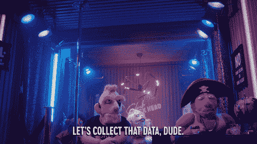

# 对全球不同数据收集平台的调查

> 原文：<https://medium.com/nerd-for-tech/survey-on-different-data-collection-platforms-around-the-world-a4c60eee30bb?source=collection_archive---------25----------------------->

[参考](/anolytics/what-is-data-annotation-and-what-are-its-advantages-95766213351e)

要在任何机器算法中取得成功，首要的事情是可视化数据。如果数据不是健壮和干净的，我们就没有别的办法让我们的 ML 模型学习得更好。

为了开始学习最大似然算法，我们可能使用了不同的公共数据集，例如 COCO，PASCAL VOC 来解决计算机视觉问题。这些数据集本质上更加通用。但是问题出现在我们需要解决特定行业问题的地方。这些公共数据集不包含特定用例的数据。

***对于概念验证来说，开源数据集可能已经足够好了，但是在生产中，你将需要更多的数据。***

如果您的项目需要外部数据，为了获得相关数据，与其他组织建立合作伙伴关系可能是有益的。

这就是我们必须使用数据收集平台的地方，我们可以为特定的行业用例创建自己的数据集。报告显示，[2020 年，全球数据收集和标签市场规模价值 13.077 亿美元](https://www.grandviewresearch.com/industry-analysis/data-collection-labeling-market)。

作为一名 ML 工程师，我们还需要了解这样的数据收集平台，它可以在我们陷入困境时提供我们想要的数据。在这篇博客中，我调查了以下 ***全球新兴的 10 家提供数据收集和标记的公司*** ，因此 ML 工程师可以专注于培训和算法，而不是一直寻找数据！

1.  [**数据集群实验室**](http://www.datacluster.in/) :数据集群实验室位于**印度**。数据集群实验室不同于其他平台，因为它专注于通过他们管理的 ***众包*** 平台为各种人工智能项目收集数据。他们专门从事图像、视频、音频和文本数据的收集和标注，用于深度学习。他们还在[**Github**](https://github.com/datacluster-labs/Datacluster-Datasets)**和 [**Kaggle**](https://www.kaggle.com/dataclusterlabs) 上开源了他们的样本数据集。**
2.  **[**埃皮诺特**](https://epinote.ai/) :埃皮诺特总部位于波兰。Epinote 在广泛的人工智能和数据科学项目中为公司提供支持。他们帮助对 3D 2D 图像、视频、文本语音进行数据注释，并提供补充数据服务:表格数据管理、数据收集、清理、结构化和分析。**
3.  **[**LionBridge AI**](https://lionbridge.ai/):LionBridge 总部位于马萨诸塞州沃尔瑟姆。Lionbridge 主要致力于解决语言学问题。他们利用最好的人力和机器智能来增进客户之间的理解。他们的合格贡献者社区遍布全球，全天候提供对所有语言和文件类型的大量数据的访问。**

5.  **[**ClickWorker** :](https://www.clickworker.com/) 总部位于德国的 ClickWorker 是付费众包的领先供应商之一。clickworker 为其客户提供标准化和定制的解决方案(托管服务)来实现面向数据的项目。**
6.  **[**KeyMakr**](https://keymakr.com/):KeyMakr 总部位于纽约，为卷积神经网络和深度学习人工智能系统的训练提供高级数据收集服务。他们的目标是为客户提供最佳的定制数据集，从而提高 ML 系统的准确性、效率并降低数据集创建阶段的开销。**
7.  **[**LabelBox**](https://labelbox.com/) :总部位于三藩市，LabelBox 的主要产品是一个平台，可以轻松创建和管理标记数据，实现人工智能应用的快速部署。**
8.  **阿彭:阿彭是一家澳大利亚公司。阿彭帮助客户增强他们在世界各地的一流产品和服务，包括搜索引擎、社交媒体平台、语音识别系统、情感分析和电子商务网站。**
9.  **[**DOB bility**:](https://www.dobility.com/)DOB bility 在马萨诸塞州的剑桥和 DC 的华盛顿州设有办事处。Dobility 宣布了一个名为 SurveyCTO 的工具。SurveyCTO 是一种数据收集工具，设计用于影响评估、学术研究、项目 M & E、移动医疗应用或在没有(或有限)连接的现场环境中的市场研究。**
10.  **[**Scale AI**](https://scale.com/) : Scale AI 是一家总部位于美国的公司，通过帮助机器学习团队生成高质量的地面真实数据来加速人工智能应用的开发。他们先进的激光雷达，图像，视频和 NLP 注释 API 允许 OpenAI，Lyft，Pinterest 和 Airbnb 等公司的机器学习团队专注于建立差异化的模型，而不是标记数据。**

**这些都是顶级的数据收集和标注公司，未来要小心了。他们是 ***数据即服务领域的顶尖市场参与者。*****

**如果你知道任何其他数据收集公司，你可以在博客上发表评论。它将有兴趣了解这些正在做开创性工作的组织！**