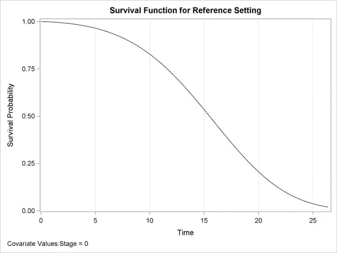
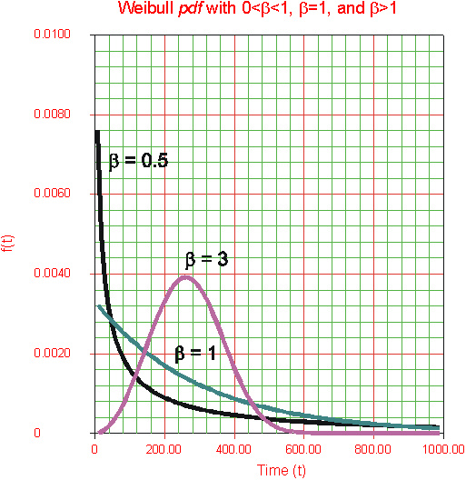

# 生存分析——一个理论视角

> 原文：<https://medium.com/nerd-for-tech/survival-analysis-a-theoretical-perspective-6c224dddb760?source=collection_archive---------1----------------------->

生存分析是机器统计的一个分支，其中结果变量是直到事件发生所花费的时间。例如，在一项研究中，对受病毒或致命疾病折磨的患者进行测试，以根据患者的特征(如年龄、性别、其他相关疾病等)确定存活时间。生存分析还应用于其他领域，如机械工程，用于评估系统可靠性，以及市场营销，用于评估客户在订阅中的流失情况。

然而，虽然它非常类似于回归问题，但有一个主要的区别。这项研究中的许多受试者可能不会经历这一事件。例如，在客户流失的例子中，许多客户可能仍然是客户并使用服务。在生存分析中，这被称为删失数据。

审查可以通过多种方式进行:

1.  **右删失:**在此过程中，事件时间与观察时间一样大。例如，在一项对经历威胁生命的疾病的顾客的研究中，一些顾客将能够在经历中存活下来，在这种情况下，该事件将不会发生。
2.  **左删截**:在这类实验中，观察时间会比事件时间大。例如，研究时间超过 9 个月的孕妇研究。
3.  **区间删截:**这是我们不知道事件时间，但不知道它落在某个区间。例如每月对患者进行一次调查，以评估该事件是否已经发生。

生存函数基本上返回在时间 *t* 之后发生的事件的概率分布。数学上它可以表示为

S(t)=P(T>t)

其中生存函数 S(t)给出了受试者在时间 t 后生存的概率函数。典型的生存曲线是向下倾斜的，表明随着时间 t 的增加，生存概率降低。在实践层面上，这是非常直观的，因为随着时间的推移，患者患病或客户流失的可能性会降低。

人们也可以争辩说，人们也可以计算病人在 t 时刻死亡的概率，但是由于删截，我们不能这样做。删截不允许我们计算事件发生的概率，所以我们计算在特定时间的生存概率。

**危险功能**

危险函数与生存函数相反。它是事件率。时间 t 的危险是事件在每个时间发生的可能性。

**平均值&中位生存时间**

受试者的平均存活时间可以通过从零到存活时间的存活曲线下的面积来计算。它可以通过对生存函数进行时间积分来计算。

中位生存时间是生存概率为 0.5 的时间。

# 估计概率分布

有多种非参数和参数方法来模拟生存函数的分布。。

**威布尔分布**

最流行的方法之一是威布尔分布，它是模拟机器故障的理想方法。威布尔分布的一个例子如下

威布尔分布允许我们通过改变它的参数以指数形式扩展函数。A b <1 indicates that the hazard rate is expected to fal while a b> 1 意味着危险率预计会增加。

**指数分布**

在指数分布中，风险率应该是常数。数学上它可以表示如下:

**危险函数** : h(t)=p

**生存功能:** S(t)=e^-pt

**密度函数:** pe^pt

当事件率随时间保持不变时，指数分布是理想的。

# **型号对比**

评估生存模型准确性的最常见方法之一是 **Brier 评分**。Brier 分数给出了与实际相比的任何概率度量的准确性。数学上可以表示如下:

Brier 得分= 1/n *σ(ft-ot)2

在哪里

n =样本量

f =预测概率

t =时间

o =原始概率。

然而，这种度量的问题是需要花费大量的时间来训练。评估中的另一个有用的度量可以是 **AIC** (阿凯克信息标准)，数学上表示为

AIC=-2logL+2k

其中 L =模型的对数似然

k =参数的数量

# **非参数方法**

## 卡普兰·迈耶曲线

卡普兰迈耶估计量中最常见的建模方法之一。

对于生存分析，我们评估变量，在这种情况下，我们将它定义为 Y，即事件时间或观察时间的最小值。换句话说

y =最小值(E，C)

其中 E 是事件时间，C 是审查时间。

**对数秩检验**

假设我们需要看两组的生存分布是否有差异。例如，在一个实验中，我们可能需要观察对照组和治疗组的存活率分布是否不同。我们也可以进行 t 检验，但是正如我们之前解释的那样，我们可能会因为审查而遇到问题。

对数秩检验是一种大样本卡方检验，它使用卡方统计来比较两条或多条 KM 曲线。对数秩检验可以用数学方法表示如下。

w =(X E(X))/Var(X)。

**其他话题**

在接下来的几篇文章中，我们将对 python 进行生存分析，还将讨论 Cox 比例风险模型。敬请期待

**参考文献**

> *Gareth J .、Daniela W .、Trevor H. & Robert T.* **统计学习导论:在 R(统计中的施普林格文本)中的应用** *。斯普林格。*