# SWAP()函数

> 原文：<https://medium.com/nerd-for-tech/swap-function-1793f4acf10e?source=collection_archive---------17----------------------->

> **交换** () **函数**用于**交换**两个数。

# 交换功能是如何在机器级别发生的？

步骤 01: 首先，你要创建一个目录。

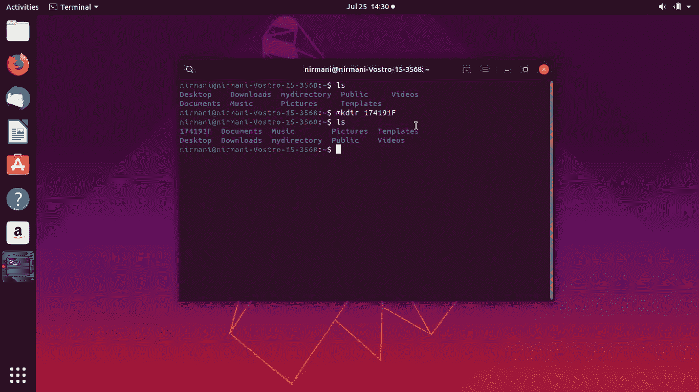

步骤 02: 创建一个交换。c 文件。

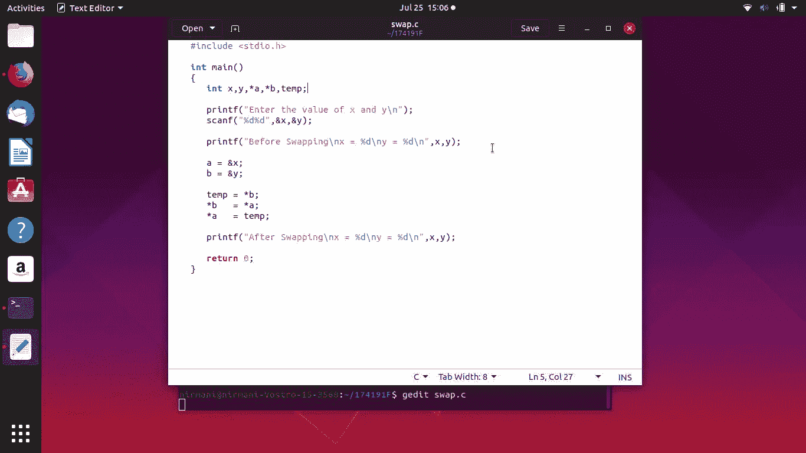

当我们描述上面的交换代码时。

首先，我们需要使用 scanf 语句接受两个数字。现在，您需要将两个变量的地址传递给函数。参数传递方案称为按指针传递。现在看一下函数定义，我们已经将两个变量的地址从主函数传递给了交换函数。所以我们需要一个变量容器来存储整型变量的地址，即:整型指针。因此，第一个数字的地址将被收集在“a”指针变量中，而第二个数字将被收集在“b”指针变量中。

**步骤 03:** 运行并编译 swap.c 代码。

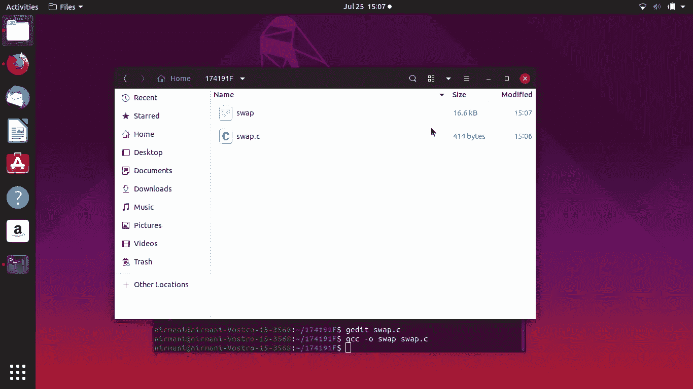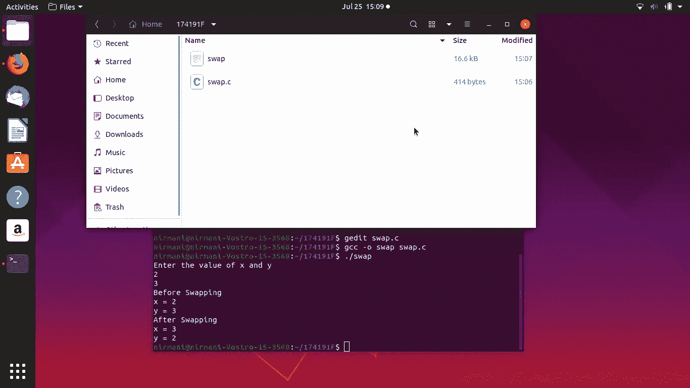

**步骤 04:** 下图 5 显示了删除编译交换文件。

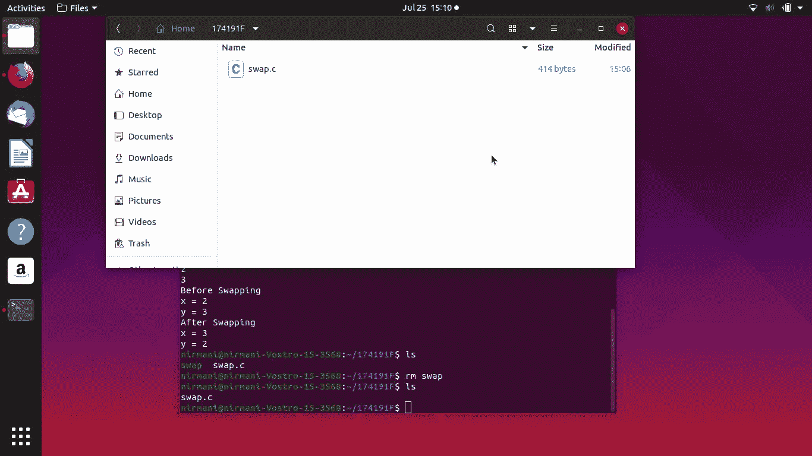

**步骤 05:** 编译 32 位程序。我的机器是 64 位机器，我已经处理了 32 位。

我用了“gcc swap . c-o swap-fno-stack-protector-32”

然后我得到一个错误“无法定位 libc6-dev-i386 包

我用代码“sudo apt-get install libc 6-dev-i386”解决了这个错误

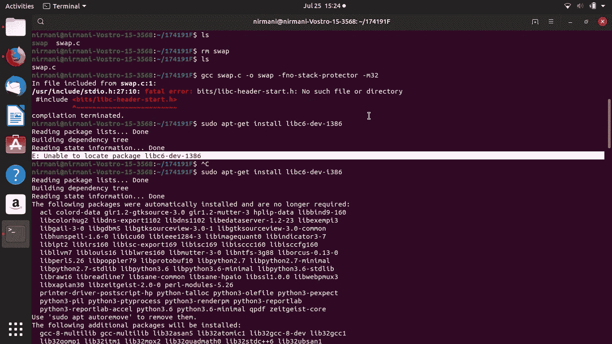

**步骤 06:** 之后再次编译 32 位代码。

**步骤 07:** 执行带“”的代码。/swap”。

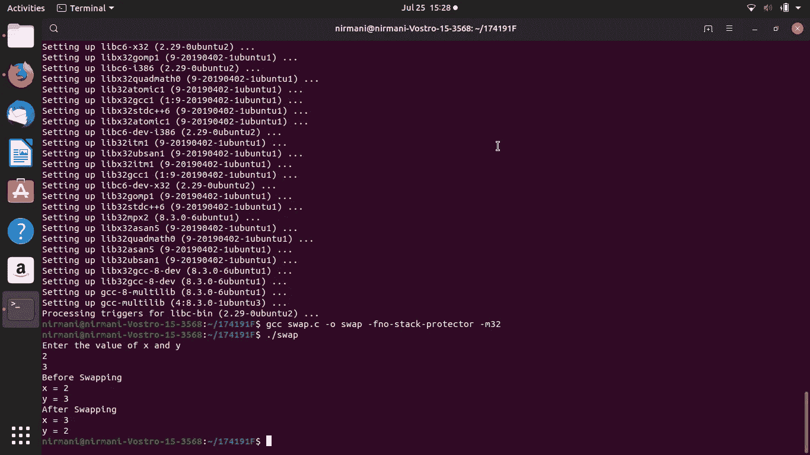

**步骤 08:** 用“gcc -s swap.c”组装代码，得到文件 a.out

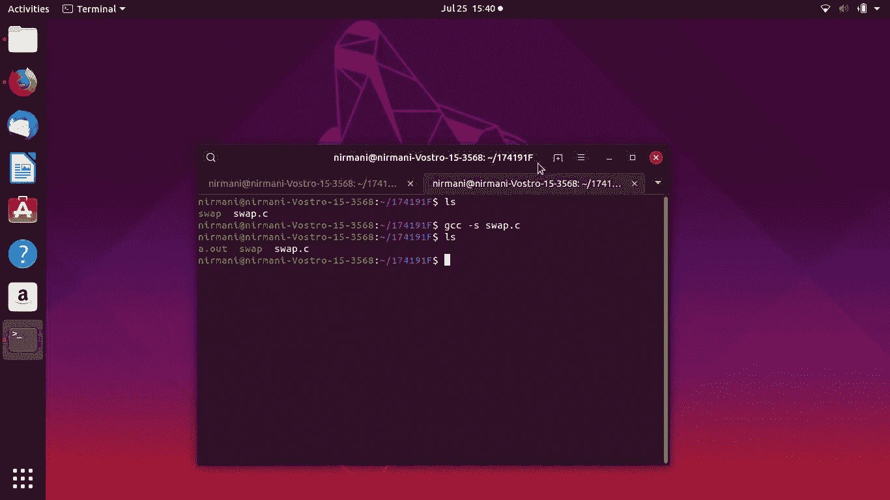

**步骤 09:** 然后我用 objdump 得到了反汇编的代码。

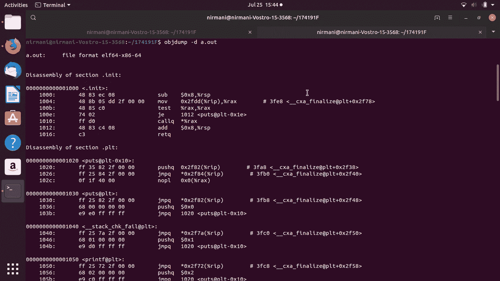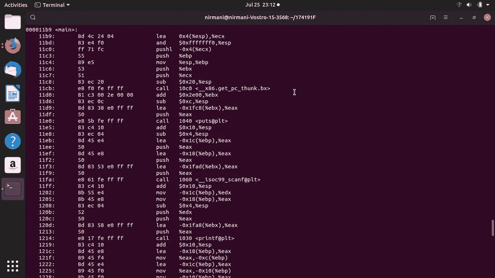

**我们来解释一下流程。**

080483b4 <swap>:</swap>

80483b4: 53 推送%ebx

80483b5: 8b 54 2408 mov 0x8(%esp)，%edx

80483b9: 8b 44 240c mov 0xc(%esp)，%eax

80483bd: 8b 0a mov (%edx)，%ecx

80483bf: 8b 18 mov (%eax)，%ebx

80483c1: 89 1a mov %ebx，(%edx)

80483c3: 89 08 mov %ecx，(%eax)

80483c5: 5b pop %ebx

80483c6: c3 ret

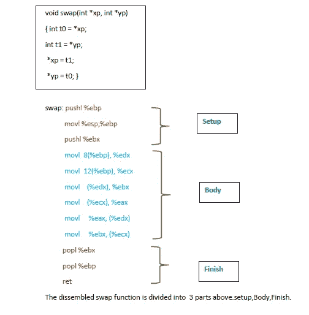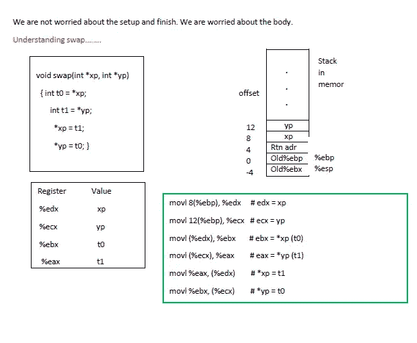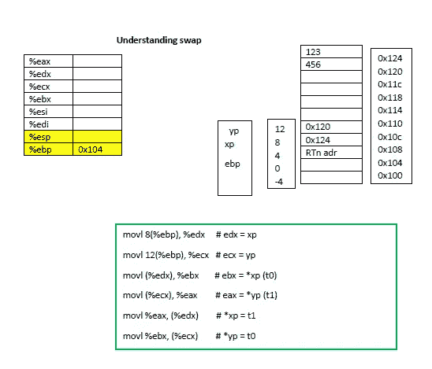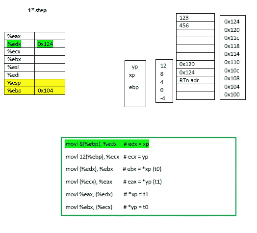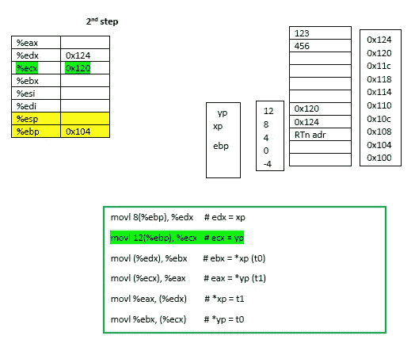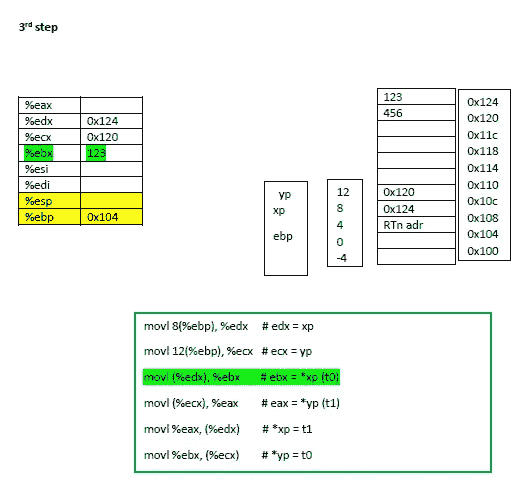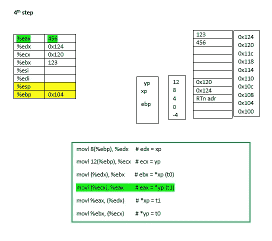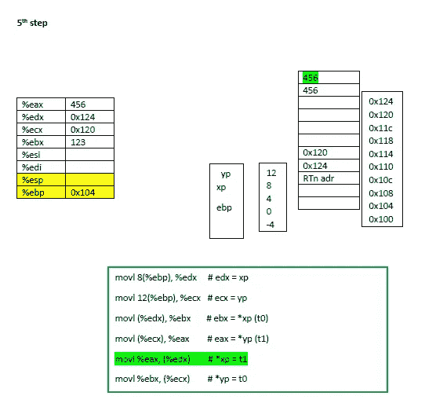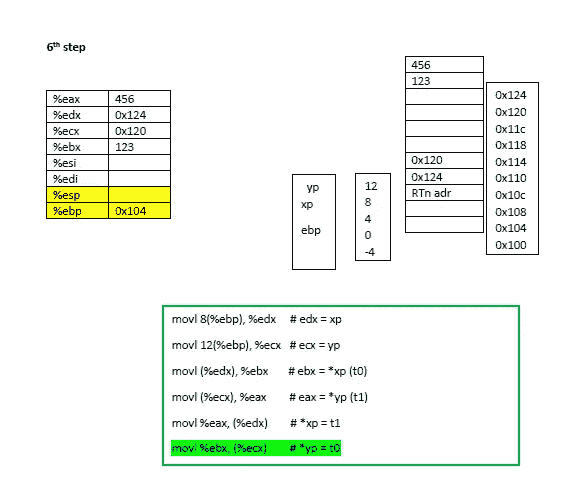