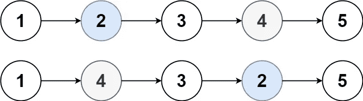

# 交换链表中的节点—第 96 天(Python)

> 原文：<https://medium.com/nerd-for-tech/swapping-nodes-in-a-linked-list-day-96-python-2869ec485d13?source=collection_archive---------7----------------------->


照片由 [Garmin Bao](https://unsplash.com/@garminb?utm_source=medium&utm_medium=referral) 在 [Unsplash](https://unsplash.com?utm_source=medium&utm_medium=referral) 上拍摄

今天的问题摘自每日 Leetcode 编码挑战—三月版。让我们看看问题陈述。

[**1721 年**](https://leetcode.com/problems/swapping-nodes-in-a-linked-list/) **。交换链表中的节点**

给你一个链表的`head`和一个整数`k`。

返回*链表头后* ***交换*** *的值，从* `kth` *节点开始，从* `kth` *节点结束(链表是****1-索引*** *)。*

**例 1:**



```
**Input:** head = [1,2,3,4,5], k = 2
**Output:** [1,4,3,2,5]
```

**例 2:**

```
**Input:** head = [7,9,6,6,7,8,3,0,9,5], k = 5
**Output:** [7,9,6,6,8,7,3,0,9,5]
```

**例 3:**

```
**Input:** head = [1], k = 1
**Output:** [1]
```

**例 4:**

```
**Input:** head = [1,2], k = 1
**Output:** [2,1]
```

**例 5:**

```
**Input:** head = [1,2,3], k = 2
**Output:** [1,2,3]
```

**约束:**

*   列表中的节点数是`n`。
*   `1 <= k <= n <= 105`
*   `0 <= Node.val <= 100`

给我们一个链表和一个输入数字“K”。我们必须交换前面第 k 个节点的**值**和后面第 k 个节点的值。

因为我们只需要交换值，所以我们将把第 k 个位置的节点(从开始到结束)存储在一个变量中，并在它们之间交换值。

从一开始就很容易找到第 k 个节点。但是我们如何从末端知道第 k 个节点呢？我们有快指针和慢指针。快速指针将继续向前移动，直到我们到达第 k 个节点。一旦到达第 k 个节点，我们将开始移动慢速指针。此时，我们的快指针和慢指针都将保持移动。一旦快速指针到达链表的末尾，慢速指针将从链表的末尾指向第 k 个节点。

让我们来看看代码片段。

```
class NodeSwaper:
    def swapNodes(self, head: ListNode, k: int) -> ListNode:
        fast_ptr = 1
        start = 0
        end = head
        temp = head
        while(temp):
            if fast_ptr == k:
                start = temp
            temp = temp.next
            fast_ptr += 1
            if fast_ptr > k+1:
                end = end.next
        start.val, end.val = end.val, start.val
        return head
```

# 复杂性分析。

**时间复杂度**

时间复杂度是 O(N ),因为我们遍历链表一次。

**空间复杂度**

空间复杂度是 O(1 ),因为我们没有使用任何其他数据结构来存储计算。

在上面的问题中，我们只需要交换值。下面的代码将交换整个节点本身，而不仅仅是值。

```
class NodeSwaper:
    def swapNodes(self, head: ListNode, k: int) -> ListNode:
        dictionary_ll = dict()
        i = 1
        temp = head
        while(temp):
            dictionary_ll[i] = temp
            temp = temp.next
            dictionary_ll[i].next = None
            i += 1
        temp = dictionary_ll[k]
        dictionary_ll[k] = dictionary_ll[i-k]
        dictionary_ll[i-k] = temp
        new_head = dictionary_ll[1]
        new_head_return = new_head
        i = 2
        while(i <= len(dictionary_ll)):
            new_head.next = dictionary_ll[i]
            i += 1
            new_head = new_head.next
        return new_head_return
```

# 复杂性分析。

**时间复杂度**

时间复杂度是 O(N ),因为我们遍历链表一次。

**空间复杂度**

空间复杂度是 O(N ),因为我们使用字典来存储链表。