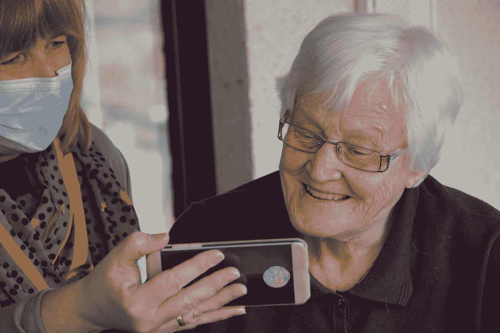

# 瑞典人工智能老年人护理试点项目

> 原文：<https://medium.com/nerd-for-tech/sweden-artificial-intelligence-elderly-care-pilot-projects-a24dac1909ff?source=collection_archive---------3----------------------->

瑞典人口的平均预期寿命逐年提高，人口老龄化带来的挑战增加。近年来，面对护理人才持续短缺和“超老龄化”的双重挑战，瑞典积极行动，将人工智能引入老年护理领域，大力推进全面数字化和智能化试点项目。

爱斯基摩图纳位于瑞典中东部，人口约 10.7 万。它是瑞典首批开始为家庭护理服务提供数字解决方案的城市之一。人工智能和通信平台优化了对老年人的支持，节省了护理人员的大量时间，减少了日常工作和交通的时间。因此，团队可以将更多的精力放在人力和物力资源上，改善老年人的福祉。

该市正在与一家挪威公司合作，该公司是北欧最著名的 IT 解决方案提供商，也是欧洲第二大 IT 解决方案提供商，将在未来几年内分阶段为当地老年人提供数字化综合护理解决方案。据报道，护理机器人去年秋天搬进了该市约 20 名老人的家中。他们每天按时分发药品，并跟踪他们的用药情况。该公司计划在今年年底推出一款新型护理机器人，配有虚拟人工智能助手“Lily”，增加与老人的对话功能。

该市老年人护理部门的行政主管约翰·林德斯特罗姆表示，智能数字护理计划的目标是为老年人更独立地生活创造条件。“我们需要增加老年人在日常生活中的安全感和独立性，减少他们的孤独感。”

但他强调，护理机器人助手不能单独成为老年人的替代方案，必须成为一整套系统。新升级的智能助理需要与各种现有的数字解决方案相结合，并主动适应老年人的条件和需求。同时，养老金计划的推广需要在与医生、护士和每个老年人的其他工作人员协商后进行。每个案例都应该单独评估，每个护理解决方案应该在两到三年内具有灵活性。

数字智能融合计划的推出，给当地老人的生活带来了惊喜的变化，工作人员的作息时间也变得更加灵活。

据报道，创造未来的老年人护理服务有几个显著的要素是不可或缺的:首先，使用护理机器人来确保老年人在正确的时间接受正确剂量的药物治疗。第二，建立包括 AI 助手在内的交流平台，提供更加智能和人性化的关怀服务。第三，摄像头和传感器智能技术的加入，当护理出现问题时，传感器装置可以及时发出警报。此外，社交应用的激活也意义重大。可以方便老人与志愿者建立联系。

## 定制数据集

随着 AI 商业化进程的加快和 AI 技术在各行各业的应用，人们对特殊场景下的数据质量的期望越来越高。高质量的标签数据将是人工智能公司的核心竞争力之一。

如果说之前的算法模型使用的一般数据集是粗粮，那么算法模型目前需要的是定制的营养餐。如果公司想要进一步提高某些模型的商业化，他们必须逐步从通用数据集向前发展，以创建独特的数据集。

# 结束

将您的数据标注任务外包给[字节桥](https://tinyurl.com/45b7y4he)，您可以更便宜、更快速地获得高质量的 ML 训练数据集！

*   无需信用卡的免费试用:您可以快速获得样品结果，检查输出，并直接向我们的项目经理反馈。
*   100%人工验证
*   透明标准定价:[有明确定价](https://www.bytebridge.io/#/?module=price)(含人工成本)

为什么不试一试呢？

https://www.robot-china.com/news/202112/20/69047.html