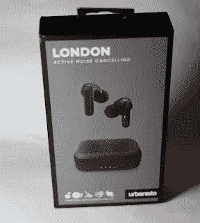
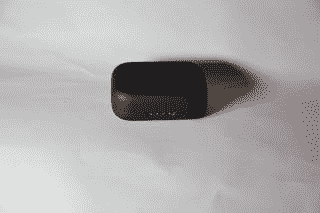
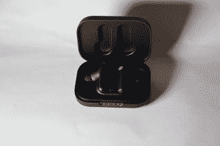
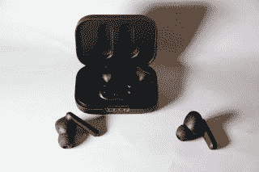
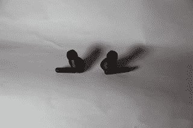

# 瑞典听起来像伦敦吗

> 原文：<https://medium.com/nerd-for-tech/sweden-does-the-london-sound-3d092df4bd26?source=collection_archive---------15----------------------->

[Urbanista](https://www.urbanista.com/uk/) 是一家瑞典音频公司，生产一系列有线和无线耳机、耳塞和蓝牙扬声器。它们以城市命名(尽管只有一个是瑞典斯德哥尔摩的[斯德哥尔摩加](https://www.urbanista.com/uk/stockholm-plus)真正的无线水果克隆)。

接受审查的入耳式耳机是 [Urbanista London](https://www.urbanista.com/uk/london) ，更像是水果味的专业耳机，它们有硅头，适合耳道，短头斜向下向前悬挂。审查的型号是黑色(午夜)，尽管它有粉红色(玫瑰金)、蓝色(深蓝宝石)和白色(珍珠)可供选择。有明确的迹象表明，该品牌是“时尚达人”，目标市场是千禧一代。

耳机上有 2 个小贴士，盒子里还有 3 种不同的尺寸。

该保护套支持无线充电(Qi 兼容)和 USB-C(随附线缆)。

当在充电垫上或插上电源时，led 指示充电水平。

打开外壳，led 将会亮起，显示电量(充满电可以播放 25 小时，但耳机实际上一次只能播放 5 小时，所以需要放回外壳，如果电池耗尽，可以再次充电，这不是瞬间的)。

耳机通过磁力固定，将支架靠在充电点上。

在外壳的前面还有一个按钮，在茎部之间，需要按住按钮才能将系统置于蓝牙配对模式。配对完成后，打开外壳，将耳机放入耳朵就可以了。长按该按钮将重置表壳/耳机并松开配对。耳机是蓝牙 5，因此兼容手机的电池寿命应该最大化。

耳机本身是触摸敏感的，敏感部分在徽标下，当它们在耳朵里时也能检测到。

使用最小的硅尖，耳机在移动时仍留在耳朵里，非常舒适。它们具有 IPX4 防水性能，因此可以在健身房或体育运动中使用，尽管汗水可能会降低硅的抓地力，它们可能会滑出。遗憾的是，Urbanista 没有提供挤压后可以牢固贴合任何形状耳道的记忆泡沫耳塞。

配对真的很简单，只需按下盒子里的按钮 *Urbanista London* 就会显示为一个可连接的设备，只需点击它，它们就配对了。然后把耳机放在耳朵里，声音就会被听到。

奇怪的是，如果在配对前将耳机从外壳中取出，然后按下配对按钮，耳机将显示为两个独立的蓝牙设备，每个设备都可以单独连接，但不能连接在一起。如果发生这种情况，忘记他们，重新开始配对。支持的蓝牙音频编解码器有 HSP、HFP、A2DP 和 AVRCP。引用的频率响应是 20Hz 到 20KHz，但这是非常不现实的，因为蓝牙压缩了很多东西。

一切都是通过轻敲耳塞上的 logo 来控制的(左右耳塞都用)。需要一个结实的龙头，它需要在标识区域，而不是在侧面。

有六个麦克风，用于消除噪音和拾取通话语音。

若要播放，请轻按左耳塞两次，再轻按两次将会暂停。

提高音量，向右轻击一次。

降低音量，向左轻按一次。

接听电话，向左或向右触摸两次。

结束通话，触摸左或右两次。

拒绝通话，触摸并按住左侧或右侧。

Siri，向右触摸两次。

主动噪音消除(ANC)开/关，按住右按钮 2 秒钟。

环境语音模式(AVM)开/关，按住左按钮 2 秒钟。

打开 ANC，将音量调高，它确实会阻挡外部噪音或语音。它并不完美，但确实有效，音乐肯定更饱满，当关闭时，他的鼓听起来很嘶嘶作响(或者那是嘶嘶的？).还有其他耳机具有更好的噪音消除功能，但它们往往要贵得多。

打开 AWM 会让(砰砰)音乐听起来褪色，即使只是听一段声乐播客也会显得柔和。

当离开蓝牙源(电脑或手机)时，音频工作，直到它不工作，然后开始随机切断。

这些耳机可能不是为有鉴赏力的音响发烧友(或者只是音频势利者)准备的，但它们看起来很好，音频质量也相当不错，而且用 ANC 播放音乐是一种很好的体验，音调温暖。长时间佩戴也非常舒适。

绝对值得一看，虽然不像 ANC 那样精致，但它们是水果派的好选择(便宜得多)。

它们可以直接从 urban ista 或从 T2 亚马逊购买，价格为 129.00 英镑

【http://eurotechnews.blogspot.com】最初发表于**。**