# 甜蜜，甜蜜，释放…

> 原文：<https://medium.com/nerd-for-tech/sweet-sweet-release-d7be317abaa6?source=collection_archive---------3----------------------->

## **使用 GitHub 动作设置对 itch.io 的持续部署**

在上一篇文章中，我们研究了如何使用 GitHub 动作实现我们的持续集成管道。现在，我们应该有一个为多个平台构建的项目，并将这些构建上传到一个地方，每次我们构建(到主分支)时，我们都可以从*下载它们*！太棒了。现在，我们想着手 CI/CD 渠道的另一半，即持续部署或 CD。

持续部署获取我们在上几篇文章中建立的上传的构建，并允许将它们上传到其他人可以访问的地方。在网站的情况下，这可能是一个 web 服务器，它托管您的站点并向公众提供服务。对于游戏来说，这可能是一个或多个分发渠道，如 Steam、android 或 iOS 商店、控制台部署、云服务器或 itch.io 等服务。如果你的游戏是基于 HTML 或可在浏览器中玩的，则有一些网站，如 smelle . io、itch.io 甚至 GitHub 页面可以托管你的游戏，并让玩家访问。今天我们将讨论从 GitHub actions 部署到 itch.io。

# 设置我们的 itch.io 帐户

我们首先需要的是 itch.io 上的账户。

导航到 [itch.io](https://itch.io) ，并点击注册按钮(如果您已经有一个帐户登录，导航到 Creator Dashboard 的项目选项卡并跳到下一部分)

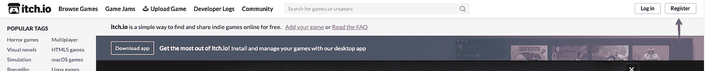

itch.io —注册按钮

接下来，填写用户名、密码和电子邮件地址字段。确保选中“我对在 itch.io 上分发内容感兴趣”复选框，并选中“我接受服务条款”复选框。然后，单击创建帐户按钮。这将使您进入 Creator Dashboard 屏幕的“项目”选项卡。

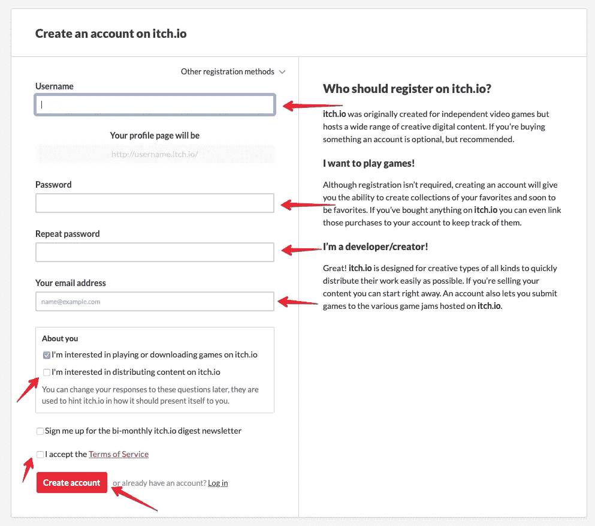

itch.io —注册页面

# 设置我们的游戏页面

接下来我们需要做的是在我们的帐户中为我们的游戏建立一个页面。我们可以在我们的帐户中托管多个游戏，玩家可以通过我们的帐户名称在一个地方找到我们所有的游戏。这是伟大的展示和整个作品组合！

单击“创建新项目”按钮

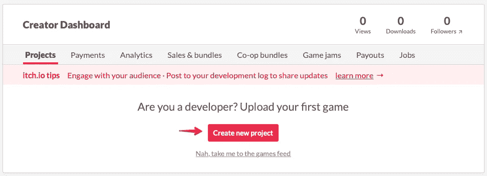

itch.io —新建项目按钮

在“创建一个新项目”屏幕上，用我们游戏的名字填写标题字段。请注意，该屏幕将根据我们的标题为我们自动填充项目 URL 字段。**记下为我们生成的字符串！这将是我们稍后设置 GitHub 操作时需要的项目名称！**填写我们游戏的简短描述。在分类下取默认的“游戏”。在“项目类型”下，保持默认选择“可下载”，如果我们计划托管一个可以在浏览器中玩的游戏的 WebGL 构建，我们将在未来的步骤中返回并将其更改为 HTML。在“发布状态”下，根据游戏的状态选择“开发中”或“原型”。我倾向于选择“开发中”作为开始。

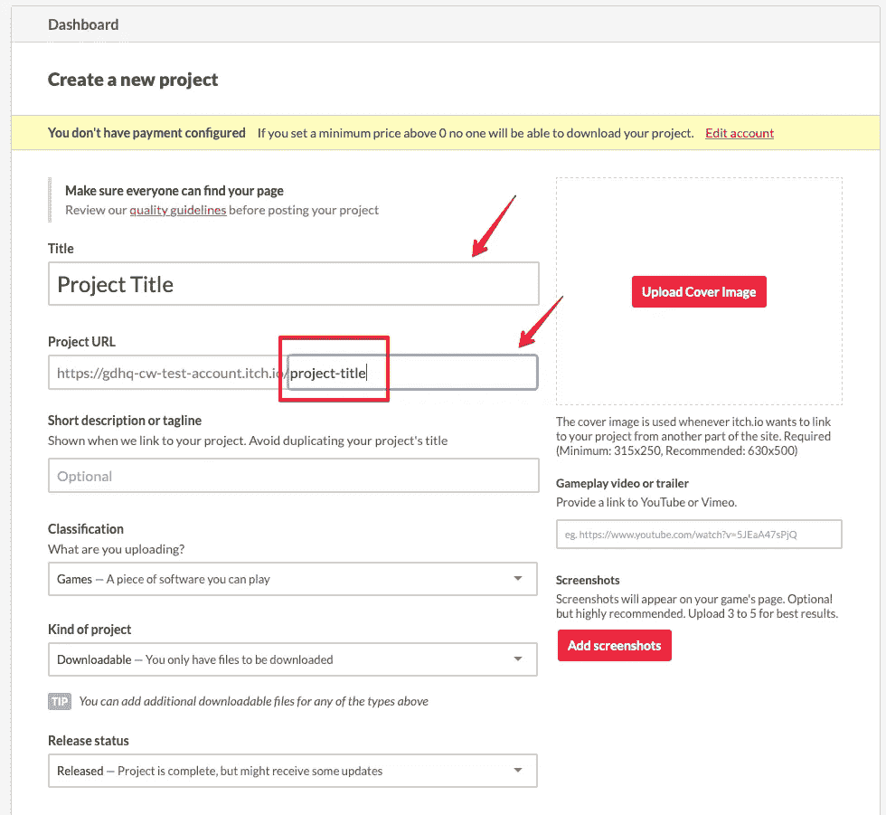

itch.io —新项目 pt。一

在“定价”下，选择您计划用于游戏的定价方案。对于我的项目，我现在默认为“0 美元或捐赠”。这让玩家可以选择在开发过程中帮助我支持和维护项目，但不需要付费。我还保留默认的“建议捐赠”2.00 美元。我们可以跳过上传部分，因为我们将使用 itch.io 的 API，名为 Butler，直接从我们的构建管道上传文件。填写 description 字段，这在技术上是可选的，但它在发布时确实构成了页面上的大部分内容。选择你的游戏类型

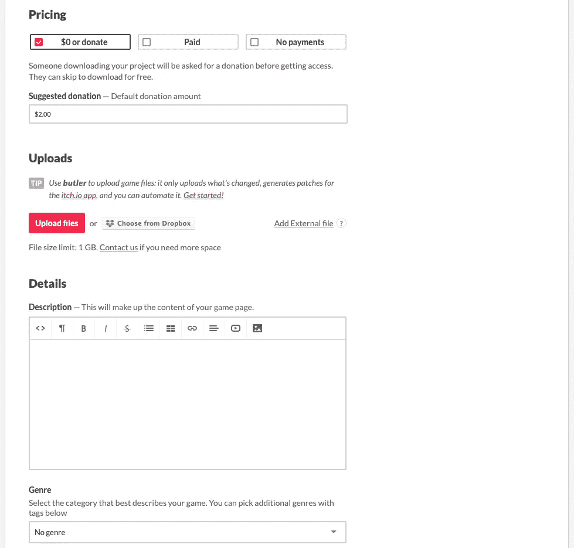

itch.io —新项目 pt。2

采用标签、App Store 链接和自定义名词部分的默认值。如果需要，我们可以稍后回来修改这些。对于社区，我喜欢选择“评论”,但要选择最适合你与玩家社区互动的方式。在“可见性”下选择“草稿”,当我们准备好向全世界发布游戏时，我们可以更改这个选项，但现在我们是唯一需要在我们设置游戏时看到游戏的人。点击“保存和查看网页”按钮。

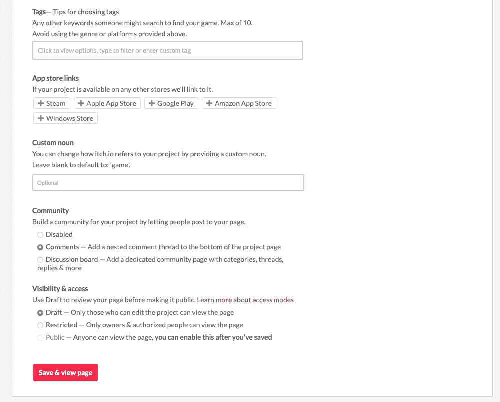

itch.io —新项目 pt。3

然后，您将被带到您的项目页面，我们准备进入下一步。

# 设置管家秘密

我们需要一个令牌来与 Butler API 交互，就像我们需要一个令牌来与 GitHub APIs 交互一样。我们将为 Butler 生成一个令牌，然后，就像我们的 GitHub 令牌一样，我们将把它作为一个秘密存储在我们的存储库中，以便我们可以从我们的工作流文件中访问它。

点击网站右上角您的帐户名称旁边的向下箭头。点击设置。

itch.io —设置

单击 API Keys(您可能需要向下滚动页面才能看到它)。单击“生成新的 API 密钥”按钮。

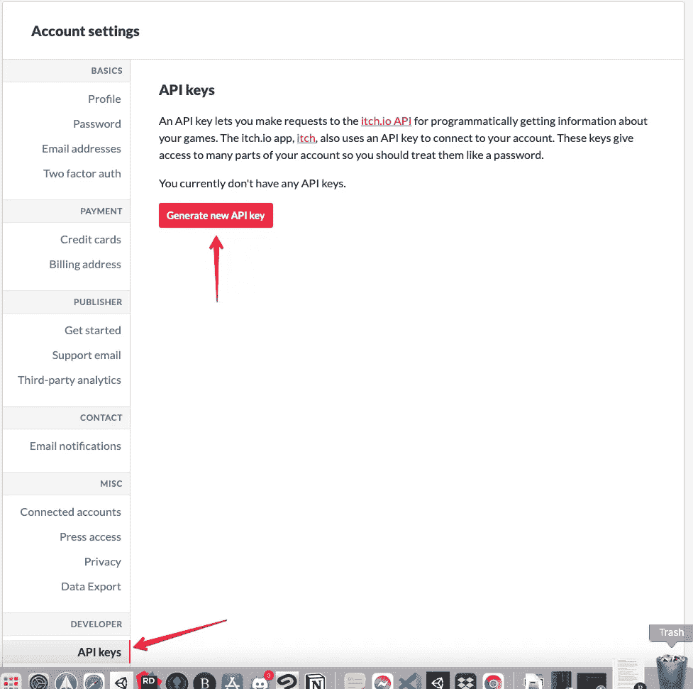

生成 API 键按钮

此时，会生成一个新密钥，并将其添加到屏幕上的密钥列表中。单击“查看”展开密钥。我们将在下一步创建 GitHub 秘密时需要这个密钥。

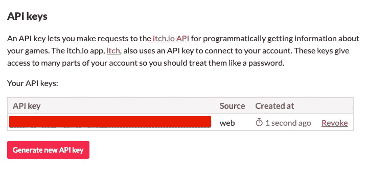

生成的 API 密钥

# 设置 GitHub 秘密

回到我们在 GitHub 上的库，点击设置，点击秘密，点击“新建库秘密”按钮。

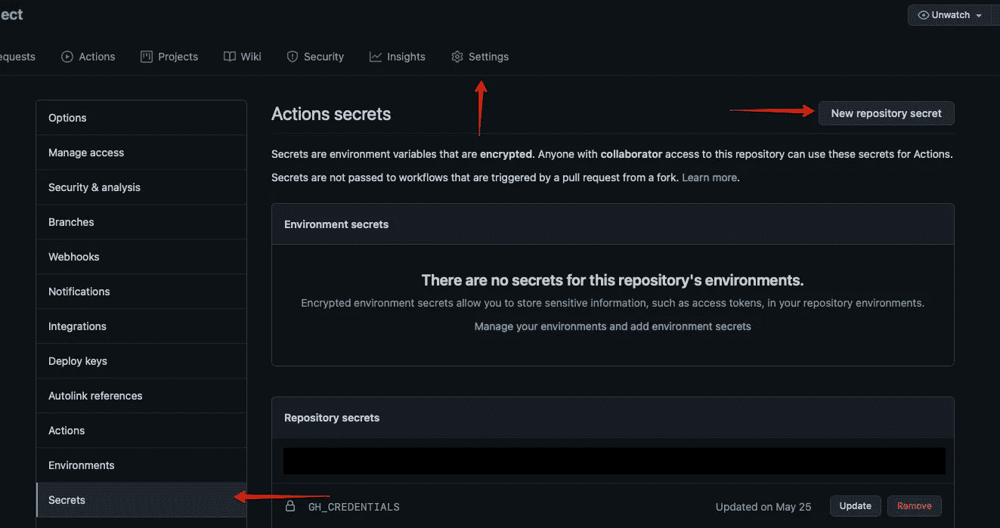

创建秘密

将我们的新秘密命名为“管家凭证”。将我们的 API 令牌从 itch.io 粘贴到值框中。单击“添加密码”按钮。

# 设置工作流作业

现在我们终于完成了所有的设置，我们可以对我们的工作流文件进行更改了。在本地存储库中打开 main.yml，将文件的顶部修改为如下所示

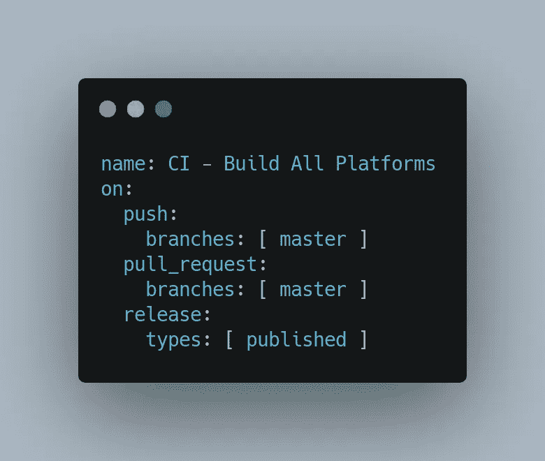

构建触发器

添加 release 节点允许我们拥有仅当我们在 GitHub 上创建一个版本时才触发的文件部分。在我们的例子中，当我们创建一个正式版本时，我们只想将我们的文件发布到 itch.io。

接下来，我们希望压缩我们的构建工件，以便它们可以像 itch 一样上传到我们的各种部署通道。将下面的块添加到我们现有的**构建**任务中

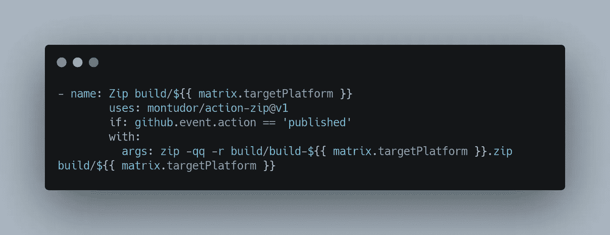

压缩文件步骤

接下来，我们希望将 zip 文件上传到 GitHub 发布频道，这样我们就可以将它下载到未来的发布任务中。在上面的 zip 文件块之后添加下面的块。

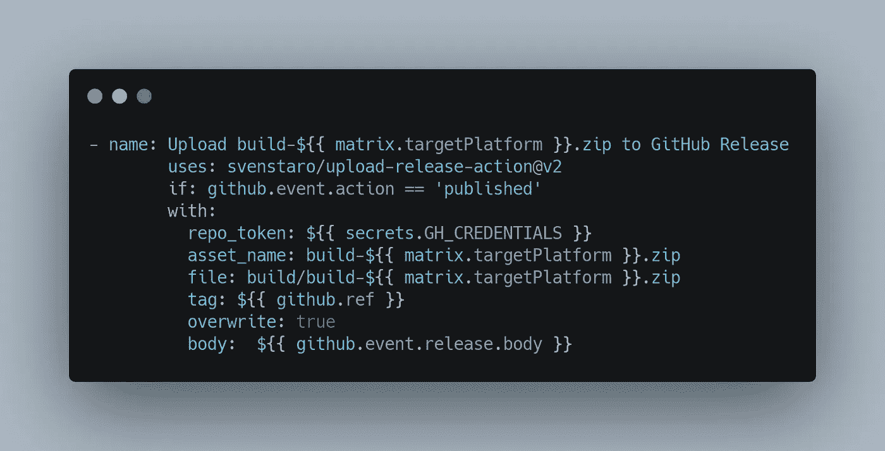

上传步骤

接下来，我们将生成发布的作业添加到 itch.io。注意，这是一个不同于我们的构建作业的作业，应该缩进到与构建作业相同的级别。我们需要为每个平台(WebGL、Windows、macOS 等)创建一个发布作业。).因为每项工作都非常相似，所以我在这里只展示 WebGL 版本，但是在文章结尾的完整代码示例中会包括其他平台的版本。

将以下作业添加到我们文件的末尾。我们要注意的是，在我们的工作中有一个“需要”条款和一个“如果”条款。“needs”子句确保我们的构建作业在运行发布作业之前成功完成。“if”子句确保我们的发布作业只在我们创建一个新的发布版本时运行。

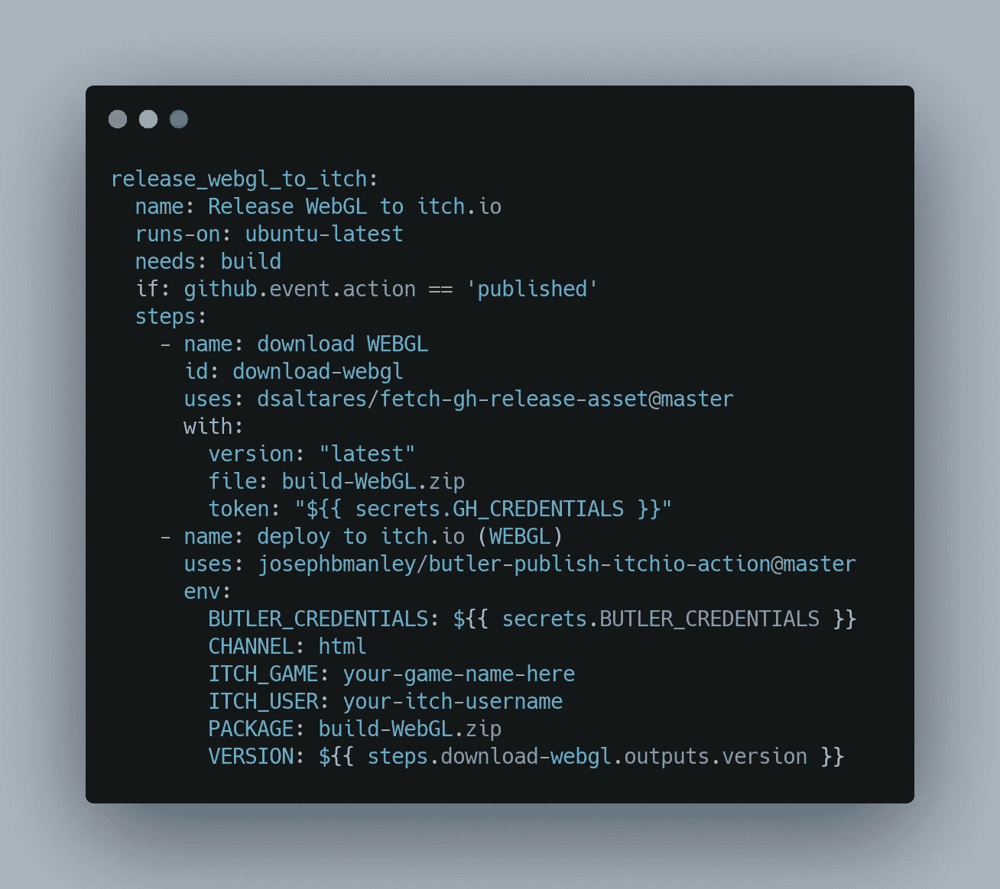

发布作业

我们现在需要将变更签入到我们的存储库中。由于 GitHub 目前的限制，我们需要将更改合并到 master 中，然后才能在我们的存储库的 Actions 选项卡中选择更改。

现在我们的操作已经在我们的存储库中了，我们需要创建一个发布。为此，请加载我们存储库的 Code 选项卡，并单击屏幕右侧的“Releases”链接。

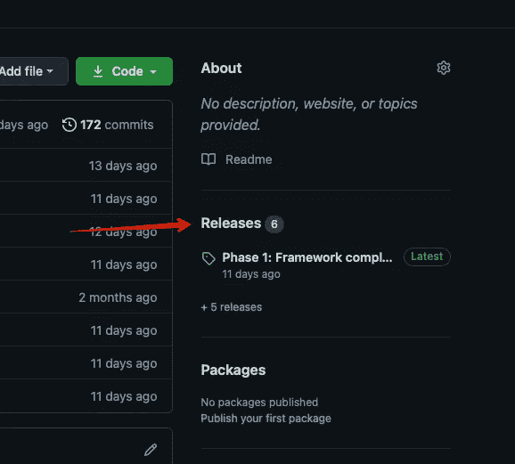

放

在“发布”屏幕上，单击“起草新发布”按钮。

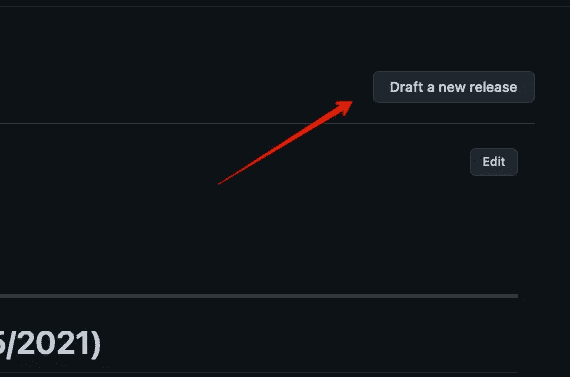

起草一个新的释放按钮

然后填写标签版本、发布标题和描述字段。最后点击“发布”按钮。

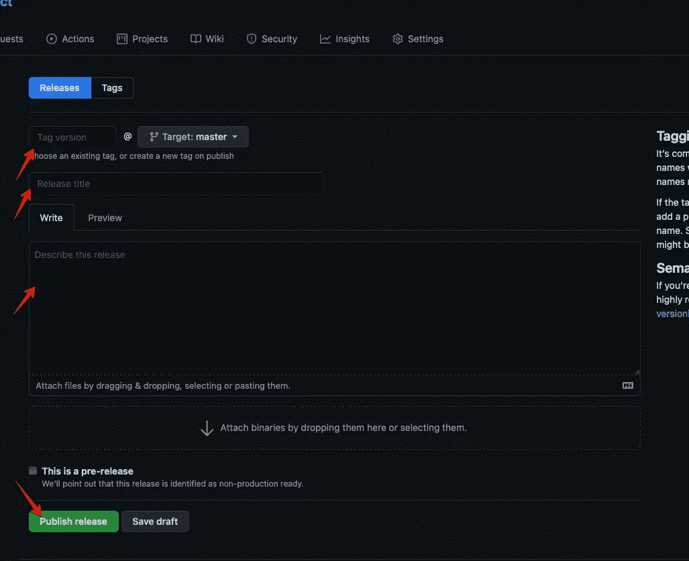

起草新版本

这将再次启动我们的操作，它将从我们的 main.yml 文件执行我们的所有构建，然后它将运行我们的发布到 itch。这需要一段时间才能完成。一旦完成，我们还有最后一步来使我们的游戏在 itch.io 上的浏览器中可玩。只有当我们使我们的 WebGL 构建在浏览器中可玩时，这一步才是必要的。我们所有的其他平台将在我们的游戏页面上显示为可下载的文件。

# 让我们的游戏可以在浏览器中玩

现在我们回到 itch.io，加载我们的游戏页面，点击页面顶部的编辑游戏。

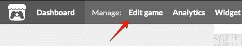

itch.io —编辑游戏

这将把我们带回到我们第一次设置游戏页面时填写游戏信息的页面。我们需要向下滚动到标签为“项目种类”的选项，并将选择更改为 HTML。

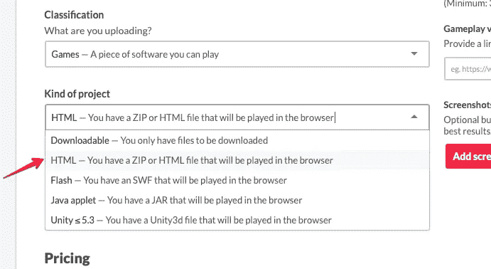

itch . io——一种项目

此时，我们还应该在“上传”部分看到我们上传的文件。我们需要找到标记为 upload 的 HTML，并检查“该文件将在浏览器中播放”选项。最后，单击页面右上角的保存按钮。

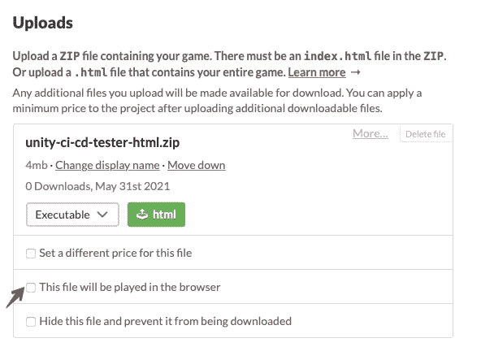

让游戏可以在浏览器中玩

# 完整的文件

向我们的流程中添加额外的平台就是为每个平台创建一个新的任务，并向我们的 WebGL 构建填充类似的信息。下面是包含附加平台的完整动作工作流文件。

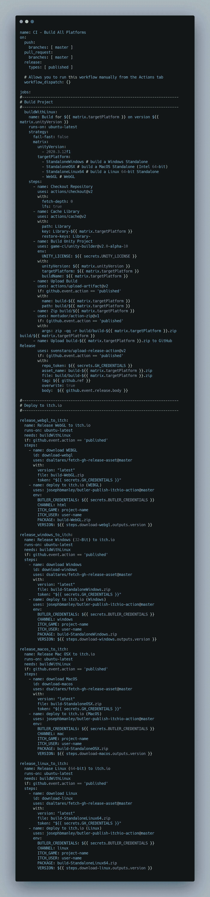

已完成的 GitHub 动作工作流文件

# 下次吧！

现在我们已经自动发布到 itch.io 了！下一次我们将看看如何将 WebGL 构建发布到 GitHub pages 站点，并使其在浏览器中可播放。如果你喜欢这篇文章，或者想在我的旅程中与我同行，请在[gamedevchris.medium.com](http://gamedevchris.medium.com)关注我。