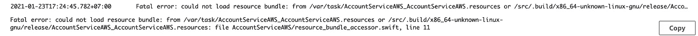
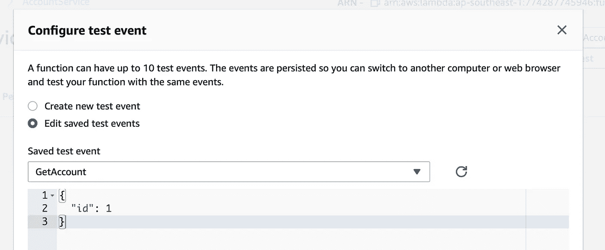
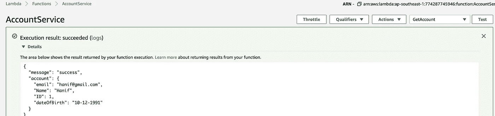

# 将 Swift AWS Lambda 与 SQLite 连接

> 原文：<https://medium.com/nerd-for-tech/swift-aws-lambda-sqlite-ae471f08b31f?source=collection_archive---------6----------------------->


德米特里·马什金在 [Unsplash](https://unsplash.com/s/photos/blocks-lego?utm_source=unsplash&utm_medium=referral&utm_content=creditCopyText) 上的照片

去年在 2020 年，Swift 正式支持 AWS lambda，苹果在 WWDC 2020 上制作了视频，Swift 与 AWS Lambda 配合使用。

目前在我的工作项目中，我们有丰富的 iOS 应用程序，丰富的意思是用户的所有功能都是在 iOS swift 中编写的，生成 PDF，业务验证，计算等。它不像以前的客户-服务器应用程序。

因此，有了这个消息，我们可以尝试将这些功能转移到 AWS Lambda 或后端服务中，以便其他人可以使用这些功能。当然会有一些障碍，但我在[这里](https://tirtavium.medium.com/the-things-you-need-to-consider-before-make-your-ios-mac-functions-run-on-aws-lambda-linux-a3ea26c9f270)分享了这些问题，这篇文章的重点是在 AWS Lambda 上集成 swift SQLite，在使我们的 swift 代码库支持多平台(iOS、Mac、Linux、android)之前，我们需要考虑什么😝).

在这篇文章中，如标题所述，我将分享如何 Swift AWS Lambda 支持 SQLite 的源代码，您可以在我的 [**github**](https://github.com/tirtavium/Swift-AWS-Lambda-SQLite) 查看。

首先我们需要考虑，在你的项目中使用 SQLite 的目的是什么，是为了像普通 RDBMS 一样添加记录吗？如果是这样的话，你需要三思而行，因为 AWS lambda 存储仅适用于 512MB，我的建议是你需要消除这种想法，并使用其他服务，如 AWS DynamoDB 或 RDS。

如果您只需要只读，因为数据库中有如此多的静态数据，并且大小小于 512MB，那么您可以继续在 AWS Lambda 上使用您的 swift 代码库，在您将它部署到 AWS Lambda 并调用一些功能后，您还需要考虑性能成本，我的建议是第一步是针对最简单的功能，并查看该功能的性能。如果结果通过了您的用户数据的估计，您可以继续使用 Lambda。

**先决条件**

1.  Xcode 12，因为 swift 包管理器从 xcode 12 开始支持资源 it，准确地说，它需要 swift-tools-version:5.3
2.  码头工人，我们需要这个为我们的 lambda 做容器。

我将解释 package.swift

**产品:**它有**可执行文件**，名称为 **AccountServiceAWS，**这需要与**源**文件夹目录相匹配，您可能还需要查看项目的**库**标签，因为可执行文件意味着执行的结果将是正在运行的程序，如果库结果将是要使用的库。

> **注明**:不支持**可执行**产品**要进行**单元测试**，您可以为您的业务代码创建库，并为依赖于 AWS lambda 运行时的东西创建可执行文件，出于示例目的，我不在此考虑。**

**依赖项:**所有需要的依赖项都在这里，因为现在它只需要 AWS lambda 运行时、AWS lambda 库和 Soto 库来连接到这个示例的其他 AWS 服务是 S3。

**targets:** Targets 是一个包的基本构造块，所以在这里它只包含 1 个 target，包含所有需要的依赖项和资源， **systemLibrary** 是安装在系统上的库，在我们的例子中，我们有 **SQLite3** 这是 C 库，我们需要稍后在 docker 映像上安装它，正如您可以看到的，sources 文件夹上有文件夹 CSQLite3， **testTarget** 用于单元测试。

如果您使用 Xcode，您可以直接运行项目并用 curl 验证它:

```
$ curl --header "Content-Type: application/json" \
--request POST \
--data '{"id": 1}' \
http://localhost:7000/invoke
```

它会这样回应

```
{
 "account":{
    "ID":1,
    "dateOfBirth":"10-12-1991",
    "Name":"Hanif",
    "email":"hanif@gmail.com"
 },
 "message":"success"
}
```

这是因为我们在 Package.swift 中有 account.db 作为资源，并且因为我们在 mac 上运行它，但是如果我们以这种状态部署到 AWS lambda，我们将得到 resource_bundle_accessor 的错误，因此 mac 和 AWS Lambda 之间有不同的行为。



资源捆绑包存取器

为了解决这个问题，我们需要将 accountData.db 上传到 S3 桶中，下载并保存到 AWS Lambda 上的/tmp 文件夹中，该文件夹只有 512MB 的存储限制。

为了将我们的功能连接到 AWS S3，我们需要索托和 S3 访问密钥，在您拥有它之后，您可以将其放在 **SharedResource.swift**

```
**static** **public** **let** s3BucketName = "calculationservice"**static** **public** **let** awsClient = AWSClient(credentialProvider: .static(accessKeyId: "xxxx", secretAccessKey: "xxxxx"),httpClientProvider: .createNew)
```

s3BucketName 是您存储的 accountData.db 存储桶，您需要用您的存储桶替换 accessKeyId 和 secretAccessKey，以便能够访问 accountData.db。

经过这一步，你可以去码头部分。

首先你需要用它来构建 docker 容器。

```
$ docker run \
   --rm \
   --volume "$(pwd)/:/src" \
   --workdir "/src/" \
   swift:5.3.1-amazonlinux2 \
  /bin/bash -c "yum -y install sqlite-devel && swift build --product AccountServiceAWS -c release -Xswiftc -static-stdlib"
```

所以它使用 swift:5.3.1-amazonlinux2，并安装了 sqlite-devel，AccountServiceAWS 是我们拥有的产品。

成功之后，我们需要运行这个脚本

```
$ ./scripts/package.sh AccountServiceAWS
```

这是一个创建包上传到 AWS Lambda。

完成后，我们可以在*上看到结果。build/lambda/AccountServiceAWS/lambda . zip*

这个 lambda.zip 需要上传到 S3，因为直接上传到 AWS lambda 的最大容量是 10MB，而我们的 lambda.zip 是 30MB。

上传后，你可以回到 AWS lambda 和功能代码，从亚马逊 S3 上传文件。


如果这成功了，你可以用测试事件测试这个函数，并把它请求成这样。



点击测试，您将看到与您在机器终端上看到的结果相同的结果。



成功

# 完成，谢谢你🙏