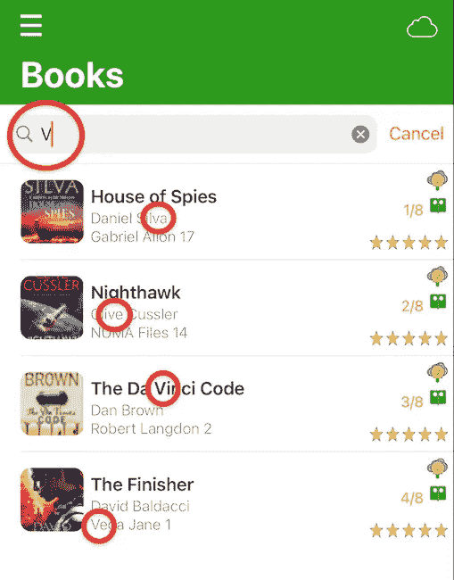
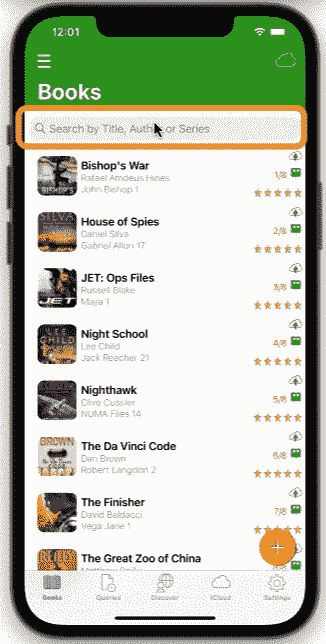

# 具有多个标准和过滤器持久性的快速动态搜索栏

> 原文：<https://medium.com/nerd-for-tech/swift-dynamic-search-bar-with-multiple-criteria-and-filter-persistence-905ac05b6ae0?source=collection_archive---------3----------------------->

UITableView 搜索栏按多个标准筛选记录，并在分支时保留筛选视图。

图书 ui 表按标题、作者和系列查看搜索栏

# 方案

我们的应用程序允许用户使用搜索文本字符串，通过书名、作者或系列来搜索特定的记录(书籍)。搜索栏将具有以下特征:

> **动态**，当用户键入文本字符串时显示过滤后的记录。
> 
> **多重标准**，显示标题、作者或系列中出现文本字符串的所有书籍
> 
> **过滤持久性**，如果用户选择一条记录，更新它，然后返回到表格视图，表格视图将显示更新后的过滤记录。

作为一个实际的例子，本文将关注 3 个标准，但是这个逻辑适用于你为你的应用程序选择的任何数量的标准。

GIF 图书搜索栏过滤器持久性

# 技术

屏幕上方有一个搜索栏。搜索栏是实时动态的，它在用户键入搜索文本字符串时显示过滤后的搜索结果。搜索将查找任何标题，作者或具有搜索栏字符串的系列。

基本原理是有 **2 个数组**:从核心数据中检索出的**books:【Book】**的原始数组和一个**search results【Book】**反映当前显示的搜索结果。对搜索栏控制器是否活动(用户在搜索栏中输入的文本)的二进制检查决定了要显示哪个数组。

两个视图控制器(图书表和搜索栏)在它们之间传递数据(搜索栏传递文本字符串)的概念需要在 Swift 中实现**委托**功能。因此，BooksTableViewController**将充当 **UISearchBarDelegate** 。**

**我们还使用了**UISearchResultsUpdating**，这是一组让我们根据用户输入搜索栏的信息(文本字符串)更新搜索结果的方法。**

*****注意*** :在 iOS 15 之前，SwiftUI 不支持一个**列表**修饰符进行搜索。在 iOS 15 中，一个新的修饰符*可搜索*变得可用。看看这个。**

# **观众**

**本文面向寻求完整、成熟、以代码为中心的解决方案来加速开发项目的 Swift 开发人员。下面的代码片段可以通过最小的定制来使用。**

# **应用模型**

**我们的文章基于苹果应用商店发布的[apps gam Books](https://appsgym.com/projects/books/)型号应用(名为 [8Books](https://apps.apple.com/au/app/8books/id1152860892) ，你可以在 AppsGym.com 上免费下载完整的 [Xcode 项目](https://appsgym.com/appsgym-books-swift-xcode-project-tour/)。**

# **用户界面**

****BooksTableViewController** 将显示核心数据中的书籍。我们将通过编程来设置和使用搜索栏，而不是通过故事板来添加它。添加 UISearchController 的代码非常简单。因此，没有特定的 UI 设置。**

# ****逻辑****

**我们声明 UISearchController 的一个实例 **searchController** 。该逻辑检查搜索控制器**是否激活**。如果 searchController 是活动的(搜索栏中有一个值)，那么表格视图显示 **searchResults** 数组。如果未激活(用户未输入任何搜索文本或删除了所有文本)，则表格视图显示**书籍**数组。**

**searchController 处于活动状态检查发生在**

**numberOfRowsInSection(..)，cellForRowAt(..)，以及 canEditRowAt(..)**

**搜索栏逻辑出现在**

**filterContentForSearchText(..)，以及(..)更新搜索结果**

# **密码**

****bookstableviewcontroller . swift 初始化****

**bookstableviewcontroller . swift**viewDidLoad()****

**bookstableviewcontroller . swift**view willapear()****

**bookstableviewcontroller . swift**numberOfRowsInSection(..)****

**bookstableviewcontroller . swift**cellForRowAt(..)****

**bookstableviewcontroller . swift**canEditRowAt(..)****

**bookstableviewcontroller . swift**搜索栏****

**本文介绍了图书表视图中搜索栏的实现。搜索栏允许用户输入一个文本字符串，所有标题、作者或系列中包含该文本字符串的图书记录将实时显示在搜索栏上(随着用户的键入而动态显示)。如果用户分支显示一本书的详细信息和/或更新它，那么搜索视图将反映用户返回时的任何变化。**

**希望你觉得它在你的应用程序中有用。感谢阅读！**