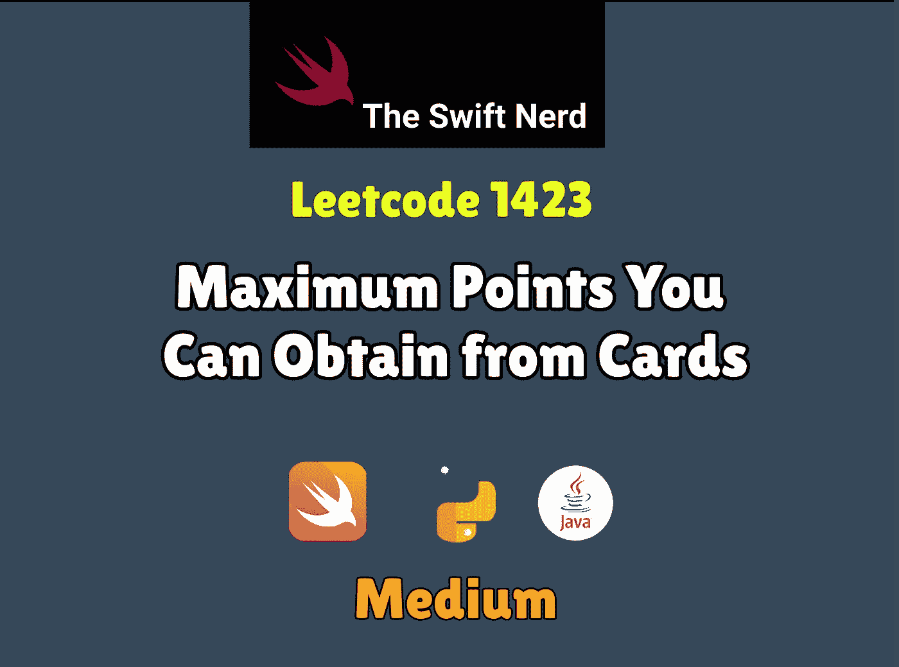

# Swift Leetcode Challenge:您可以从卡片中获得的最高点数

> 原文：<https://medium.com/nerd-for-tech/swift-leetcode-challenge-maximum-points-you-can-obtain-from-cards-dc57330479a2?source=collection_archive---------20----------------------->

## Swift 中的滑动窗口+双指针

[](https://theswiftnerd.com/maximum-points-you-can-obtain-from-cardsleetcode-1423/) [## 您可以从卡中获得的最高点数(Leetcode 1423)

### 难度:链接:第 11 天:May Leetcode 挑战有几张牌排成一排，每张牌都有一个…

theswiftnerd.com](https://theswiftnerd.com/maximum-points-you-can-obtain-from-cardsleetcode-1423/) 

你也可以通过上面的链接在 Swift Nerd 博客上阅读完整的故事。

# 问题陈述

有几张卡片**排成一行**，每张卡片都有相关的点数，点数在整数数组`cardPoints`中给出。

在一个步骤中，您可以从该行的开头或结尾抽取一张牌。你得拿正好`k`张牌。你的分数是你所拿的牌的分数之和。

给定整数数组`cardPoints`和整数`k`，返回可以获得的*最大分数*。

# 例子

```
**Input:** cardPoints = [1,2,3,4,5,6,1], k = 3
**Output:** 12
**Explanation:** After the first step, your score will always be 1\. However, choosing the rightmost card first will maximize your total score. The optimal strategy is to take the three cards on the right, giving a final score of 1 + 6 + 5 = 12.**Input:** cardPoints = [2,2,2], k = 2
**Output:** 4
**Explanation:** Regardless of which two cards you take, your score will always be 4.**Input:** cardPoints = [9,7,7,9,7,7,9], k = 7
**Output:** 55
**Explanation:** You have to take all the cards. Your score is the sum of points of all cards.**Input:** cardPoints = [1,1000,1], k = 1
**Output:** 1
**Explanation:** You cannot take the card in the middle. Your best score is 1.**Input:** cardPoints = [1,79,80,1,1,1,200,1], k = 3
**Output:** 202
```

**约束:**

*   `1 <= cardPoints.length <= 10^5`
*   `1 <= cardPoints[i] <= 10^4`
*   `1 <= k <= cardPoints.length`

# 解决办法

这个问题看起来像是取 k 的最大值，但是问题是我们可以从两端取值。所以我们无论如何都要从左边或者右边取总 k 值。

# 双指针

我们可以只取 **k** 个值，所以这些值可以是左边的，也可以是右边的，或者一些值是左边的，其余的是右边的，但是值的总数是 K。我们可以创建一个左右两边 K 值的 [**前缀和**](https://www.geeksforgeeks.org/prefix-sum-array-implementation-applications-competitive-programming/) 。然后，我们可以遵循双指针技术来迭代两端值的可能组合。最初，我们从左边取 0 个值，从右边取 k 个值的和，然后从左边取 1 个值，从右边取 k-1 个值，直到我们得到左边的 k 个值和右边的 0 个值。我们可以使用一个变量并更新最大值来跟踪可能的最大和。我们的解决方案的复杂度将是 O(K ),但是由于我们正在保存前缀和，因此将需要 O(N)空间。

> 我们能做得更好吗？

**阅读博客上的帖子，了解完整的详细解释**

# 复杂性分析

该解决方案的复杂度将是 O(K ),并且因为我们正在保存前缀总和，所以将需要 O(K)的额外空间

**时间= O(K)**

**空间= O(K)**

感谢您的阅读。如果你喜欢这篇文章，并发现它很有用，请分享并像野火一样传播它！

你可以在[swift 网站](https://theswiftnerd.com/)|[LinkedIn](https://www.linkedin.com/in/varunrathi28/)|[Github](https://github.com/varunrathi28)上找到我