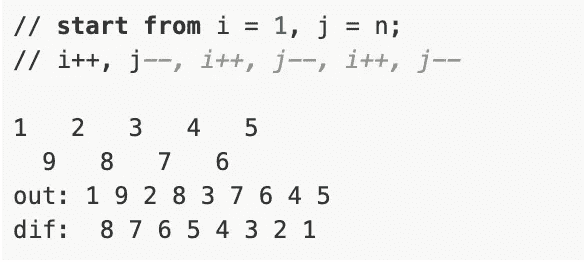

# Swift Leetcode 系列:美丽的安排 II

> 原文：<https://medium.com/nerd-for-tech/swift-leetcode-series-beautiful-arrangement-ii-f090ce408f99?source=collection_archive---------19----------------------->

## [4 月 Leetcode 挑战赛](https://leetcode.com/explore/challenge/card/april-leetcoding-challenge-2021/594/week-2-april-8th-april-14th/3705/):第 12 天(Leetcode #667 中等)

[](https://theswiftnerd.com/beautiful-arrangement-ii-leetcode-667/) [## 美丽的安排 II (Leetcode 667)

### 难度:链接:April Leetcoding 挑战 2021:第 12 天给定两个整数 n 和 k，需要构造一个列表…

theswiftnerd.com](https://theswiftnerd.com/beautiful-arrangement-ii-leetcode-667/) 

你也可以通过上面的链接在 Swift Nerd 博客上阅读完整的故事，以在其他语言中找到更多关于它的信息。

# 问题陈述

给定两个整数`n`和`k`，你需要构造一个列表，这个列表包含从`1`到`n`的`n`个不同的正整数，并且满足以下要求:
假设这个列表是【a1，a2，a3，…，an】，那么列表[| a1–a2 |，| a2–a3 |，| a3–a4 |，…，| an-1–an |]正好有`k`个不同的整数。

如果有多个答案，打印其中任何一个。

# 例子

```
**Input:** n = 3, k = 1
**Output:** [1, 2, 3]
**Explanation:** The [1, 2, 3] has three different positive integers ranging from 1 to 3, and the [1, 1] has exactly 1 distinct integer: 1.**Input:** n = 3, k = 2
**Output:** [1, 3, 2]
**Explanation:** The [1, 3, 2] has three different positive integers ranging from 1 to 3, and the [2, 1] has exactly 2 distinct integers: 1 and 2.
```

# 限制

1.  `n`和`k`在 1 < = k < n < = 104 的范围内。

# 解决办法

这个问题有点棘手，但我们会努力找出一种模式。当 k = 1 时，意味着在|a1 — a2|、|a2 — a3|、|a3 — a4|、…、|an-1 — an|的列表中，只能有一个不同的元素。由于我们的数字都在**【1，n】**的范围内，所以它们都相差 1，这是明显的。因此，对于 K = 1，我们可以简单地以递增或递减的方式返回数列[1，n]，即 **[1，2，3 … N]** 或 **[N，N-1，…1】**。

当 k 很大时，问题变得更加棘手。对于**【1，n】**的范围，最大可能差值为 n-1。并且由于最小差值是 1，所以差值将在**【1，n-1】**的范围内。这里要注意的是 k 的最大值是 n-1。我们以 **n = 5** 和 **k = 4** 为例。获得 **4** 的绝对差值的唯一可能方式是 **1** 和 **5** 连续。之后 **3** 的下一个最小绝对差值有两种可能，分别是**1**4 或**2**5。由于 **1** 和 **5** 已经彼此相邻，这意味着我们可以用**【1，5，2】**或**【4，1，5】**实现第二步。

我们可以观察到，我们可以通过**交替追加**或**之字形**来获得结果(听起来很酷！)这两个极端的可能值。在我们插入 k 值之后，我们可以通过简单地递增来插入**(n-k)**值的结果。



为了以之字形顺序填充值，我们可以在第一部分**【1，k+1】**中取左值和右值。我们可以使用模块操作 **(i % 2)** 交替递增它们。两个指针将会相向移动( **Left ++和 right —** )，我们将会迭代直到我们已经填充了 **k** 个值，这标志着我们的第一次通过。对于第二遍，我们可以简单地从 k + 1 循环到 n，并填充 i +1(因为 I 是基于 0 的，值的范围应该是**【0，n】**)。

有一个关于这个 [leetcode](https://leetcode.com/problems/beautiful-arrangement-ii/discuss/106948/c-java-clean-code-4-liner) 的有趣的论坛，在那里我得到了解决方案的想法。

# 复杂性分析

*时间* = **O(N)** 我们迭代两次来构建我们的模式，一次是针对 **1 到 k + 1** ，然后是针对 **k + 2 到 n** 。做的总功是 **2*N** ，渐近为 O(N)。

*空格* = **O(1)** 。我们采用了一个输出数组，但这完全是因为问题的需要。否则，我们可以直接在控制台上输出，这也将是完美的。

感谢您的阅读。如果你喜欢这篇文章，并发现它很有用，请分享并像野火一样传播它！

你可以在[the swift nerd](https://theswiftnerd.com/)|[LinkedIn](https://www.linkedin.com/in/varunrathi28/)|[Github](https://github.com/varunrathi28)上找到我