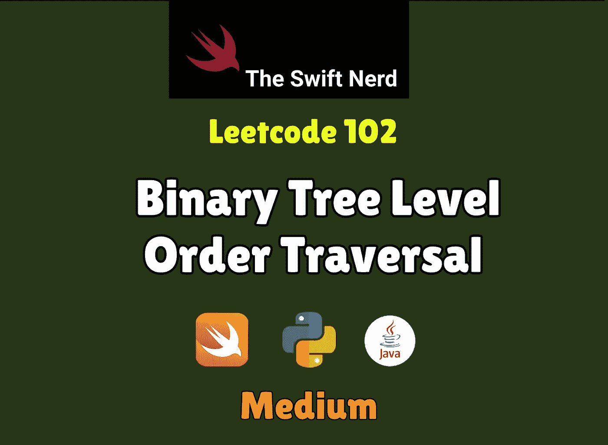

# Swift Leetcode 系列:二叉树层次顺序遍历

> 原文：<https://medium.com/nerd-for-tech/swift-leetcode-series-binary-tree-level-order-traversal-db7603af1bb3?source=collection_archive---------14----------------------->

## 像专家一样快速穿过树林🚀 🚀 🚀

[](https://theswiftnerd.com/binary-tree-level-order-traversal/) [## 二叉树层次顺序遍历(Leetcode 102)

### 难度:链接:第 12 天:五月 Leetcode 挑战给定二叉树的根，返回遍历的层次顺序…

theswiftnerd.com](https://theswiftnerd.com/binary-tree-level-order-traversal/) 

你可以通过上面的链接在 Swift Nerd 博客上阅读完整的故事。

# 问题描述

给定二叉树的`root`，返回*其节点值*的层次顺序遍历。(即从左到右，逐层)。

# 例子


```
**Input:** root = [3,9,20,null,null,15,7]
**Output:** [[3],[9,20],[15,7]]**Input:** root = [1]
**Output:** [[1]]**Input:** root = []
**Output:** []
```

# 限制

*   树中的节点数量在范围`[0, 2000]`内。
*   `-1000 <= Node.val <= 1000`

# 解决办法

# 广度优先搜索

BFS 方法包括使用一种叫做 **Queue(q)** 的数据结构，这样我们就可以按照正确的顺序处理树的节点。队列按照先进先出( **FIFO** )的顺序运行，所以插入会在末尾，从前面移除。我们可以使用该属性，并通过在每次迭代后查找队列中的元素计数来计算下一级要处理的项目数。

# 复杂性分析

*   **时间复杂度= O(N)** 因为每个节点恰好被处理一次。
*   **空间复杂度= O(N)** 保持包含`N`节点值的输出结构

感谢您的阅读。如果你喜欢这篇文章，并发现它很有用，请分享并像野火一样传播它！

你可以在[the swift nerd](https://theswiftnerd.com/)|[LinkedIn](https://www.linkedin.com/in/varunrathi28/)|[Github](https://github.com/varunrathi28)上找到我