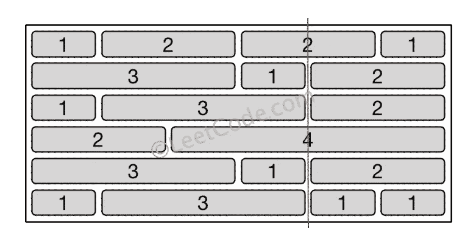
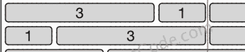

# Swift Leetcode 系列:砖墙

> 原文：<https://medium.com/nerd-for-tech/swift-leetcode-series-brick-wall-273f424e76b4?source=collection_archive---------12----------------------->

## 查看适用于 Leetcode 554 的 Swift 解决方案


四月 Leetcode 挑战:第 22 天

[](https://theswiftnerd.com/leetcode-brick-wall-solution/) [## 砖墙(Leetcode 554)

### 难度:标签:四月 Leetcode 挑战:第 22 天你面前有一堵砖墙。这堵墙是长方形的…

theswiftnerd.com](https://theswiftnerd.com/leetcode-brick-wall-solution/) 

你也可以通过上面的链接在 Swift Nerd 博客上阅读完整的故事。

# 问题陈述

你面前有一堵砖墙。墙是长方形的，有几排砖。这些砖块高度相同，但宽度不同。你要从**顶**到**底**画一条垂直线，穿过**最少的**砖块。

砖墙由一列行表示。每一行都是一个整数列表，从左到右表示这一行中每个砖块的宽度。

如果你的线穿过砖块的边缘，那么砖块不被认为是交叉的。你需要找出如何画出穿过最少砖块的线，并返回穿过砖块的数量。

你不能只沿着墙的两条垂直边中的一条画一条线，在这种情况下，这条线显然不会穿过任何砖块。

**举例:**

```
**Input:** [[1,2,2,1],
        [3,1,2],
        [1,3,2],
        [2,4],
        [3,1,2],
        [1,3,1,1]]**Output:** 2**Explanation:**
```



# 限制

1.  不同行砖块的宽度总和相同，不会超过 INT_MAX。
2.  每行砖的数量在[1，10，000]的范围内。墙的高度在[1，10，000]的范围内。这堵墙的总砖数不会超过 2 万块。

# 解决办法

如果我们能理解你实际需要计算什么，问题就简单了。这是一个贪婪问题的例子，我们需要最小化交叉砖块的数量(或者通过它们平分)。由于砖块具有不同的长度，并且它们将相对于其他砖块层水平堆叠，因此砖块末端重合的点将会出现。把注意力集中在图片的一小部分，以便更好地理解。



在同一垂直线上结束的砖块需要从左边和右边有相同的偏移量。可以通过将从开始到当前砖块的所有砖块的长度相加来计算偏移量。我们可以维护一个字典来存储偏移的频率。由于一个偏移量在单个砖块行中只能出现一次，因此计数值将表示在该距离处结束的砖块的数量。

# 前缀和

为了计算偏移量，我们需要计算每一行的前缀总和。这可以简单地通过初始化一个行和变量，遍历砖块数组，并将当前砖块添加到和变量中来完成。在计算前缀和之后，我们需要增加字典中的频率。请注意，我们不能考虑起点和终点(因为所有砖块都在公共垂直线上开始和结束，所以答案在这两条线上总是零)。在计算前缀总和时，我们需要忽略每一行中的最后一块砖，这样就不会计算它的前缀总和。

# 贪婪的方法

这个问题是一个经典的贪婪问题，需要最小化/最大化一些量来得到结果。为了穿过最少的砖块，我们需要最大化在一条共同的垂直线结束的砖块。答案最终将是总行数和最大行数之间的差值。

```
min_crossed_bricks = total_brick_rows - max_rows_with_common_endpoint
```

# 复杂性分析

因为我们正在遍历每一块砖，所以操作将等于砖的总数。

*时间* = **O(N * M)** 其中 N 行，M 是单行中可能的最大砖块数。

*空格* = **O(N * M)**

感谢您的阅读。如果你喜欢这篇文章，并发现它很有用，请分享并像野火一样传播它！

你可以在[the swift nerd](https://theswiftnerd.com/)|[LinkedIn](https://www.linkedin.com/in/varunrathi28/)|[Github](https://github.com/varunrathi28)上找到我