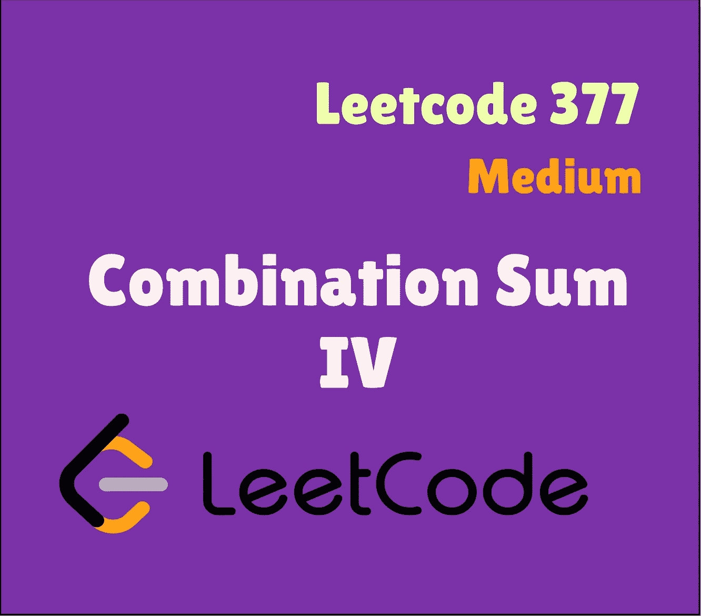
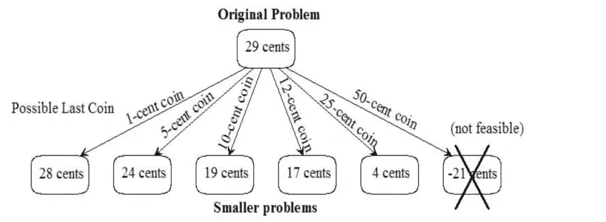

# Swift Leetcode 系列:组合 Sum IV

> 原文：<https://medium.com/nerd-for-tech/swift-leetcode-series-combination-sum-iv-748a8380b8ad?source=collection_archive---------12----------------------->

## 回溯+ DP =漂亮的大脑锻炼



[Leetcode 377(中号)](https://leetcode.com/problems/combination-sum-iv/)

[](https://theswiftnerd.com/combination-sum-iv-leetcode/) [## 组合和 IV (Leetcode 377)

### 难度:链接:April Leetcoding 挑战 2021:第 19 天给定一个非重复整数数组 num 和一个目标整数…

theswiftnerd.com](https://theswiftnerd.com/combination-sum-iv-leetcode/) 

你也可以通过上面的链接在 Swift Nerd 博客上阅读完整的故事。

这是经典 coint change 问题的一个变种，如果你想改进你的递归和动态编程，自己解决它是非常重要的。

# 问题描述

给定一个由**个不同的**个整数`nums`和一个目标整数`target`组成的数组，返回*加起来等于* `target`的可能组合数。

答案是**保证**适合一个 **32 位**整数。

**例 1:**

```
**Input:** nums = [1,2,3], target = 4
**Output:** 7
**Explanation:**
The possible combination ways are:
(1, 1, 1, 1)
(1, 1, 2)
(1, 2, 1)
(1, 3)
(2, 1, 1)
(2, 2)
(3, 1)
Note that different sequences are counted as different combinations.
```

**例 2:**

```
**Input:** nums = [9], target = 3
**Output:** 0
```

# 限制

*   `1 <= nums.length <= 200`
*   `1 <= nums[i] <= 1000`
*   `nums`的所有元素都是**独有的**。
*   `1 <= target <= 1000`

# 解决办法

该问题类似于硬币找零问题的经典问题。我们可以考虑递归地将问题分解成子问题，然后构建我们的解决方案。

# 追踪

每当你听到“组合”或“排列”这个词，理想情况下，回溯这个词应该出现在你的脑海中。我们可以使用回溯来置换所有可能的数字组合，并选择适合我们条件的分支。看看硬币兑换问题的例子。



我们可以从目标开始，递归地尝试 nums 数组中每个数字的组合。如果我们有一个目标 **T** 并且从数组中取一个数 A[i]，其中 0 < = i < n，那么子问题将变成为 **T — A[i]** 寻找总的组合，这将依次递归地置换所有可能的路径。一旦 T-A[I]= = 0，这意味着当前分支是一个解，我们可以把它加到结果中。如果 **T — A[i] < 0** ，这意味着数字的当前排列不能给我们目标和，因此我们可以丢弃该分支。

# 重要事项:

当你试图运行这个问题时，它会运行样本测试用例，但是你会在提交时得到 **TLE** ( **时间限制超过**)。为什么？因为递归的深度。对于回溯方法，复杂度将是指数级的 **O(NM)** 。其中 N 是数组的大小，M 是最终总和。在约束中，数组的最大大小为 200，而目标可以是 1000。所以我们在讨论顺序为 **200 1000** 的操作，这是一个大规模的操作(不要忘记空间的递归堆栈)。但是因为我们重复了很多操作，我们可以缓存它们，这就是动态编程的用武之地。

因为没有 DP 我们不能提交问题，那么它是唯一可能的解决方案(DP ),但是回溯方法对于发展直觉和理解子问题是重要的。有了更少的约束，我们的回溯解也能得到接受。

# 动态规划

这是一个经典的动态规划问题，因为该问题可以分解为子问题，优化局部结果将有助于优化全局结果。(**重叠子问题**和**优化结构**)。代码或多或少是相同的，但是我们将缓存解决每个子问题的结果。DP[i]将表示实现总和 I 的可能组合的总数。我们将使用自上而下的动态规划，因为我们将从我们的主要问题开始，并朝着较小的子问题努力。还有一种自下而上的方法，我们从 1 开始解决子问题，并朝着主问题和过程努力，我们将解决所有可能的递归步骤，这是我们解决最终问题所需要的。

**自上而下的方法**

我们的 DP 数组( **dp** )将包含单元格( **dp[i]** )，其中 **i** 将表示在 **T** 之前剩余的空间，而 **dp[i]** 将表示从 **i** 到达解(**DP[T】**)的方式的数量。

在我们构建 **dp** 时，在 **i** 的每个值处，我们将遍历我们的数字数组( **N** )中不同的 **num** s，并考虑每个**num**(**DP【I-num】**)可以到达的单元格。因此， **dp[i]** 的值将是这些可能移动的结果的总和。

# 密码

# 回溯(递归)

# 代码:自上而下方法(DP)

# 复杂性分析

# 追踪

**Time = O(NM)** 其中 N 是数组的大小，M 是总量。

**空间= O(1)**

把递归想象成一棵树，每条路径代表一种凑数的方式，树的高度是拥有最多硬币的组合。由于数量是固定的，包含最多硬币的组合将使用最小的硬币。在最坏的情况下，树的根节点可以有 n 个子节点。因此，运行时间成指数增长。

# 动态规划

Time = **O(N * M)** 其中 N 是数组的大小，M 是总量。

Space = **O(M)** (用于存储从 0 到 M 的结果)

感谢您的阅读。如果你喜欢这篇文章，并发现它很有用，请分享并像野火一样传播它！

你可以在[the swift nerd](https://theswiftnerd.com/)|[LinkedIn](https://www.linkedin.com/in/varunrathi28/)|[Github](https://github.com/varunrathi28)上找到我