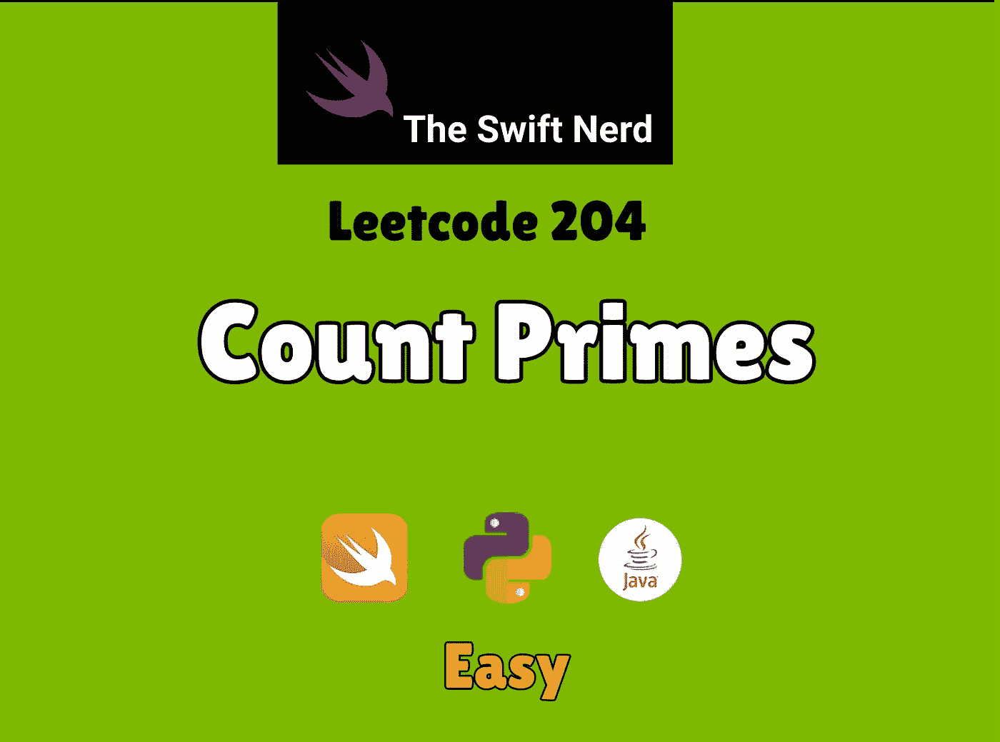

# Swift Leetcode 系列:计算素数

> 原文：<https://medium.com/nerd-for-tech/swift-leetcode-series-count-primes-f48b02e5351d?source=collection_archive---------21----------------------->

## 厄拉多塞的 Swift +筛子=🤔 🧠

[](https://theswiftnerd.com/count-primes-leetcode/) [## 计算质数-

### 难度:链接:第二天:LeetCode Challenge 可以统计出小于一个非负数的素数个数，n…

theswiftnerd.com](https://theswiftnerd.com/count-primes-leetcode/) 

你可以查看 Swift Nerd 博客上的完整解释，以及上面链接上的其他酷帖。

# 问题描述

计算小于非负数的素数的个数，`n`。

# 例子

```
**Input:** n = 10
**Output:** 4
**Explanation:** There are 4 prime numbers less than 10, they are 2, 3, 5, 7.**Input:** n = 0
**Output:** 0**Input:** n = 1
**Output:** 0
```

# 限制

*   `0 <= n <= 5 * 106`

# 解决办法

这个问题是不言而喻的，解决起来很简单，但是优化起来有点棘手。质数是只能被 1 和它本身整除的数。你可以对 0 到 n 之间的整数进行布特力素性检查，更新计数。然而，复杂度将是 O(N2)的阶，并且因为 N 被给定为 106 的阶，所以 N2 将被 1012 限制，这将肯定导致 **TLE** (时限超过误差)。

# 厄拉多塞筛

这是一个计算一定范围内的素数的古老算法，在竞争性编程中非常流行(阅读厄拉多塞的[筛子)。在这个算法中，我们创建了一个可能的数字列表，从最小的可能数字开始，我们丢弃该数字范围内的所有倍数，依此类推。我们可以从最小的质数 2 开始，把它的所有倍数一直标到“n”都标为非质数。然后，我们对数组中未标记为复合的下一个可用数字重复相同的过程，依此类推。最后，我们可以列出所有没有标质数的数字，这就是我们的结果集。](https://en.wikipedia.org/wiki/Sieve_of_Eratosthenes)


为了简化我们的逻辑，每当我们把一个指数作为非主要的，我们可以保持一个非主要市场数字的计数器，并增加它。最初 1 被标记为非素数。因为我们只检查到 n-1

```
num_primes = n - 1 - no_non_primes
```

# 复杂性分析

时间复杂度由 loglogN 限定。然而，由于因式分解定理，外部循环运行 *√n* 。因此总复杂度变成了 *O(√n* * Log(LogN))。我们只存储 N + 1 个元素来生成非素数，因此空间以 O(N)为界。

**Time =*O(√n** Log(LogN))**

**空格= O(N)**

复杂度的证明在这里给出[。你也可以在 leetcode 论坛上查看](http://www.cs.umd.edu/~gasarch/BLOGPAPERS/sump.pdf)[讨论](https://leetcode.com/problems/count-primes/discuss/473021/Time-Complexity-O(log(log(n))-Explained)。

感谢您的阅读。如果你喜欢这篇文章，并发现它很有用，请分享并像野火一样传播它！

你可以在[swift 网站](https://theswiftnerd.com/)|[LinkedIn](https://www.linkedin.com/in/varunrathi28/)|[Github](https://github.com/varunrathi28)上找到我