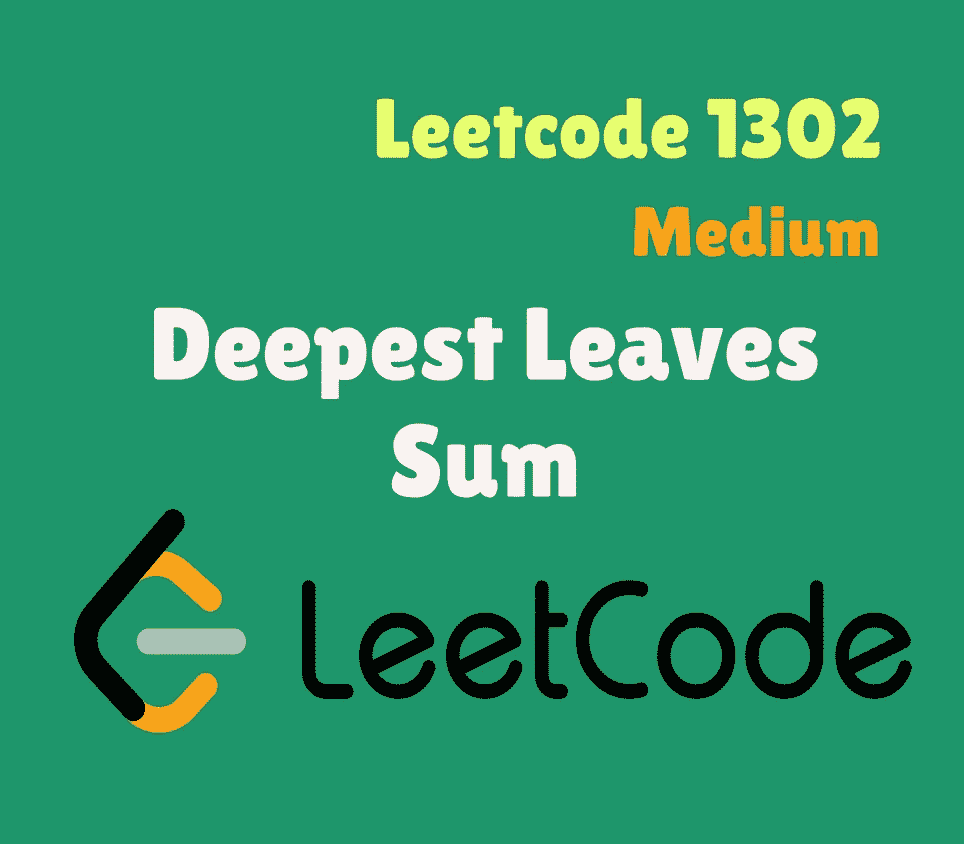
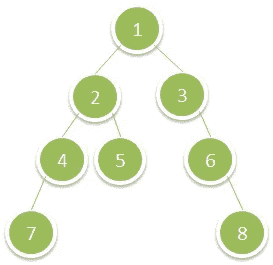

# Swift Leetcode 系列:最深的叶子和

> 原文：<https://medium.com/nerd-for-tech/swift-leetcode-series-deepest-leaves-sum-b681746565b1?source=collection_archive---------16----------------------->

[Swift 中的 Leetcode 1302(中)](https://leetcode.com/explore/challenge/card/april-leetcoding-challenge-2021/594/week-2-april-8th-april-14th/3704/)

[](https://theswiftnerd.com/deepest-leaves-sum-leetcode-1302/) [## 最深的叶子总和(Leetcode 1302)

### 难度:标签:April Leetcoding 挑战 2021:第 11 天给定一棵二叉树的根，返回…的值之和

theswiftnerd.com](https://theswiftnerd.com/deepest-leaves-sum-leetcode-1302/) 

你也可以在 Swift Nerd 博客上阅读完整的故事，并通过链接找到更多有趣的帖子。

# 问题描述

给定二叉树的`**root**`，返回*其最深叶*的值之和。

# 例子

**例 1**



```
**Input:** root = [1,2,3,4,5,null,6,7,null,null,null,null,8]
**Output:** 15
```

**例 2**

```
**Input:** root = [6,7,8,2,7,1,3,9,null,1,4,null,null,null,5]
**Output:** 19
```

# 限制

*   **树中的节点数在** `**[1, 104]**` **范围内。**
*   `**1 <= Node.val <= 100**`

# 解决办法

这是经典的树搜索技术的扩展。如果我们仔细观察，因为所有最深的节点也形成最后一级。我们可以使用**广度优先搜索(BFS)** 并将该级别中所有节点的总和存储在一个变量中。当我们完成最后一层时，sum 变量将剩下所有最深节点的总和。

或者，我们也可以使用**深度优先搜索(DFS)** 并使用递归遍历到最深的节点。我们可以找到树的高度，然后将树的高度作为参数传递，以检查我们是否在最深的节点，并简单地返回这些节点的值。我们将详细讨论这两种方法。

# 横向优先搜索

BFS 方法包括使用一种叫做 **Queue(q)** 的数据结构，这样我们就可以按照正确的顺序处理树的节点。队列按照先进先出(FIFO)的顺序运行，所以插入会在末尾，从前面移除。我们可以使用该属性，并通过在每次迭代后查找队列中的元素计数来计算下一级要处理的项目数。这是一个棘手的步骤，也是问题的主要症结。为了找到级别的总和，我们可以在迭代队列时将值相加，并在每次遍历后将总和重置为 0。处理完所有级别后，***sum 变量将剩下最后一个级别*** 的总和，因为我们 ***只在下一次正向迭代*** 中重置总和。

现在，在队列为空之后，levelSum 将拥有所有最深层的节点值，我们只需要返回它；).

# 深度优先搜索

另一个解决问题的方法是先找到树的最大深度。在下一步中，我们可以从根和每个递归调用开始我们的递归，增加当前级别并传递最大深度(在步骤 1 中计算)。当级别等于最大深度时，我们可以从递归步骤返回节点值并将它们相加。为了计算树的高度，我们可以使用简单的递归函数。

# 密码

## 使用 BFS 方法

## 使用 DFS

# 复杂性分析

时间复杂度= **O(V)** 其中 V 是顶点(图)或节点(树)的总数

空间占用= **O(V)** ，因为在最坏的情况下，我们可以让所有级别的节点同时进入队列。

感谢您的阅读。如果你喜欢这篇文章，并发现它很有用，请分享并像野火一样传播它！

你可以在[网站](https://theswiftnerd.com/)|[LinkedIn](https://www.linkedin.com/in/varunrathi28/)|[Github](https://github.com/varunrathi28)上找到我