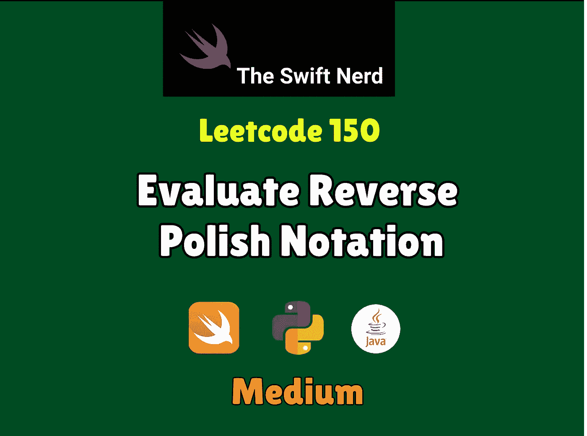

# Swift Leetcode 系列:评估反向波兰符号

> 原文：<https://medium.com/nerd-for-tech/swift-leetcode-series-evaluate-reverse-polish-notation-9ee82c527f68?source=collection_archive---------16----------------------->

## 堆栈+表达式= Leetcode 150🚀 🚀 🚀

[](https://theswiftnerd.com/evaluate-reverse-polish-notation-leetcode/) [## 评估反向波兰符号(Leetcode 150)

### 难度:链接:第 25 天:May Leetcode Challenge 评估一个算术表达式在逆向波兰中的值…

theswiftnerd.com](https://theswiftnerd.com/evaluate-reverse-polish-notation-leetcode/) 

点击上面的链接，阅读 Swift Nerd 博客上的完整故事。

# 问题描述

评估[反向波兰符号](http://en.wikipedia.org/wiki/Reverse_Polish_notation)中算术表达式的值。

有效的运算符有`+`、`-`、`*`和`/`。每个操作数可以是整数或其他表达式。

**注意**两个整数之间的除法应该向零截断。

保证给定的 RPN 表达式总是有效的。这意味着表达式将始终计算结果，并且不会有任何被零除的操作。

# 例子

```
**Input:** tokens = ["2","1","+","3","*"]
**Output:** 9
**Explanation:** ((2 + 1) * 3) = 9**Input:** tokens = ["4","13","5","/","+"]
**Output:** 6
**Explanation:** (4 + (13 / 5)) = 6**Input:** tokens = ["10","6","9","3","+","-11","*","/","*","17","+","5","+"]
**Output:** 22
**Explanation:** ((10 * (6 / ((9 + 3) * -11))) + 17) + 5
= ((10 * (6 / (12 * -11))) + 17) + 5
= ((10 * (6 / -132)) + 17) + 5
= ((10 * 0) + 17) + 5
= (0 + 17) + 5
= 17 + 5
= 22
```

# 限制

*   `1 <= tokens.length <= 104`
*   `tokens[i]`可以是运算符:`"+"`、`"-"`、`"*"`或`"/"`，也可以是范围`[-200, 200]`内的整数。

# 解决办法

我们可以立即想到一种强力方法，在这种方法中，我们可以动态地评估结果。然而，当我们需要回溯一个嵌套表达式时，问题就出现了。*例如:*

```
Input : ["4","13","5","/","+"]
Result : (4 + (13 / 5)) = 6
```

在这种情况下，我们可能不得不反向追踪整个数组，这将增加它的复杂度到 O(N2)。我们需要想出一个更好的方法。

如果你知道[反向波兰符号](https://en.wikipedia.org/wiki/Reverse_Polish_notation)的历史，它是专门设计来通过更有效地使用**堆栈**使计算更容易。使用堆栈将使我们能够获得最后两个操作数，并轻松地存储结果值以供将来计算。因为给定输入总是有效的反向波兰表达式，因此我们在任何操作符之前至少有两个操作数(+ / — *)。还有一点需要注意的是，在 **/和-** 的情况下，操作数的顺序很重要。所以如果输入是**3 2—**，那么结果应该是**3–2**而不是**2–3**。我们可以通过使用堆栈的顶部作为第二个操作数，并在其之后弹出的值作为第一个操作数来确保这一点。我们还需要将结果推回到堆栈中，最终结果会留在堆栈中，我们可以返回。

# 复杂性分析

我们对输入数组进行线性迭代，并弹出最后两个元素，以防遇到 O(1)操作的操作符。因此，这是一个 O(N)算法。对于空间，我们使用一个堆栈，在最坏的情况下，它会一次包含所有的元素。

**时间= O(N)**

**空间= O(N)**

感谢您的阅读。如果你喜欢这篇文章，并发现它很有用，请分享并像野火一样传播它！

你可以在[网站](https://theswiftnerd.com/)|[LinkedIn](https://www.linkedin.com/in/varunrathi28/)|[Github](https://github.com/varunrathi28)上找到我