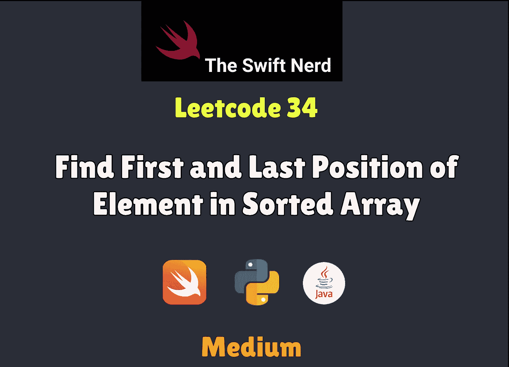
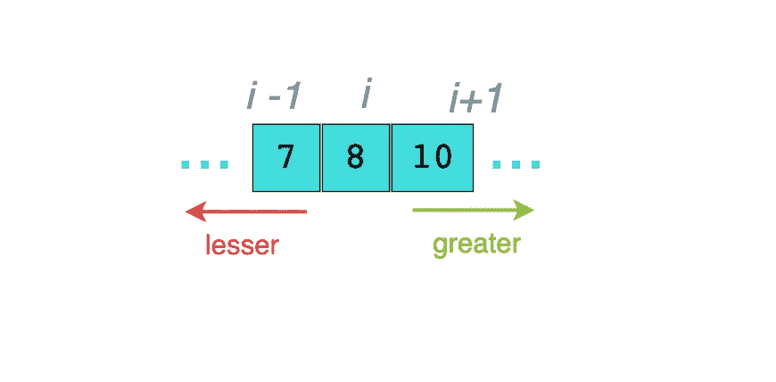

# Swift Leetcode 系列:查找排序数组中元素的第一个和最后一个位置

> 原文：<https://medium.com/nerd-for-tech/swift-leetcode-series-find-first-and-last-position-of-element-in-sorted-array-6ca2475b33d0?source=collection_archive---------13----------------------->

✅ ✅ ✅与二分搜索法魔术队



Leetcode 34

[](https://theswiftnerd.com/find-first-and-last-position-in-sorted-array-leetcode/) [## 查找排序数组中元素的第一个和最后一个位置(Leetcode 34)

### 难度:链接:四月 Leetcode 挑战:第 29 天给定一个按升序排列的整数 num 数组，找出…

theswiftnerd.com](https://theswiftnerd.com/find-first-and-last-position-in-sorted-array-leetcode/) 

你也可以在 Swift Nerd 博客上阅读完整的故事，以及上面链接上的其他有趣的故事。

# 问题描述

给定一个按升序排序的整数数组`nums`，找出给定`target`值的开始和结束位置。

如果在数组中没有找到`target`，返回`[-1, -1]`。

**跟进:**你能写一个有`O(log n)`运行时间复杂度的算法吗？

# 例子

```
**Input:** nums = [5,7,7,8,8,10], target = 8
**Output:** [3,4]**Input:** nums = [], target = 0
**Output:** [-1,-1]
```

# 限制

*   `0 <= nums.length <= 105`
*   `-109 <= nums[i] <= 109`
*   `nums`为非递减数组。
*   `-109 <= target <= 109`

# 解决办法

一个简单直接的解决方案是迭代数组，并使用两个变量跟踪第一个和最后一个位置。这将是一个线性操作，非常容易实现，但是，这不是一个最佳的解决方案。每当我们得到一个排序数组时，我们都应该考虑对数复杂度。我们应该利用的属性是排序数组中任何元素的，大于它的元素在右边，小于它的元素在左边。哪种算法能让我们做到这一点？



# 二进位检索

排序数组和二分搜索法总是携手并进。我们可以修改普通二分搜索法来查找第一个/最后一个位置，首先查找目标的索引，然后查找比目标稍大的数字的索引。

首先，我们可以在 **T** 上执行标准的左二分搜索法( **find** )。接下来，我们可以通过检查存储在第一次搜索结果中的值( **N[Tleft]** )来查看 **T** 是否已经存在于 **N** 中。如果我们在那个索引处没有找到 **T** ，那么 **T** 在 **N** 中不存在，我们应该**返回[-1，-1]** 。

否则，我们仍然需要在 **N** 中找到 **T** 值范围的右端。为此，我们可以再次使用**查找**，这次使用下一个整数( **T + 1** )。由于这将在 **T** 值范围的末端之后找到索引*，我们可以仅向后移动一个位置来找到 **T** 范围的末端。*

另一种方法是创建两个函数，一个用于寻找下界，另一个用于寻找上界。由于两者都将使用二分搜索法，渐近界限将在 LogN 内。这种方法很简单，但有点多余，虽然我们可以在一个函数中通过传递一个类似标志的标识符来表示我们想向左还是向右。

# 复杂性分析

*   ***时间复杂度:O(log N)*** *为二分搜索法*
*   ***空间复杂度:O(1)***

感谢您的阅读。如果你喜欢这篇文章，并发现它很有用，请分享并像野火一样传播它！

你可以在[the swift nerd](https://theswiftnerd.com/)|[LinkedIn](https://www.linkedin.com/in/varunrathi28/)|[Github](https://github.com/varunrathi28)上找到我