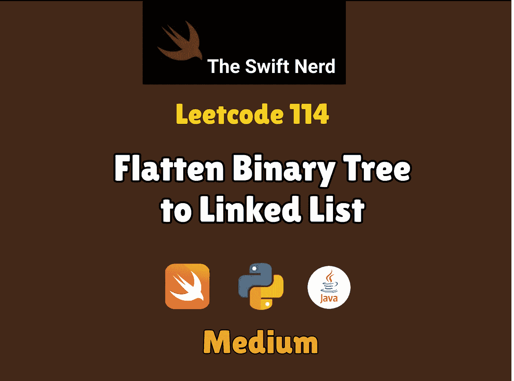
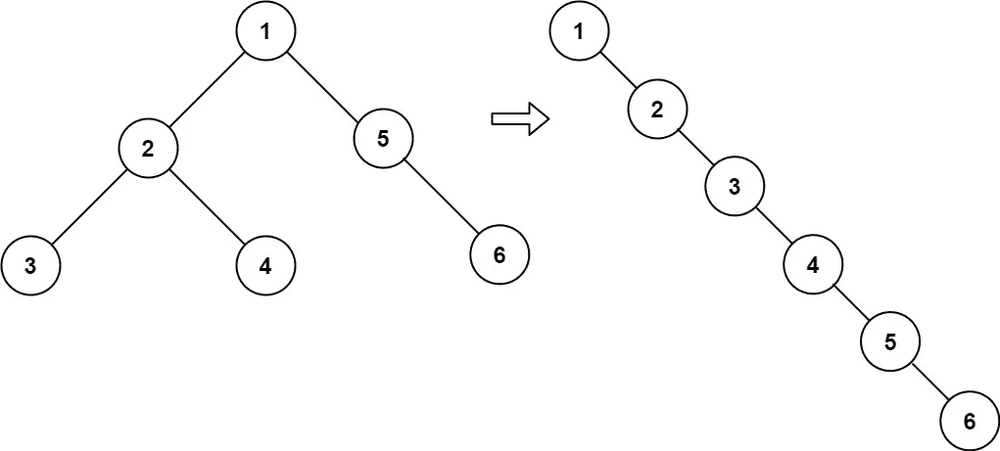
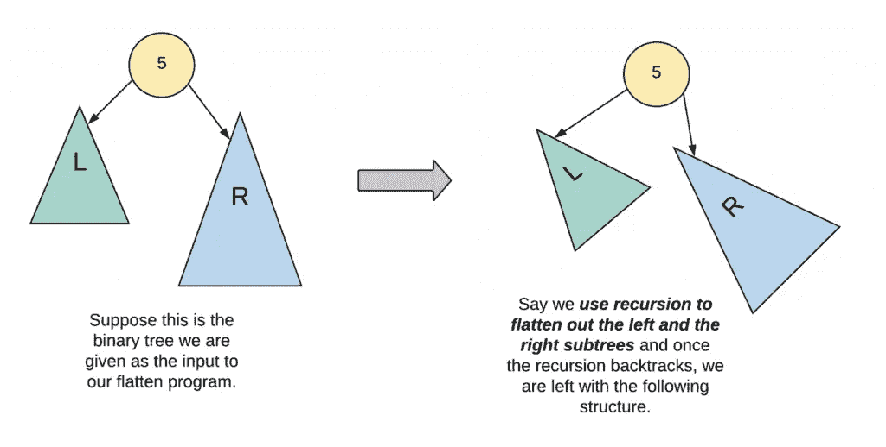

# Swift Leetcode 系列:将二叉树扁平化为链表

> 原文：<https://medium.com/nerd-for-tech/swift-leetcode-series-flatten-binary-tree-to-linked-list-6049f114f51f?source=collection_archive---------20----------------------->

## **Swift +二叉树+链表= Leetcode 114 ✅✅✅**

[](https://theswiftnerd.com/flatten-binary-tree-to-linked-list/) [## 将二叉树展平为链表(Leetcode 114)

### 给定一棵二叉树的根，把树展平成一个“链表”。“链表”应该使用相同的 TreeNode…

theswiftnerd.com](https://theswiftnerd.com/flatten-binary-tree-to-linked-list/) 

点击上面的链接查看 Swift Nerd 博客上的完整故事。

# 问题描述

给定一棵二叉树的`root`，将该树展平成一个“链表”:

*   “链表”应该使用相同的`TreeNode`类，其中`right`子指针指向列表中的下一个节点，而`left`子指针总是`null`。
*   “链表”的顺序应该与二叉树的 [**前序遍历**](https://en.wikipedia.org/wiki/Tree_traversal#Pre-order,_NLR) 相同。

# 例子



```
**Input:** root = [1,2,5,3,4,null,6]
**Output:** [1,null,2,null,3,null,4,null,5,null,6]**Input:** root = []
**Output:** []**Input:** root = [0]
**Output:** [0]
```

# 限制

*   树中的节点数在范围`[0, 2000]`内。
*   `-100 <= Node.val <= 100`

**跟进:**你能原地把树放平吗(有`O(1)`额外空间)？

# 解决办法

我们可以直观地想到一种递归方法来遍历预排序方法中的列表，并递归地将左右子树转换为偏斜树。



递归求解左右子树后，我们需要做的就是修正一些关于房间的指针。这种递归将自下而上移动，当根节点被处理时，我们确信我们已经转换了左边和右边的子树。现在保留一个指针来遍历左边子树中最右边的节点(这是连接右边子树作为 tail 所需要的)。当我们到达左子树中的终端节点时，只需将左子树设置为根的右子树，并将原始的右子树与终端左节点的右子树连接起来。

# 追问:O(1)空间？

关注[博客](https://theswiftnerd.com/flatten-binary-tree-to-linked-list/)了解优化的解决方案。

# 复杂性分析

**时间= O(N)**

**Space = O(N** ) ( *用于递归的堆栈空间*)。

感谢您的阅读。如果你喜欢这篇文章，并发现它很有用，请分享并像野火一样传播它！

你可以在[the swift nerd](https://theswiftnerd.com/)|[LinkedIn](https://www.linkedin.com/in/varunrathi28/)|[Github](https://github.com/varunrathi28)上找到我