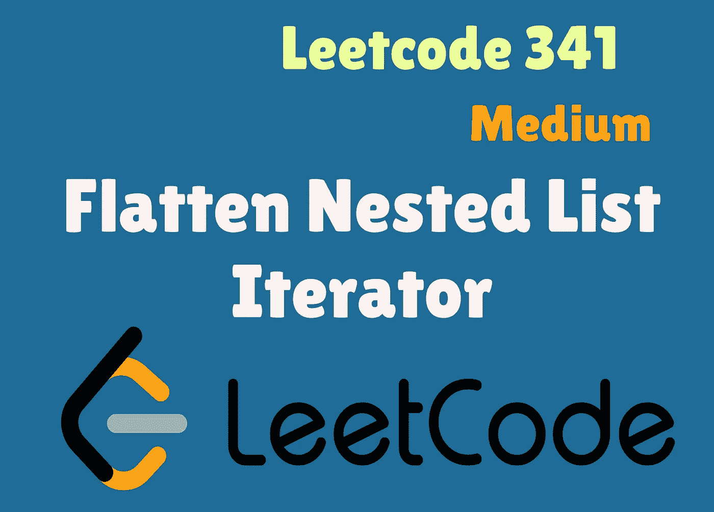

# Swift Leetcode 系列:扁平嵌套列表迭代器

> 原文：<https://medium.com/nerd-for-tech/swift-leetcode-series-flatten-nested-list-iterator-cfcfa88d53dd?source=collection_archive---------12----------------------->

## 4 月 Leetcode 挑战赛:Swift 第 13 天解决方案(Leetcode 341)

[](https://theswiftnerd.com/flatten-nested-list-iterator/) [## 展平嵌套列表迭代器(Leetcode 341)

### 难度:链接:April Leetcoding 第 13 天给你一个整数嵌套列表 nested list。每个元素都是…

theswiftnerd.com](https://theswiftnerd.com/flatten-nested-list-iterator/) 

您也可以通过上面的链接阅读 Swift Nerd 博客上的完整故事，以了解其他语言的更多信息。

# 问题描述

给你一个嵌套的整数列表`nestedList`。每个元素要么是整数，要么是列表，列表的元素也可以是整数或其他列表。实现一个迭代器将其扁平化。

实现`NestedIterator`类:

*   `NestedIterator(List<NestedInteger> nestedList)`用嵌套列表`nestedList`初始化迭代器。
*   `int next()`返回嵌套列表中的下一个整数。
*   如果嵌套列表中还有一些整数，则`boolean hasNext()`返回`true`，否则返回`false`。

# 例子

**例 1:**

```
**Input:** nestedList = [[1,1],2,[1,1]]
**Output:** [1,1,2,1,1]
**Explanation:** By calling next repeatedly until hasNext returns false, the order of elements returned by next should be: [1,1,2,1,1].
```

**例 2:**

```
**Input:** nestedList = [1,[4,[6]]]
**Output:** [1,4,6]
**Explanation:** By calling next repeatedly until hasNext returns false, the order of elements returned by next should be: [1,4,6].
```

# 限制

*   `1 <= nestedList.length <= 500`
*   嵌套列表中的整数值在范围`[-106, 106]`内。

# 解决办法

这个问题本质上非常简单，因为如果你仔细观察，就会发现这正是交互协议所做的事情。如果您对数组、集合或任何其他集合或序列使用`for`–`in`循环，那么您已经在使用该类型的迭代器了(当然使用了语法糖)。

在幕后，系统使用 makeIterator()创建一个迭代器，并对序列重复调用 next()。由于序列协议有一个相关类型的 *IteratorProtocol* ，你永远不必担心下一个元素是如何计算的。

第一直觉可能是直接使用 **flatmap()** 操作符，但是您应该再考虑一下。所有高阶运算符都在*序列*协议上定义，该协议本身符合*迭代协议*。这里的前提是，你必须实现迭代器的功能。所以如果你在面试中被问到这个问题，一定要先和你的面试官核实一下。

解决方案很简单，我们可以有一个存储整数列表的属性和一个维护当前索引的属性。初始化时，我们可以以深度优先的方式递归遍历嵌套列表。接下来要做的就是简单地检查一个元素是整数还是嵌套列表。你可能会被诱惑使用条件施法**T3 作为？** *Int* ，然而这是行不通的。为什么？因为 NestedInteger 是一个私有类而 Int 是一个 struct。可以发现有实用方法 **isInteger()** 和 **getInteger()** 解决了我们的问题。我们可以创建一个递归函数来追加所有整数，并在嵌套列表中递归调用它自己。

为了获取下一个元素，我们可以简单地使用 **defer** 在返回当前元素后增加计数。HasNext()非常简单，因为我们只需要比较 currentIndex 和 list count。

## 最终代码

# 复杂性

Time = **O(N)** :其中 N 是元素的总数

空间= **O(N)**

感谢您的阅读。如果你喜欢这篇文章，并发现它很有用，请分享并像野火一样传播它！

你可以在[the swift nerd](https://theswiftnerd.com/)|[LinkedIn](https://www.linkedin.com/in/varunrathi28/)|[Github](https://github.com/varunrathi28)上找到我