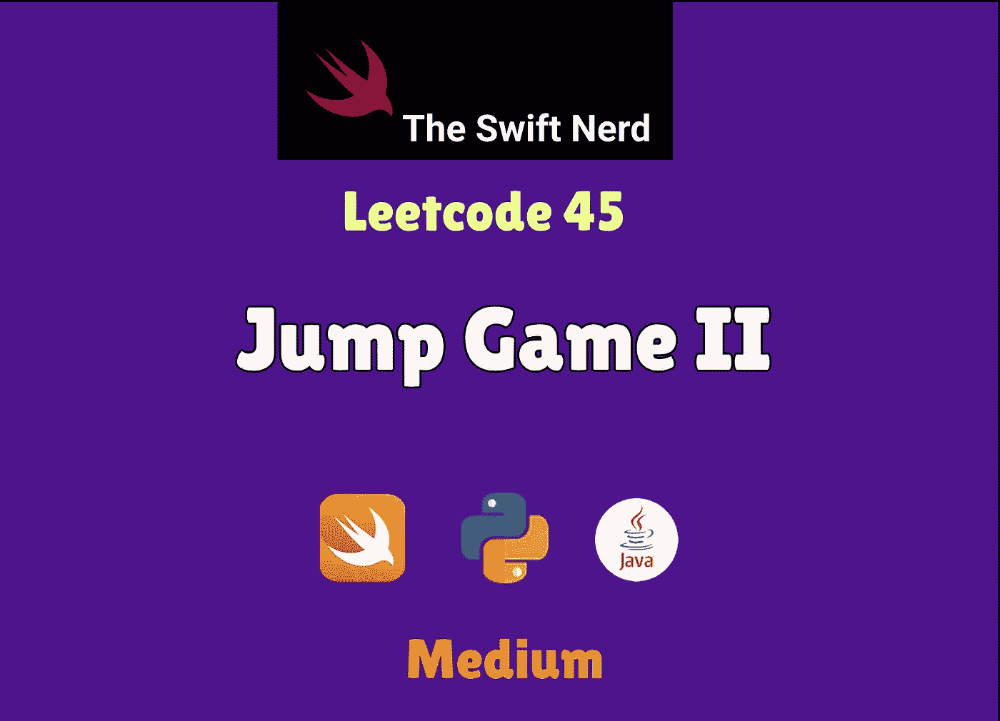
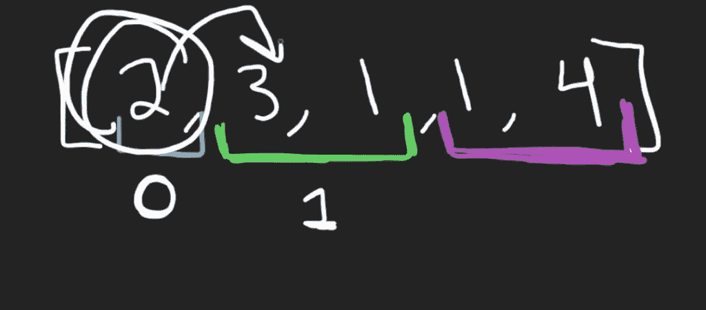
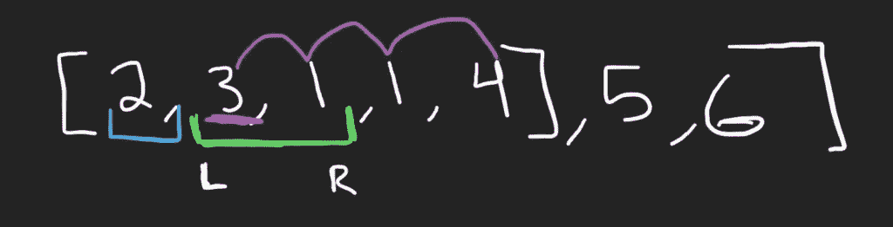

# Swift Leetcode 系列:跳跃游戏 II

> 原文：<https://medium.com/nerd-for-tech/swift-leetcode-series-jump-game-ii-535aa19f9cda?source=collection_archive---------5----------------------->

## 迅捷+动态规划+贪婪=🔥 🧠 ✅

[](https://theswiftnerd.com/jump-game-ii-leetcode/) [## 跳跃游戏 II (Leetcode 45) -

### 难度:链接:第 5 天:May Leetcode 挑战给定一个非负整数 num 的数组，你最初是…

theswiftnerd.com](https://theswiftnerd.com/jump-game-ii-leetcode/) 

点击上面的链接可以看到更详细的解决方案和其他有趣的帖子。

给定一个非负整数数组`nums`，您最初被定位在数组的第一个索引处。数组中的每个元素代表你在那个位置的最大跳跃长度。

您的目标是以最少的跳跃次数到达最后一个索引。你可以假设你总能到达最后一个索引。

**例子**

```
**Input:** nums = [2,3,1,1,4]
**Output:** 2
**Explanation:** The minimum number of jumps to reach the last index is 2\. Jump 1 step from index 0 to 1, then 3 steps to the last index.**Input:** nums = [2,3,0,1,4]
**Output:** 2
```

**约束:**

*   `1 <= nums.length <= 1000`
*   `0 <= nums[i] <= 105`

# 解决办法

通过一些例子，您可以观察到这个问题可以分解成递归的子问题，如

# 贪婪的方法

我们想知道什么？最小值跳转到最后一个索引。为了达到最小跳跃，我们需要最大化每个指数的跳跃值。每当我们想要 ***最大化/最小化*** 一个数量以达到一个全局解决方案时，这是贪婪方法的一个很好的候选。我们可以将数组*分成相同的区域，这些区域可以通过最小可能数量的跳转*来访问。这将导致许多滑动窗口，我们将迭代每个滑动窗口，并找到我们能达到的最远的索引。



完成每个窗口后，我们将计算下一个窗口的索引。起始(**左**)索引将是前一个窗口的下一个，结束(**右**)索引将是前一个窗口可到达的最远的一个。



也增加跳跃的次数，这就是我们的答案。

# 复杂性分析

我们在数组上使用广度优先搜索，每个元素迭代一次，因此总共 N 次操作。此外，我们使用变量来跟踪窗口，总跳转和最远的指数，我们可以达到这是独立的大小输入。

时间= **O(N)** // *贪婪的接近*

**(N2)//**/*动态编程*

**空间= O(1)/**/*贪婪*

**O(N)//**/*动态编程*

感谢您的阅读。如果你喜欢这篇文章，并发现它很有用，请分享并像野火一样传播它！

你可以在[swift 网站](https://theswiftnerd.com/)|[LinkedIn](https://www.linkedin.com/in/varunrathi28/)|[Github](https://github.com/varunrathi28)上找到我