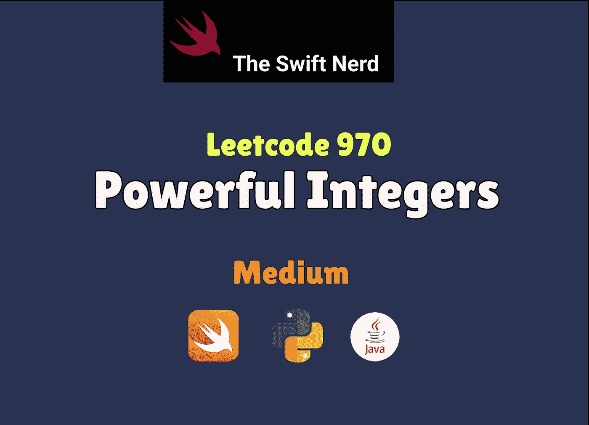

# Swift Leetcode 系列:强大的整数

> 原文：<https://medium.com/nerd-for-tech/swift-leetcode-series-powerful-integers-182eef5c58b8?source=collection_archive---------23----------------------->

## Swift + Sets = **🤯**



第 30 天:四月 Leetcode 挑战(Leetcode 970)

[](https://theswiftnerd.com/powerful-integers-leetcode-970/) [## 强大的整数(Leetcode 970)

### 难度:中等链接:第 30 天:April Leetcoding 挑战给定三个整数 x，y，和 bound，返回所有…

theswiftnerd.com](https://theswiftnerd.com/powerful-integers-leetcode-970/) 

您也可以在 Swift Nerd 博客上阅读完整的故事，以及上面链接上的其他有趣文章。

# 问题描述

给定三个整数 x、y 和`bound`，返回*一个列表，其中包含所有值小于或等于*界限的 ***有效整数*** *。*

对于某些整数 i > = 0，j > = 0，如果一个整数可以表示为 xi + yj，那么这个整数就是**强大的**。你可以按**任何顺序**返回答案。在您的回答中，每个值应该最多出现**一次**。

**例 1:**

```
**Input:** x = 2, y = 3, bound = 10
**Output:** [2,3,4,5,7,9,10]
**Explanation:**
2 = 20 + 30
3 = 21 + 30
4 = 20 + 31
5 = 21 + 31
7 = 22 + 31
9 = 23 + 30
10 = 20 + 32
```

**例二:**

```
**Input:** x = 3, y = 5, bound = 15
**Output:** [2,4,6,8,10,14]
```

# 限制

*   `1 <= x, y <= 100`
*   `0 <= bound <= 106`

# 解决办法

问题就是简单的找出满足条件 **xi + yj < =界**的整数 **(i，j)** 。我们可以使用蛮力来迭代两个嵌套循环，并检查两项之和是否小于界限。我们可以使用一个 **set** 结构来防止重复回答。然后，我们可以让嵌套循环增加 **x** 和 **y** 值的幂，同时将适当的结果添加到我们的集合中。任何与 x 或 y 复合的项的最大值都是 bound — 1(为什么因为 **x，y > = 1，**所以如果其中任何一项变成 1 那么另一项的最大值= bound — 1)。

# 边缘情况

我们需要注意当 x 或 y = 1 时的情况。假设 y = 1，那么对于每一次幂 I，yi = 1，这将成为一个无限循环。因此，在连续循环的末尾，*我们可以检查 x = 1 和 y = 1 并中断，因为其他项的所有可能值都将在当前迭代中获得。*

# 复杂性分析

x 达到界限所需的运算是 LogX(Bound)。类似地，y 达到界限的最大运算是 LogY(Bound)。因此，总运算量将是 O(LogX(Bound) * LogY(Bound))的数量级，这是巨大的，因为随着幂的增加，满足条件的整数将是有限的。太空也是如此。

**时间= O(LogX(Bound)* LogY(Bound))**

**Space = O(LogX(Bound)* LogY(Bound))**

感谢您的阅读。如果你喜欢这篇文章，并发现它很有用，请分享并像野火一样传播它！

你可以在[swift 网站](https://theswiftnerd.com/)|[LinkedIn](https://www.linkedin.com/in/varunrathi28/)|[Github](https://github.com/varunrathi28)上找到我