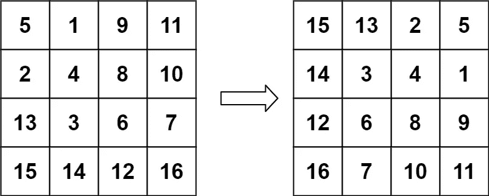

# Swift Leetcode 系列:旋转图像

> 原文：<https://medium.com/nerd-for-tech/swift-leetcode-series-rotate-image-5678f0dd209d?source=collection_archive---------14----------------------->

## swift:4 月 25 日✅✅✅leet code 挑战赛

[](https://theswiftnerd.com/leetcode-rotate-image/) [## 旋转图像(Leetcode 48)

### 难度:链接:四月 Leetcode 挑战:第 25 天给你一个代表一幅图像的 n×n 2D 矩阵，旋转…

theswiftnerd.com](https://theswiftnerd.com/leetcode-rotate-image/) 

你也可以看看我博客上的讨论以及其他有趣的帖子。

# 问题陈述

给你一个代表图像的 *n* x *n* 2D `matrix`，将图像旋转 90 度(顺时针)。

你必须原地旋转图像[](https://en.wikipedia.org/wiki/In-place_algorithm)**，这意味着你必须直接修改输入的 2D 矩阵。**不要**分配另一个 2D 矩阵并进行旋转。**

****例 1:****

****

```
**Input:** matrix = [[1,2,3],[4,5,6],[7,8,9]]
**Output:** [[7,4,1],[8,5,2],[9,6,3]]
```

****例 2:****

****

```
**Input:** matrix = [[5,1,9,11],[2,4,8,10],[13,3,6,7],[15,14,12,16]]
**Output:** [[15,13,2,5],[14,3,4,1],[12,6,8,9],[16,7,10,11]]
```

****例 3:****

```
**Input:** matrix = [[1]]
**Output:** [[1]]
```

****例 4:****

```
**Input:** matrix = [[1,2],[3,4]]
**Output:** [[3,1],[4,2]]
```

# **限制**

*   **`**matrix.length == n**`**
*   **`**matrix[i].length == n**`**
*   **`**1 <= n <= 20**`**
*   **`**-1000 <= matrix[i][j] <= 1000**`**

# **解决办法**

**如果我们能理解引导我们解决问题的诀窍，问题就简单了。这个问题可以用不同的方法解决，但是我们将使用矩阵的属性和运算。如果我们仔细观察，输入中矩阵的每一列都被转换成输出中的一列(但是在**中反过来是**)。这和什么手术很像？**矩阵转置。****

# **移项**

**为了找到矩阵的转置，我们只需要使用两个循环遍历并交换 *(i，j)* 到 *(j，i)* 的元素。这是一个简单的操作，之后我们可以看到每个列值都映射到一行，但是元素需要颠倒。我们现在可以循环遍历每一行并反转矩阵。**

# **反面的**

**反转时小心循环，直到只有半列，否则元素会反转两次，矩阵保持不变。**

## **密码**

# **复杂性分析**

**我们正在迭代 2D 矩阵中的每一个元素，因此复杂度是矩阵元素的数量级。转置和反转行操作也是如此。由于溶液需要在适当的位置，这是一个恒定的空间操作。**

****时间= O(N2)****

****空格= O(1)****

**感谢您的阅读。如果你喜欢这篇文章，并发现它很有用，请分享并像野火一样传播它！**

**你可以在[swift 网站](https://theswiftnerd.com/)|[LinkedIn](https://www.linkedin.com/in/varunrathi28/)|[Github](https://github.com/varunrathi28)上找到我。**