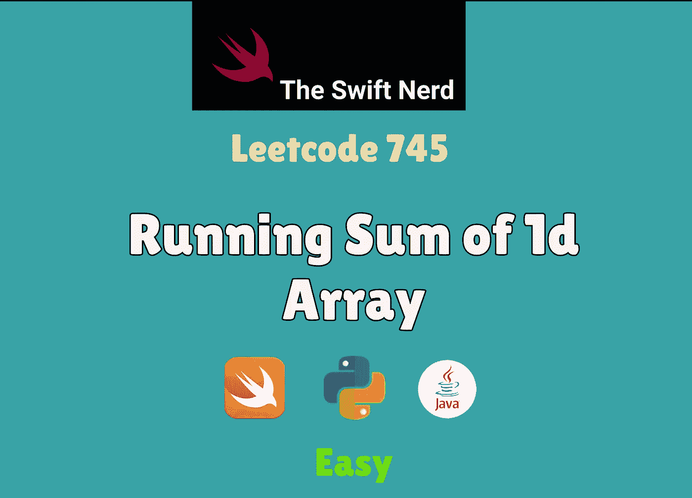

# Swift Leetcode 系列:一维数组的运行和

> 原文：<https://medium.com/nerd-for-tech/swift-leetcode-series-running-sum-of-1d-array-3a5775b16cf4?source=collection_archive---------16----------------------->

## 在 Swift 中查找前缀总和



[第三天:五月 Leetcode 挑战赛](https://leetcode.com/explore/challenge/card/may-leetcoding-challenge-2021/598/week-1-may-1st-may-7th/3730/)

[](https://theswiftnerd.com/leetcode-running-sum-1d-array/) [## 一维数组的运行和(Leetcode 1480)

### 难度:链接:第三天:给定一个数组 num，挑战五月 Leetcode。我们将数组的累计和定义为…

theswiftnerd.com](https://theswiftnerd.com/leetcode-running-sum-1d-array/) 

你也可以通过上面的链接在 Swift Nerd 博客上阅读完整的故事。

# 问题描述

给定一个数组`nums`。我们将数组的运行总和定义为`runningSum[i] = sum(nums[0]…nums[i])`。

归还`nums`的流水账。

# 例子

```
**Input:** nums = [1,2,3,4]
**Output:** [1,3,6,10]
**Explanation:** Running sum is obtained as follows: [1, 1+2, 1+2+3, 1+2+3+4].**Input:** nums = [1,1,1,1,1]
**Output:** [1,2,3,4,5]
**Explanation:** Running sum is obtained as follows: [1, 1+1, 1+1+1, 1+1+1+1, 1+1+1+1+1].**Input:** nums = [3,1,2,10,1]
**Output:** [3,4,6,16,17]
```

# 限制

*   `1 <= nums.length <= 1000`
*   `-10^6 <= nums[i] <= 10^6`

# 解决办法

这是你在 Leetcode 上遇到的最简单的问题(当然除了 Fibonacci 数)。对于刚接触编程的人来说，这种寻找序列中累积和的方法叫做[前缀求和](https://en.wikipedia.org/wiki/Prefix_sum)。这是竞争性编程中的一个重要范例，如果你以前没有遇到过，你应该多读一些。你可以点击 [CMU 页面](https://www.cs.cmu.edu/~guyb/papers/Ble93.pdf)和 [GeeksForGeeks](https://www.geeksforgeeks.org/prefix-sum-array-implementation-applications-competitive-programming/) 文章上的链接来了解更多关于它的应用。

我们可以通过简单地取一个变量来存储我们找到的累积和来解决这个问题。我们可以使用输入数组来更新第 I 个索引之前的总和。从数组的第二个元素开始迭代，用当前数字+前一个索引处的元素更新当前数字，即`prefixSum [i] = prefixSum [i-1] + nums [i]`。由于第一个数字前没有数字，`prefixSum [0] = nums [0]`本身。

# 复杂性分析

我们只是在输入数组上迭代，所以 N 个操作都完成了。我们使用输入数组来计算，所以没有额外的空间。

**时间= O(N)**

**空格= O(1)**

感谢您的阅读。如果你喜欢这篇文章，并发现它很有用，请分享并像野火一样传播它！

你可以在[the swift nerd](https://theswiftnerd.com/)|[LinkedIn](https://www.linkedin.com/in/varunrathi28/)|[Github](https://github.com/varunrathi28)上找到我