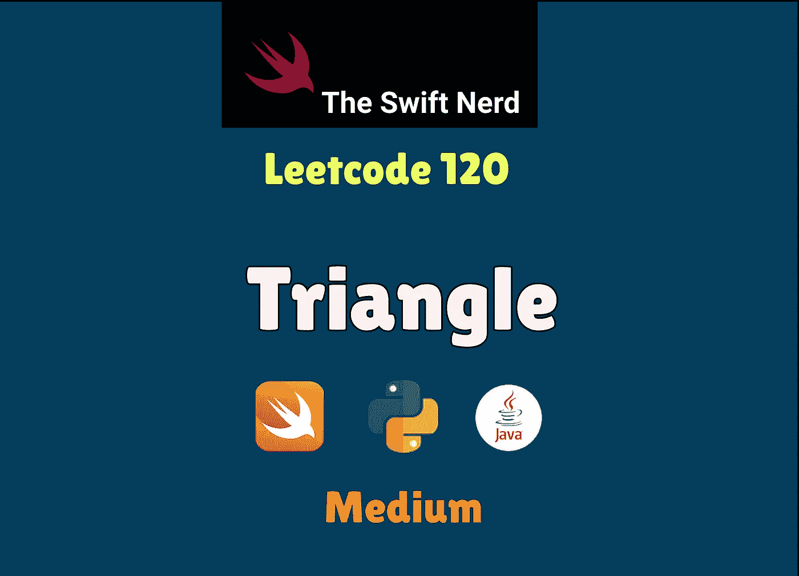
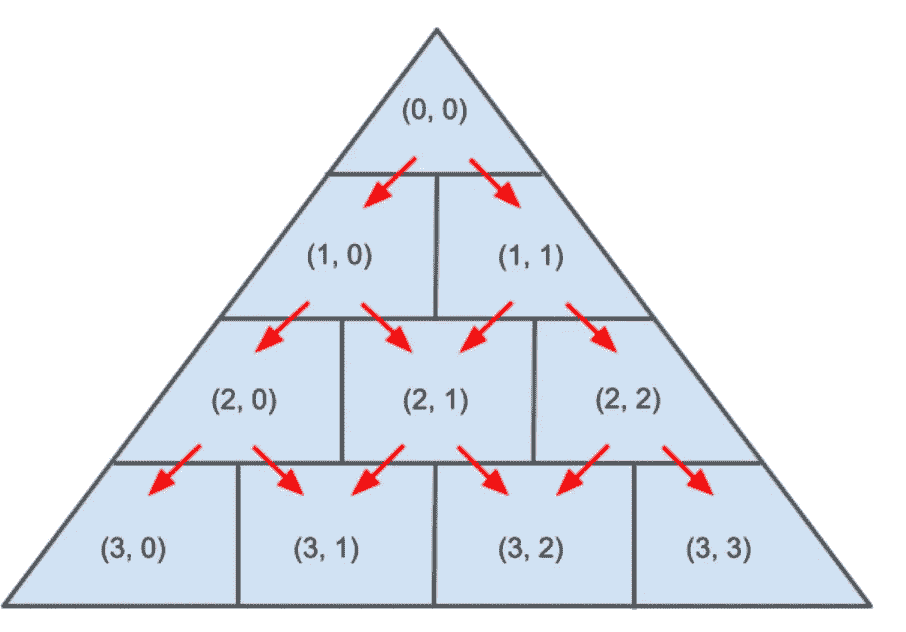

# Swift Leetcode 系列:三角形

> 原文：<https://medium.com/nerd-for-tech/swift-leetcode-series-triangle-medium-9cb748d779c7?source=collection_archive---------7----------------------->

## Swift +动态编程+记忆=🔥🔥🔥



Leetcode 120(中号)

[](https://theswiftnerd.com/triangle-leetcode/) [## 三角形(Leetcode 120)

### 难度:链接:第 21 天:四月 Leetcode 挑战赛给定一个三角形数组，返回从顶部到…

theswiftnerd.com](https://theswiftnerd.com/triangle-leetcode/) 

你也可以通过上面的链接在 Swift Nerd 博客上阅读完整的故事。

# 问题描述

给定一个`triangle`数组，返回*从上到下的最小路径和*。

对于每一步，您可以移动到下一行的相邻数字。更正式地说，如果您在当前行的索引`i`上，您可以移动到下一行的索引`i`或索引`i + 1`。

**例 1:**

```
**Input:** triangle = [[2],[3,4],[6,5,7],[4,1,8,3]]
**Output:** 11
**Explanation:** The triangle looks like:
   2
  3 4
 6 5 7
4 1 8 3
The minimum path sum from top to bottom is 2 + 3 + 5 + 1 = 11 (underlined above).
```

**例 2:**

```
**Input:** triangle = [[-10]]
**Output:** -10
```

# 限制

*   `1 <= triangle.length <= 200`
*   `triangle[0].length == 1`
*   `triangle[i].length == triangle[i - 1].length + 1`
*   `-104 <= triangle[i][j] <= 104`

**跟进:**你能否只用`O(n)`额外的空间来做这件事，其中`n`是三角形的总行数？

# 解决办法

# 递归

这是一个经典的动态规划问题，但重点是将问题分解成更小的子问题。如果我们把三角形想象成一个 n×n 的表示，那么就更容易设想下一个可能的子问题。在每一行中，列数与行数相同，因此第一行有 1 列，第 N 行有 N 列。


我们可以观察到，在矩阵中的任何单元，可能有最多两条路径，即向下的**(同一列)和对角的**(增加)列。因此，对于 **[i，j]** 元素，可能的路径将是 **[i + 1，j ]** ( *向下*)或 **[i +1，j + 1]** ( *对角线*)路径。无论我们选择哪条路径，该路径的总和将等于可能路径的元素+ min(向下/对角线)。****

****我们可以从第一排开始，一直做到最后一排。子问题将按以下方式解决。我们还需要注意 row 和 cols 的终止条件， **0 < = row < n** 。****

********

# ****密码****

# ****Swift:递归方法(自上而下)****

# ****动态编程:记忆化****

****当提交相同的解决方案时，我们会因为巨大的输入值而得到 TLE(超过时间限制)。因此，我们可以使用动态编程来缓存子问题的结果，以节省时间。我们可以维护一个存储表来存储每个[行][列]的结果。我在这里使用了一个字典，因为我们不需要随机访问，并使用键格式“row:col”来查询和保存键值对。****

# ****Swift: DP****

# ****复杂性分析****

****由于有 n 行，列数与行数相同，所以总元素数为 O(n2)。对于每个元素，递归助手函数至少调用一次，因此需要 O(n2)次运算。类似地，即使递归堆栈是 O(N) 空间，但是我们能存储的最大元素数是 n2。****

****时间= **O(n2)******

****空间= **O(n2)******

****感谢您的阅读。如果你喜欢这篇文章，并发现它很有用，请分享并像野火一样传播它！****

****你可以在[swift 网站](https://theswiftnerd.com/)|[LinkedIn](https://www.linkedin.com/in/varunrathi28/)|[Github](https://github.com/varunrathi28)上找到我****