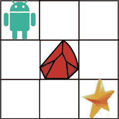

# Swift Leetcode 系列:独特路径 II

> 原文：<https://medium.com/nerd-for-tech/swift-leetcode-series-unique-paths-ii-1defdf2def4b?source=collection_archive---------11----------------------->

## Swift +动态编程= Leetcode 63 ✅ ✅ ✅

[](https://theswiftnerd.com/unique-paths-ii-leetcode/) [## 唯一路径 II (Leetcode 63)

### 难度:中等链接:April Leetcoding 挑战 2021:第 28 天一个机器人位于一个 m x n 的左上角…

theswiftnerd.com](https://theswiftnerd.com/unique-paths-ii-leetcode/) 

你也可以点击上面的链接，阅读 Swift Nerd 博客上的完整故事以及其他有趣的故事。

# 问题描述

一个机器人位于`m x n`网格的左上角(在下图中标为“开始”)。

机器人在任何时候只能向下或向右移动。机器人正试图到达网格的右下角(下图中标有“完成”)。

现在考虑如果一些障碍被添加到网格中。会有多少独特的路径？

网格中的障碍物和空间分别标记为`1`和`0`。

**例 1:**



```
**Input:** obstacleGrid = [[0,0,0],[0,1,0],[0,0,0]]
**Output:** 2
**Explanation:** There is one obstacle in the middle of the 3x3 grid above.
There are two ways to reach the bottom-right corner:
1\. Right -> Right -> Down -> Down
2\. Down -> Down -> Right -> Right
```

**例 2:**


```
**Input:** obstacleGrid = [[0,1],[0,0]]
**Output:** 1
```

# 限制

*   `m == obstacleGrid.length`
*   `n == obstacleGrid[i].length`
*   `1 <= m, n <= 100`
*   `obstacleGrid[i][j]`是`0`还是`1`。

# 解决办法

一种简单的方法是尝试用深度优先搜索递归地找到每一条可能的路径。但是由于会重复计算许多子路径，对于一个大矩阵，我们会收到一个 **TLE** (超过时间限制)。既然我们已经走上了正确的道路，我们该如何优化呢？

# 动态编程(记忆化)

我们可以在一个 **2D 矩阵**中存储一个矩阵元素可达的路径数。我们只能向右或向下移动，因此我们可以继续添加路径，DP 表中的最后一个单元格将表示可能的唯一路径的总数。单元格 **DP[i][j]** 可能从**左侧(DP [i][j — 1])** 或**顶部(DP[i — 1][j])** 到达。如果单元格是障碍，则路径为零( **obstacleGrid[i][j] = 0** )。因为我们只能从(0，0)开始，因此如果第一个单元是障碍，那么整个矩阵是不可达的，总路径将是 0。我们还需要用值 **1** 作为初始起始位置的种子来表示单一的初始路径。一旦我们完成构建 **DP** ，右下角**单元格的值应该就是我们的答案。**

## 密码

# 复杂性分析

因为我们遍历每个单元一次，所以总的操作将等于矩阵的大小，即 N * M。我们还存储每个单元的路径，因此空间复杂度也是矩阵大小的量级。

**Time = O(N * M)** ，其中 N =行数，M =列数

**空间= O(N * M)**

感谢您的阅读。如果你喜欢这篇文章，并发现它很有用，请分享并像野火一样传播它！

你可以在[网站](https://theswiftnerd.com/)|[LinkedIn](https://www.linkedin.com/in/varunrathi28/)|[Github](https://github.com/varunrathi28)上找到我