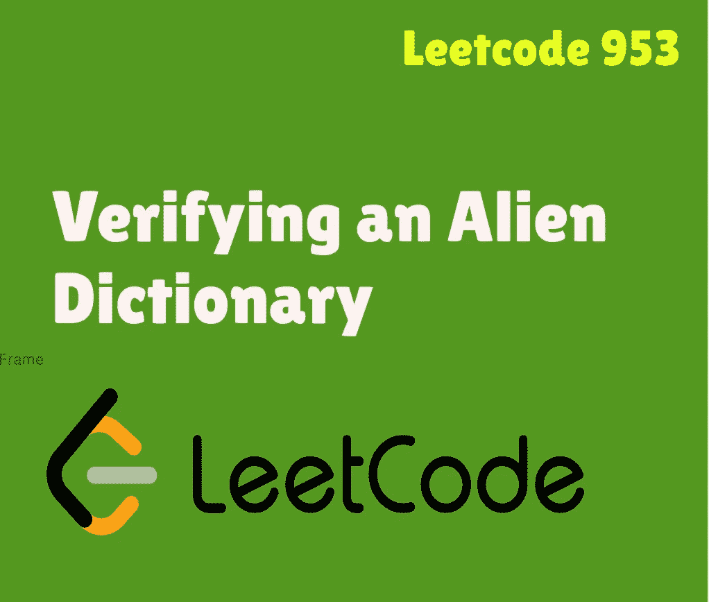

# Swift Leetcode 系列:验证外星人字典

> 原文：<https://medium.com/nerd-for-tech/swift-leetcode-series-verifying-an-alien-dictionary-3bf011c19ec3?source=collection_archive---------11----------------------->

检验字典的快速方法

[](https://theswiftnerd.com/verifying-alien-dicitonary-leetcode/) [## 验证外星人字典(Leetcode 953)

### 在一种外星语言中，令人惊讶的是他们也使用英文小写字母，但可能是以不同的顺序。的…

theswiftnerd.com](https://theswiftnerd.com/verifying-alien-dicitonary-leetcode/) 

如果您无法查看这个故事，您也可以通过上面的链接在 Swift Nerd 博客上阅读完整的故事。

# 问题描述(难度:容易)

在外星语言中，令人惊讶的是他们也使用英文小写字母，但可能是不同的`order`。字母表中的`order`是一些小写字母的排列。

给定一个用外星语言写的`words`序列和字母表的`order`，当且仅当给定的`words`按外星语言的字典顺序排序时，返回`true`。

# 例子

```
**Input:** words = ["hello","leetcode"], order = "hlabcdefgijkmnopqrstuvwxyz"
**Output:** true
**Explanation:** As 'h' comes before 'l' in this language, then the sequence is sorted.**Input:** words = ["word","world","row"], order = "worldabcefghijkmnpqstuvxyz"
**Output:** false
**Explanation:** As 'd' comes after 'l' in this language, then words[0] > words[1], hence the sequence is unsorted.**Input:** words = ["apple","app"], order = "abcdefghijklmnopqrstuvwxyz"
**Output:** false
**Explanation:** The first three characters "app" match, and the second string is shorter (in size.) According to lexicographical rules "apple" > "app", because 'l' > '∅', where '∅' is defined as the blank character which is less than any other character ([More info](https://en.wikipedia.org/wiki/Lexicographical_order)).
```

# 限制

*   `1 <= words.length <= 100`
*   `1 <= words[i].length <= 20`
*   `order.length == 26`
*   `words[i]`和`order`中的所有字符都是英文小写字母。

# 解决办法

如果我们试图用一个例子来跟随我们的直觉，比如说[“苹果”、“香蕉”]，那么我们可以很容易地判断出这些字符串是按词汇排序的。对于词汇顺序，我们只检查直到两个字符串不匹配，如果第二个字符串的字符优先级高于第一个字符串的字符优先级，那么我们说它们不是词汇顺序的。

## 字符映射

为什么我们这么快就找到了解决方案？因为我们潜意识里记得，在标准英语字母表中，A 在 B 之前，因此“苹果”->“香蕉”是正确的。在这种情况下，我们被赋予了一个新的字母优先级，因此我们需要将它保存在某个地方，以便我们以后可以比较这些字符串。简单的解决方案是迭代 order 字符串并创建表示字母和索引的[Character:Int]字典。因此，索引的值越低，它的优先顺序就应该越早。

## 比较逻辑

现在，为了比较两个字符串是否按词汇顺序排列，我们可以创建一个效用函数，它接受两个字符串并检查 string1 和 string2 是否按词汇顺序排列。注意，我们只需要比较两个字符串中的字符，直到一个字符串结束，这是两个长度中的最小值= **min(string1.count，string2.count)** 。我们只需要检查，直到我们没有找到第一个不匹配的字符对。为什么？因为如果两个子字符串具有相同的前缀，它们将总是处于正确的顺序，直到第一个不匹配的对(例如:- "Application "和" Apple "，因为前 4 个" Appl "是常见的，所以它将总是有序的。因此决定将由顺序映射确定的“I”和“e”做出)。

我们可以成对地比较数组中的字符串，如果在任何时候我们发现有一对字符串违反了条件，那么我们最终返回 false，否则返回 true。(未找到无序字符串！她哇！！！).

但是……我们忽略了一个小案例。(Whaaat？？)

# 角落案例

如果一个字符串是另一个字符串的子串，那么完整的子串应该在前面。

例如，["Apple "，" App"]，其中" App "是" Apple "的子串，因此在词汇上应该排在前面。因此，为了处理这种情况，我们可以在返回之前检查实用程序方法，看第一个字符串是否等于或小于第二个字符串。(定位“App”< position “Apple”). In any case where two strings are substrings are first length is greater, this is a failure condition.

# Code

Thank you for reading. If you liked this article and found it useful, share and spread it like wildfire!

You can find me on [the swift nerd](https://theswiftnerd.com/)|[LinkedIn](https://www.linkedin.com/in/varunrathi28/)|[Github](https://github.com/varunrathi28)