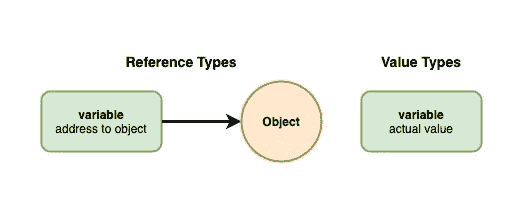
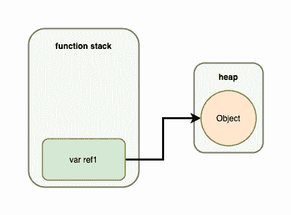
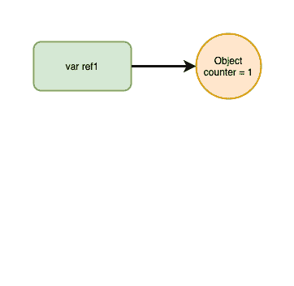
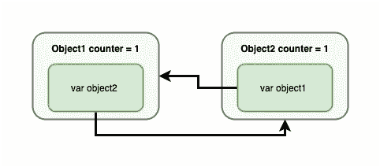
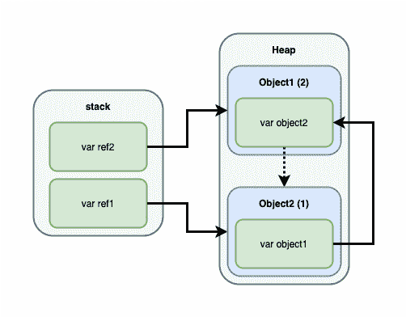

# 简而言之，快速内存管理

> 原文：<https://medium.com/nerd-for-tech/swift-memory-management-in-a-nutshell-8a12d3ef03eb?source=collection_archive---------5----------------------->

对一些人来说，计算机内存管理是一件很难理解的事情。但实际上，这对于程序员来说是非常基本的理解，我相信你们大多数人对此至少有一个基本的概念。在本文中，我们将讨论 Swift 中的内存管理。

# 值类型和引用类型

每个编程语言里总有这两个，**值类型**和**引用类型**。两者的区别只是包含它的变量的值。具有**值类型**的变量将总是存储实际值，另一方面，具有**引用类型**的变量将总是存储实际值的地址或位置。

在 Swift 编程语言中，**值类型**由 **Int** 、 **Double** 、 **Float** 、 **Bool** 、 **Tuple** 或任意一种 **struct** 类型组成。**参考型**由**闭合型**组成，或任一**类**型。

由于**值类型**将总是存储实际值，每个涉及到**值类型**的赋值将总是创建一个新的要传递的实例。对于**引用类型**，只有在初始化时才会创建一个新实例。当将**引用类型**的变量赋给另一个时，它将只是传递一个实际实例的地址。

想象一下**参考型号**就像遥控器和电视一样。变量是远程的，实例是电视。地址就是电视所在的地方。因此，创建一个新变量就相当于购买一个新遥控器。创建一个新实例就像买一台新电视一样。

让我们在操场上做一个小实验:

如上所述，当“ ***ref.number*** ”赋值时，它会将值直接赋值给 **MyClass** **实例**，该实例也被 **refType** 变量引用。另一方面，当 **val** 被赋予 **valType** 时，该值被复制到 **val** 中，从而创建了 **MyStruct** 的两个实例，因此 **val** 和 **valType** 是两个不同的实例。

使用电视类比， **refType** 是指向 **MyClass** 电视的遥控器。当我们创建 **ref** 时，我们只是想添加一个指向同一台电视的新遥控器。因此，无论我们对 **ref** 或 **refType** 做了什么，只要它指向同一个电视，它就会一直影响同一个电视。

# 堆栈和堆

让我们更深入地回忆一下。一般在 Swift 或者其他编程语言中，内存中有两个地方存储值，分别是 **Stack** 和 **Heap** 。

顾名思义， **Stack** 总是以堆栈的方式将值存储在内存中，所以新的分配总是放在前一个的上面，并且总是从顶部释放，或者通常称为 **LIFO** ( *后进先出*)。

堆做的事情不同，如果空间足够并且已经被应用程序保留，它将把值存储在任何地方。无论谁先谁后，它都会根据需要释放任何价值。

每当我们在代码上声明一个变量，并且该代码在运行时被执行，该变量将总是被存储在**堆栈**中，并且只有当执行到达返回或作用域(function，if-else 等)的末尾时才会被释放。).另一方面，**引用类型**实例及其所有属性将始终存储在**堆**中。

变量将总是存储在它们被创建的地方。当在函数或任何执行作用域上声明它时，它将一直驻留在那里，并在作用域完成后被释放。如果它被声明为实例的属性，它将一直存在于它的父实例中，直到被释放。

**值类型实例**将一直存在于变量所在的位置。但是**引用类型实例**会一直活在**堆**里。因此，如果**引用类型**实例包含**值类型属性**，这些属性将存在于其父实例内的**堆**中，直到被释放。但是如果**值类型实例**在**栈**上被创建，它将一直存在直到被释放。

为了更好地理解它，让我们看看下面这段代码:

这些代码可以通过下面的动画进行可视化:

所以，当**函数栈**被执行时，它会将 **ref1** 存储在栈中。然后它会创建一个 **MyObject** 的实例并放入堆中，然后它的地址会被 **ref1** 存储在堆栈中。当 **if scope** 被执行时，它会将 **ref2** 放在堆栈中 **ref1** 的顶部。然后 **ref1** 的值将被复制到 **ref2** ，它是 **MyObject 实例**的地址，所以我们可以说 **ref1** 和 **ref2** 引用的是同一个实例。当**作用域**结束时 **ref2** 将从**堆栈**中释放，当**功能作用域**结束时 **ref1** 也将被释放。当没有人引用 **MyObject 实例**时，它将从**堆**中释放。

# 自动引用计数

在**栈**的情况下，何时以及如何释放内存的机制非常清楚，但是在**堆**的情况下却不是这样。实际上，何时以及如何释放**堆**上的内存在以前是个大问题。如果不释放**堆**上的实例，它将消耗太多空间。Swift 编程语言使用 Objective-C 上已经存在的解决方案来解决这个问题，它被称为**自动引用计数**，或 **ARC** 。

**ARC** 只是一个计数器，一个花哨的计数器，它计算引用每个实例的变量的数量。当一个新的变量出现并引用一个实例时， **ARC** 会将该实例的计数器加 1。当变量被释放时，它会将计数器减 1。当计数器达到零时，实例将从**堆**中释放。非常简单和强大！

让我们检查下面的代码:

这是无用的代码，但我想给你们展示的是这段代码的可视化表示:

在动画中，可以清楚地看到，每当出现一个新变量来引用同一个实例时，该实例的计数器就会加 1。当变量引用其他东西时，计数器将减 1。当计数器达到零时，对象将被释放。这就是 Swift 管理**堆**的方式。

# 保留周期

**弧**也不是没有问题。使用**电弧**时的一个问题叫做**保持周期**。这是**弧**计数器永远不会达到零的情况。这种情况怎么会发生？这个机制看起来很强大，对吧？

让我们看看这段代码:

看起来不错，对吧？您是否意识到**对象 1** 和**对象 2** 是相互引用的？可以这样形象化:

无论执行过程中发生什么，两个实例计数器都不会达到零，除非手动指定为 null。这种情况被称为**保持周期**。Swift 有针对这些情况的解决方案，通过使用一个**弱**或**无主**变量。

# 弱无主变量

**弱变量**是一个不会增加**弧**计数器的变量，例如分配给它的计数器。因此，如果有三个变量引用同一个实例，并且其中一个是**弱**，那么该实例的计数器将是 2。当另外两个变量被释放时，实例也会被释放，从而使**弱变量**自动指向空。这就是为什么弱应该是可选类型。

为了更好地理解弱变量是如何工作的，让我们看看下面这段代码:

如果没有其他**强变量**引用它的实例，ref3 变量将自动为空。

**无主**怎么办？它和 weak 是一样的，但是它不是可选的，如果它的值已经为 null，它会抛出一个不可捕获的错误，因为它试图强制取消装箱。

# 解决方案

让我们回到保留周期的例子。了解了弱变量和无主变量之后，我们能为它创建一个优雅的解决方案吗？解决方案很简单，只需使其中一个引用变量变弱:

这不会造成内存泄漏，因为 **object2** 现在很弱，因此 **ARC** 计数器现在可以达到零。使用这种可视化表示可以更好地解释这一点:

现在 **ARC** 计数器，例如 **Object2** 的计数器，在栈上的变量被释放时可以达到零。它很快会使 **Object1** 实例计数器也归零，并触发 **ARC** 将其释放。

# 其他用途

弱变量可以确保实例不会被意外保留。一个最常见的用法是使用**中的**弱自我**逃避关闭**。它将确保自我不会被封闭所保留，并且在封闭被释放之前不会被释放。所有的**委托模式**都为它们的委托属性使用了一个弱变量，因为通常情况下，实现委托的对象将委托消费者作为其属性，所以它可能会引入**保留周期**问题。

# 最终注释

在这篇文章中可以提出一些观点:

*   **值类型**变量存储实际实例
*   **引用类型**变量存储实例的位置
*   **值类型**实例存储在变量所在的位置
*   **引用类型**实例存储在堆中
*   **弧**是计数实例引用变量
*   **ARC** 将在其计数器达到 0 后释放一个实例
*   **保持循环**发生在**圆弧**计数器无法归零的情况下
*   **弱变量**不会增加**圆弧**计数器
*   一个**弱变量**可选
*   一个**无主变量**与弱变量相同，但不是可选的
*   一个**无主变量**将强制展开可选值

就这些！

如果你有任何意见、问题或建议，请在下面的评论区发表。