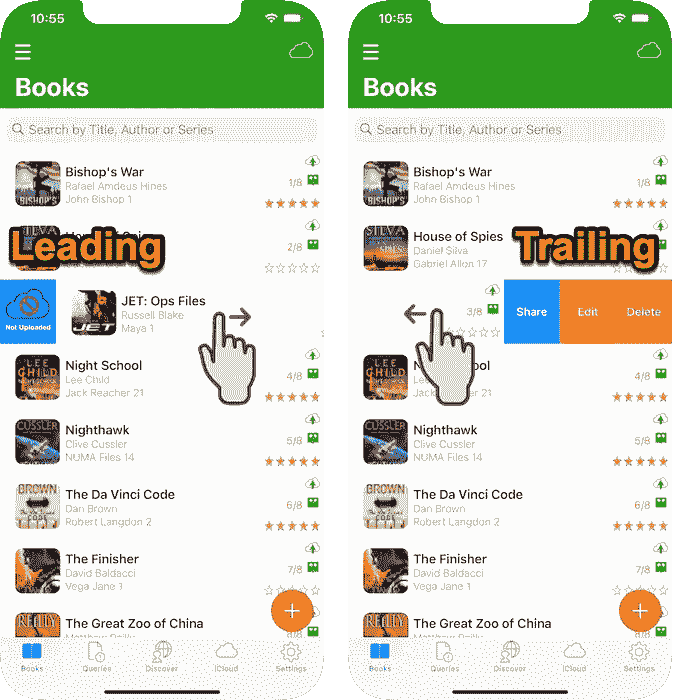

# Swift UITableView 滑动操作

> 原文：<https://medium.com/nerd-for-tech/swift-uitableview-swipe-actions-4c1069d5717c?source=collection_archive---------1----------------------->

UITableView 前导和尾随滑动菜单操作允许用户对显示的记录应用操作或导航到新视图。

显示前导和尾随推送手势菜单的 AppsGym 图书表格视图

# 方案

我们的应用程序允许在图书表格视图上进行前导和尾随滑动手势菜单操作。**领先的**动作将就地更新核心数据记录字段值(在表视图中)。**尾随**动作将删除(原地)、编辑(排序到另一个视图)或共享(同步)一个表格行记录。

# 技术

我们将利用 Swif 的刷卡动作功能:

**leadingswipeactionconfigurationforrowat()，**控制从右向左滑动

**trailingswipeactionconfigurationforrowat(..)**，控制左右滑动

在这里我们为每个滑动手势定义菜单选项和相应的动作(配置)。

***注意*** : iOS 15 SwiftUI 引入了一个名为`.swipeActions`的新修改器，供开发者在任意列表行中创建自定义滑动动作，使用。切换(边缘:。领导)和。切换(边缘:。尾随)。

GIF AppsGym Books UITableView 查看推送操作

# 观众

本文面向寻求完整、成熟、以代码为中心的解决方案来加速开发项目的 Swift 开发人员。

# 应用模型

我们的文章基于苹果应用商店上发布的 apps gam[Books](https://appsgym.com/projects/books)模型应用程序，你可以在[AppsGym.com](https://appsgym.com)上免费下载完整的 [Xcode](https://appsgym.com/appsgym-books-swift-xcode-project-tour/) 项目。

# 用户界面

不需要特定的 UI 设置，因为 UITableView 显示逻辑和代码将显示完整的核心数据记录集。刷卡动作功能将显示动作的图标(和/或文本)并执行相关的逻辑代码。

在我们的例子中，**领先**的滑动动作会改变图书 ***上传*** 的状态，作为一个拨动开关，使用图片来显示当前状态。因此，我们需要准备 2 张图片:上传的和未上传的，检查当前的上传状态并显示相关的图片。

显示云上传状态的 AppsGym Books 表行

拖动 ***共享*** 滑动动作将启动设备原生共享菜单。

GIF AppsGym 图书跟踪推送共享操作

# 逻辑

**bookstableviewcontroller . swift**展示 app 核心数据记录。它还将实现滑动动作。

**leadingswipeactionconfigurationforrowat()**将允许用户以拨动开关的方式改变图书**上传**状态。如果当前状态显示为已上载，则操作会将其更改为未上载。

**trailingswipeactionconfigurationforrowat()**将允许用户:

1.  **删除**表格视图中的图书记录及其相关照片/图像
2.  **编辑**图书记录，导航到编辑图书视图
3.  **共享**图书记录，显示设备的原生共享菜单

# 密码

## **bookstableviewcontroller . swift**

# **为 RowAt** (..)

## swipeUploadedFlagAction(..)

# **trailingswipeactionconfigurationforrowat**(..)

## swipeDeleteAction(..)

## swipeShareAction(..)

本文介绍了实现 UITableView 前导(从左到右)和尾随(从右到左)滑动手势操作的完整设置、逻辑和代码。我们研究了以下案例:

1.  在上传标记操作中就地更新核心数据记录字段值(在表视图中)
2.  删除核心数据记录(从数据库、表视图和阵列中)及其相关照片，访问 2 个独立的核心数据实体
3.  在编辑操作中，通过“继续”导航到另一个视图
4.  使用设备本机共享菜单弹出菜单共享表格记录数据

希望你觉得它在你的应用程序中有用。感谢阅读！