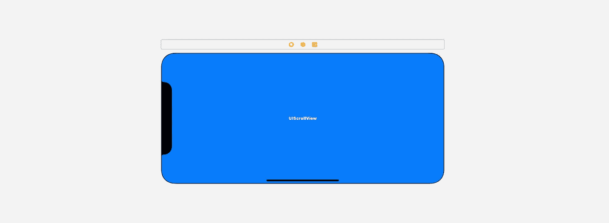

# SwiftUI:仅使用 SwiftUI _ hidden APIs 在 UIKit 中滚动

> 原文：<https://medium.com/nerd-for-tech/swiftui-scroll-like-in-uikit-using-only-swiftui-hidden-apis-8af2be0534c7?source=collection_archive---------3----------------------->

想象一下你可以配置 SwiftUI `ScrollView`



对 UIScrollView 和界面构建器的怀旧(也可能不是)。

想象一下，您可以不经过内省就进行分页。

想象一下你可以用

*   内容偏移量(以编程方式将动画滚动到定义的偏移量)
*   内容插入
*   指示器插图
*   减速率
*   弹跳选项
*   启用或禁用滚动
*   交互阻力容限

换句话说，UIKit 中`UIScrollView`的大部分可配置属性，不过用的是纯 SwiftUI。

SwiftUI 实际上允许配置所有这些选项，但是为了了解它，必须找出 SwiftUI 的`.swiftinterface`中隐藏的公共 SwiftUI 类型。

之前我写过 SwiftUI 中隐藏类型的另一个发现——view test 协议[_ 。](/@eugenedudnyk/behavioural-testing-of-swiftui-views-with-host-app-and-viewtest-f1343a281c5f)

这次我准备了一个专门的库 [SolidScroll](https://github.com/edudnyk/SolidScroll) 解放 SwiftUI 的`_ScrollView`和`_PagingView`。它只包含隐藏的 SwiftUI 类型的类型别名，为了方便起见，还包含一些初始化器和 DocC 文档。

下面我们就来详细了解一下这个 SwiftUI 宝吧。

# _ScrollView

隐藏的`_ScrollView`类型代表用`_ScrollViewConfig`和`_ScrollableContentProvider.`配置的滚动视图

```
public init<Provider>(contentProvider: Provider, config: _ScrollViewConfig = _ScrollViewConfig()) where Provider : _ScrollableContentProvider
```

在`SolidScroll`库中，使这些类型可见的相应类型别名是:

*   `SolidScrollView`(别名为`_ScrollView`)
*   `ScrollViewConfig`(别名为`_ScrollViewConfig`)
*   `AligningContentProvider`(别名为`_AligningContentProvider`)
*   `ContainedScrollViewKey`(偏好键，别名为`_ContainedScrollViewKey`)
*   `SolidScrollViewProxy`(别名为`_ScrollViewProxy`)

处理`SolidScrollView`的方式非常类似于你可能已经熟悉的常规`ScrollViewReader`(或者，如果你从未听说过它，我推荐[这个故事](https://thinkdiff.net/swiftui-how-to-create-a-chat-screen-and-scroll-automatically-d82b4984d888)用于阅读)，但是我们不是创建读者，而是倾听`ContainedScrollViewKey`偏好的偏好变化。

SolidScrollView 使用示例。

一旦我们获得了首选项的值，并且有了滚动视图代理，我们就可以对它调用`setContentOfsset(_:animated:completion:)`,以便以编程方式(有或没有动画)滚动到可滚动内容中的具体位置。

此外，现在我们可以访问底层滚动视图的属性和方法:

SwiftUI 中隐藏的`_ScrollViewProxy`类型的公共接口

# _ 分页视图

隐藏的`_PagingView`类型代表带有预配置分页的滚动视图。通过`_PagingViewConfig`提供寻呼配置。

在`SolidScroll`库中，使这些类型可见的相应类型别名是:

*   `PagingView`(别名为`_PagingView`)
*   `PagingViewConfig`(别名为`_PagingViewConfig`)

处理`PagingView`的方法非常简单——只需提供您的分页视图配置和视图集合，它们将成为`PagingView`的页面。

PagingView 使用示例。

我在这里看到的可能限制是`PagingViewConfig`和`ScrollViewConfig`都只允许相同大小的所有页面。如果你需要不同尺寸的页面，你必须有点创意。

我为 SolidScroll 库录制了一个小演示视频，请查看:

感谢阅读！