# Unity 中的开关语句

> 原文：<https://medium.com/nerd-for-tech/switch-statements-in-unity-ad6d3dd88a99?source=collection_archive---------9----------------------->

## 统一指南

## Unity 中 switch 语句实现的快速指南

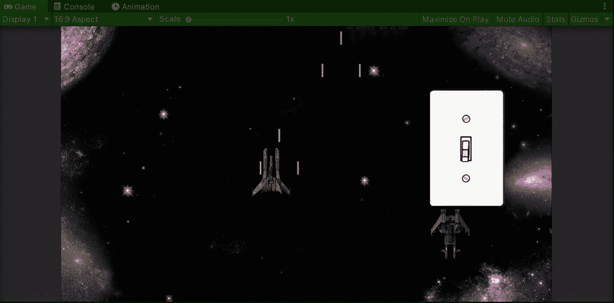

**目标**:在 Unity 中使用 switch 语句实现一个太空射击游戏的下一个加电项目。

随着太空射击游戏的发展，是时候实现列表中的下一个增强项目了，玩家的盾牌。

# 添加加电项目

为了做到这一点，就像我在[的最后一篇文章](/nerd-for-tech/creating-a-power-up-for-your-game-in-unity-6810d73376a1)中一样，让我们在场景中添加启动物品的精灵和触发与玩家碰撞所需的组件:

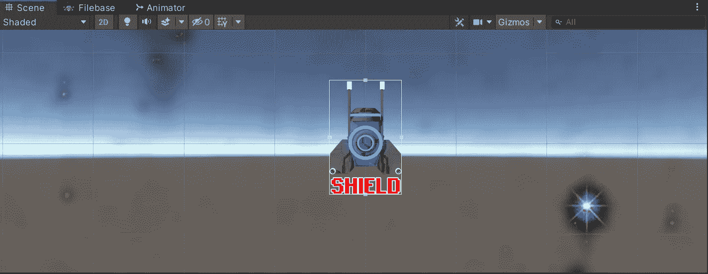

新的加电项目需要包含一个碰撞器、一个刚体 2D 和加电脚本。

然后，就像我在[的最后一篇文章](/nerd-for-tech/animating-sprites-in-unity-9d02762bde96)中一样，让我们使用 animator 视图制作开机精灵的动画。此外，我们需要将预设拖到繁殖管理器脚本中，以便它可以在游戏中每隔 5 到 10 秒钟与其他电源一起随机繁殖:

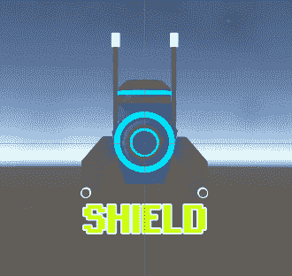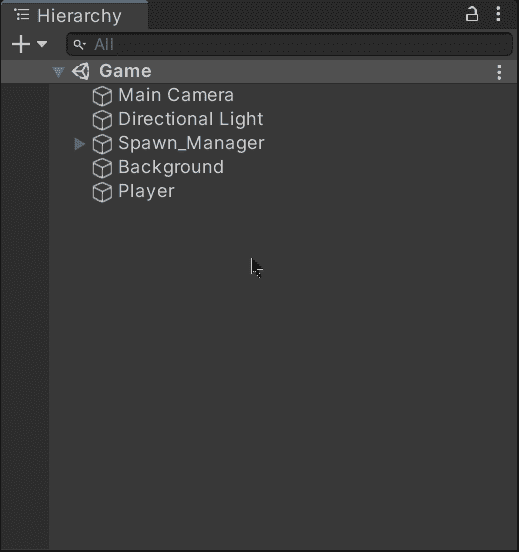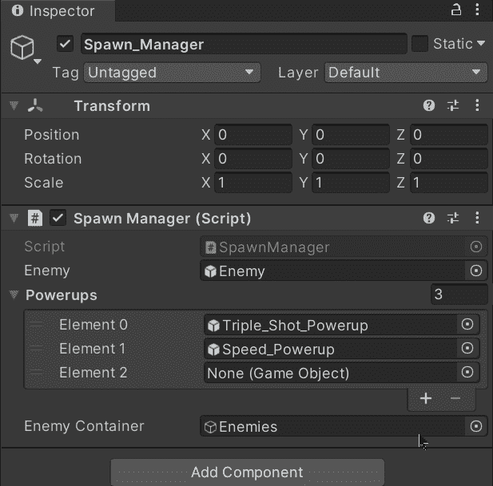

在上一篇文章中，我们拖动了速度启动预置，随机产生了三重启动。

# 添加启动可视化工具

一旦启动物品准备好了，让我们把可见的盾牌精灵拖到场景中，并确保它适合玩家的飞船，使它成为一个预置:

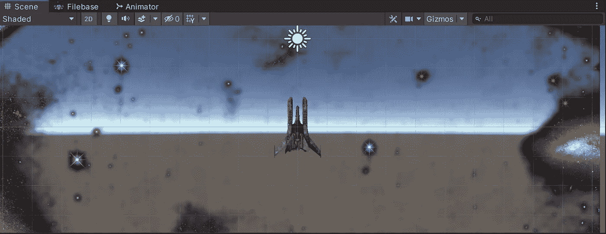

这是玩家的飞船。

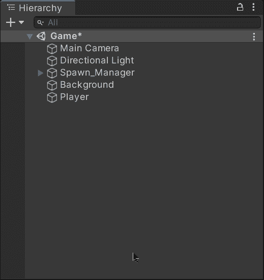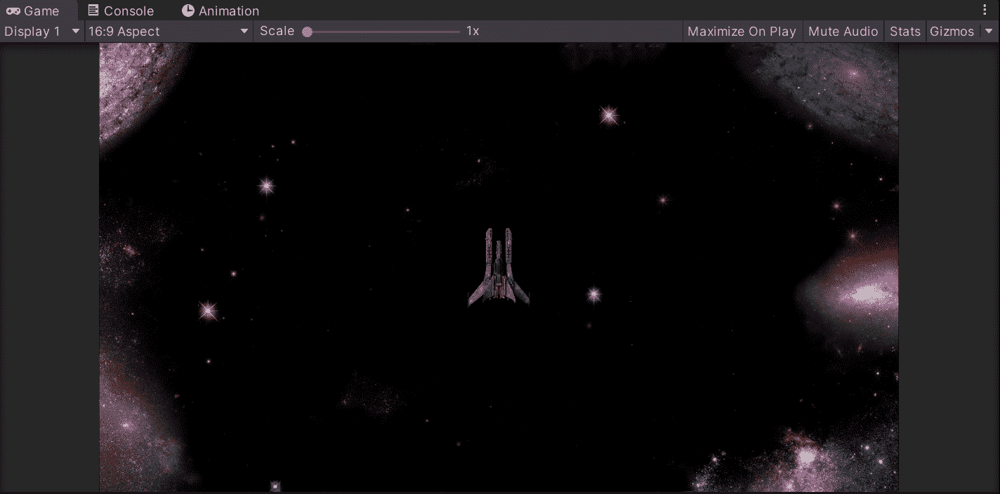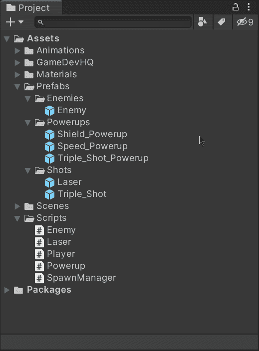

一旦盾牌适合玩家的飞船，就把它拖到相应的预设文件夹中。

我们不需要给 shield visualizer sprite 添加碰撞器、刚体或脚本。在这种情况下，我们将通过在场景中将游戏对象设置为活动或不活动来处理它。因此，一旦我们准备好盾牌游戏对象，让我们使它成为玩家游戏对象的子对象，并停用它，因为它将保持这样，直到玩家收集到启动项目来激活它:

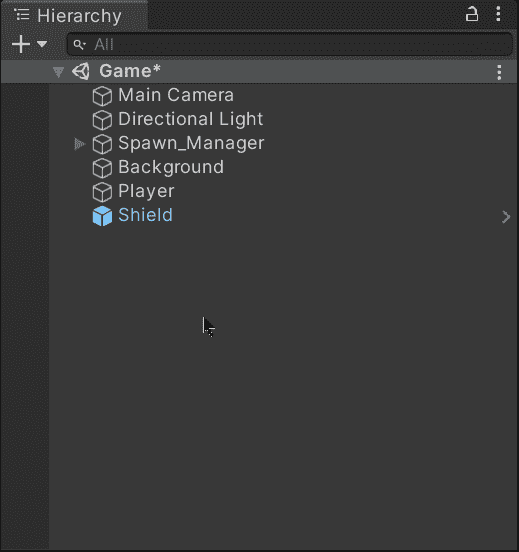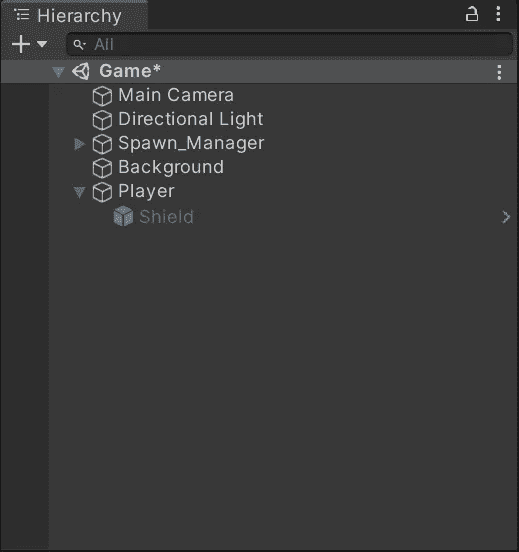

盾牌精灵将保持非活动状态，直到玩家收集到盾牌增强物品。

# 实现集合方法

现在，为了实现盾牌加电项目的集合，我们需要打开玩家脚本并为盾牌可视化工具添加一个新变量，该变量是玩家游戏对象的子对象:

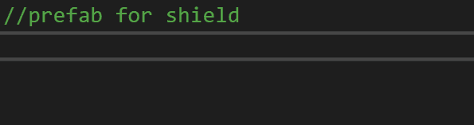

保存脚本后，让我们将盾牌从播放器拖到检查器的脚本组件中:

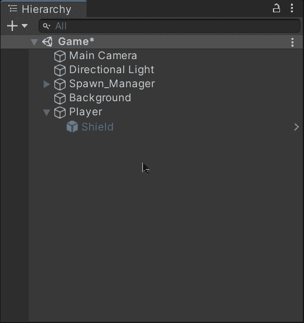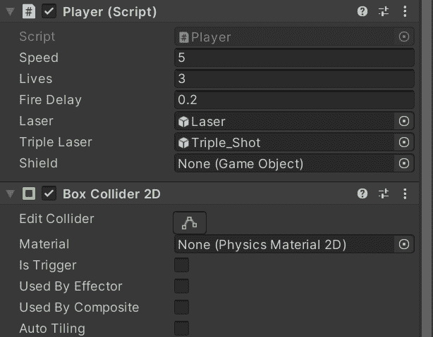

在我的[上一篇文章](/nerd-for-tech/creating-a-modular-power-up-system-e34a2414c50)中，我说过我会将加电分为临时加电和恒定加电，但我意识到，如果时间参数(协程等待的时间)为正，我实际上可以调用协程来取消临时加电。

因此，我将对所有通电使用相同的阵列，我需要更改我用于临时通电的阵列的名称和大小:

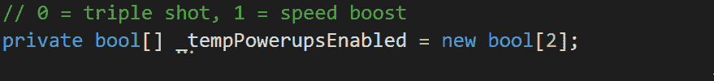

添加相应的注释，以显示屏蔽索引现在是数字 2。

然后，在启用加电的公共模块化函数中，我需要更改数组和函数名:

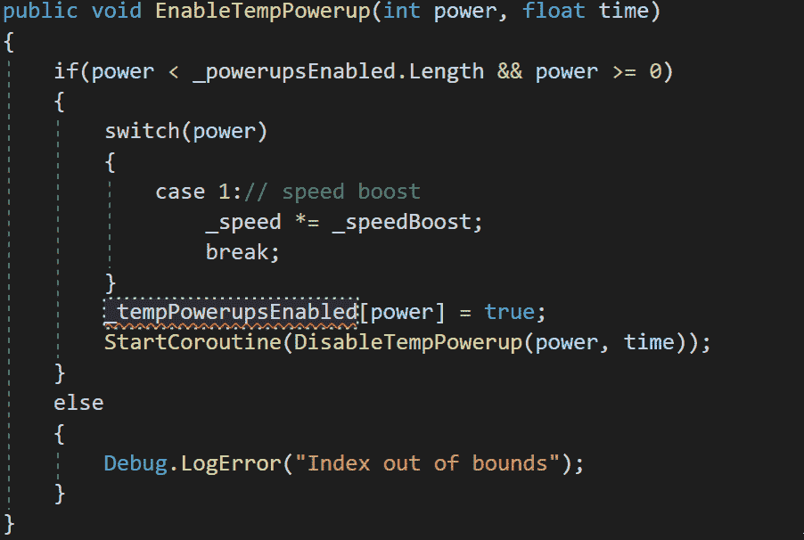

## 交换语句

switch 语句作为简化 if-else 结构的替代方法。Switch 接收将被评估的值或变量，并且根据其匹配，我们可以确定执行不同的动作，以便处理相应的评估。如果没有为评估规定的操作，我们可以确定要执行的默认操作。

回到加电脚本，我使用 switch 语句来处理根据加电 ID 触发的动作，我需要更新前两个加电案例中调用的函数，然后在案例属于 shield 加电 ID 时添加新的函数调用:

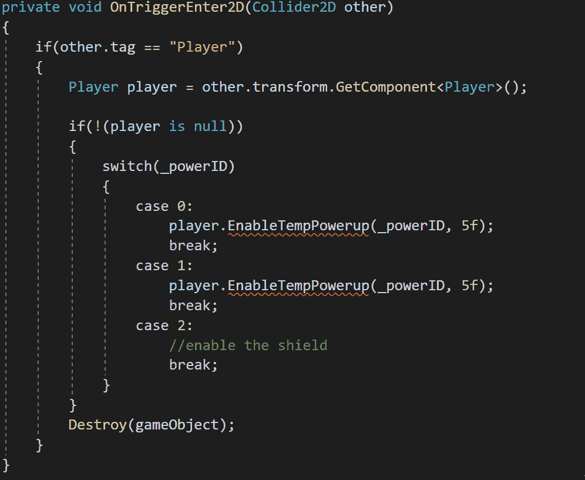

为了区分临时加电和持续加电，我将使用第二个参数(时间)。**常量将发送负值**，而**临时常量将发送正值**。

然后，让我们回到玩家脚本，在这里我们使用另一个 switch 语句来处理加电，当收到的 ID(power)是盾加电项目时，让我们添加相应的动作。如果识别了盾牌 ID，我们需要在场景中激活盾牌可视化器:

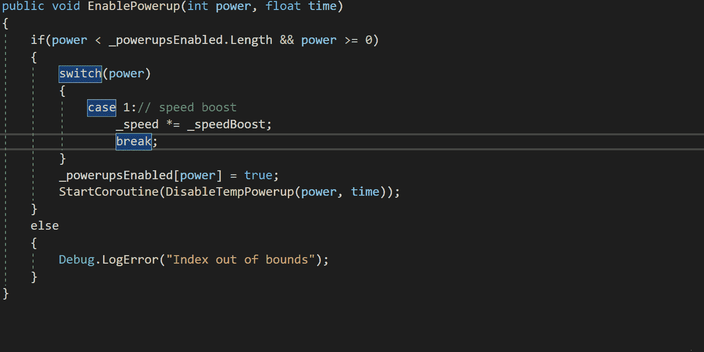

switch 语句中的情况 2 属于屏蔽上电。

现在，为了区分临时加电和持续加电，我们需要检查接收到的浮点值(time)是否大于 0。如果是这种情况，我们将调用协程，在作为参数接收的时间之后禁用上电:

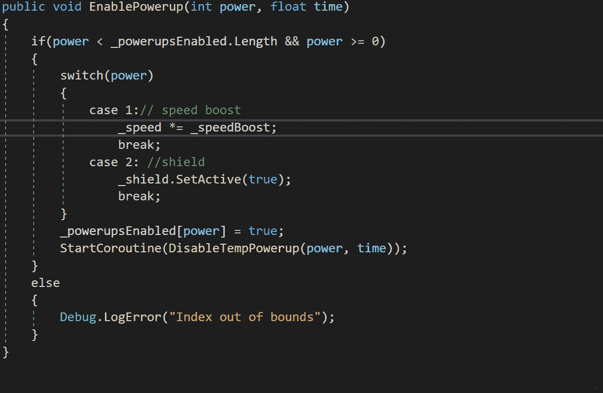

# 实现加电目的

然后，为了实现盾牌加电的目的，让我们添加一个条件，以避免在启用盾牌的情况下减去生命。如果是这种情况，我们需要从场景中取消屏蔽，并在加电数组中将相应的 bool 设置为 false:

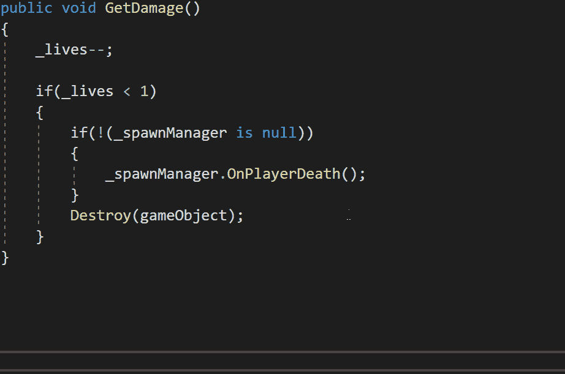

如果在 GetDamage 函数被调用时启动了护盾加电，那么 **return** 语句将会停止该函数的执行，并且不会从玩家身上减去任何生命。

另外，我们需要在 Unity inspector 中设置 shield 上电项的 ID 值，以便上电脚本能够正确识别出 **OnTriggerEnter2D** 函数包含的 switch 语句中要执行的函数:

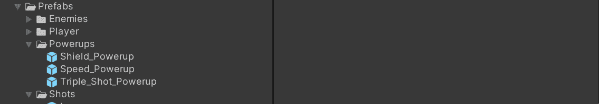

盾牌上电项的 **ID** 为 2。

如果我们在 Unity 中运行游戏，我们会注意到加电收集和实现按预期工作:

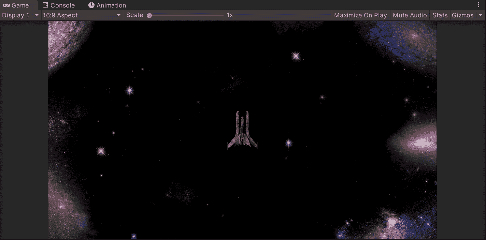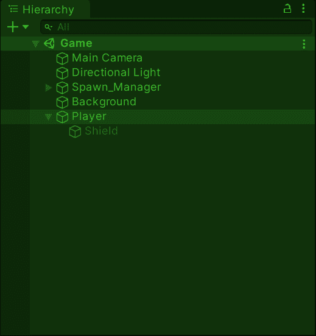

当玩家收集盾牌能量物品时，盾牌游戏对象在场景中被激活。当玩家击中一个敌人时，它就会关闭。

最后，正如我们在[的旧帖子](/nerd-for-tech/animating-sprites-in-unity-9d02762bde96)中所做的，让我们使用动画工具来制作 shield visualizer 的精灵动画:

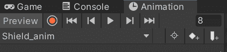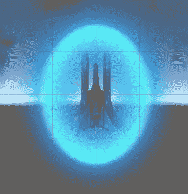

现在我们可以玩游戏了，每 5 到 10 秒场景中会随机产生 3 种能量:

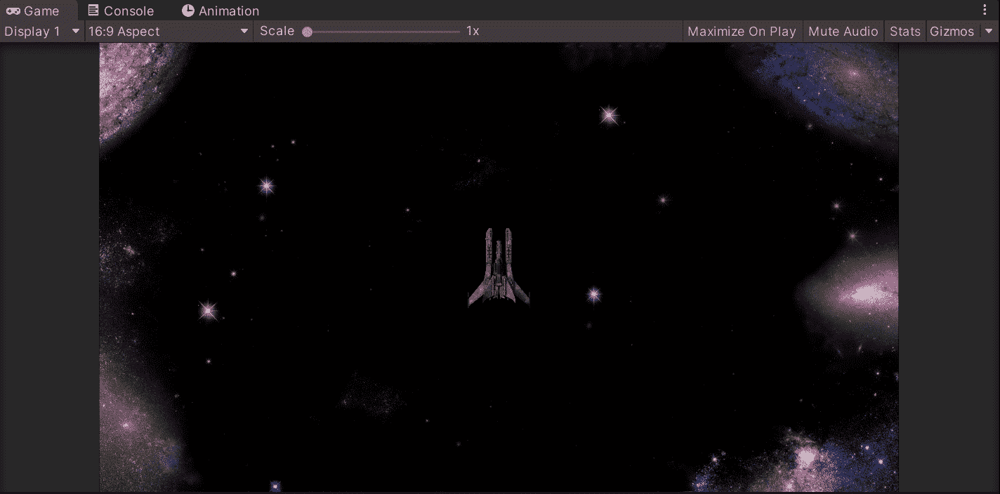

就是这样，你可以在 Unity 中使用 switch 语句来处理你游戏中的不同动作！:d .下一篇文章再见，我将展示如何在 Unity 中构建 UI 元素。

> *如果你想更多地了解我，欢迎登陆*[***LinkedIn***](https://www.linkedin.com/in/fas444/)**或访问我的* [***网站***](http://fernandoalcasan.com/) *:D**