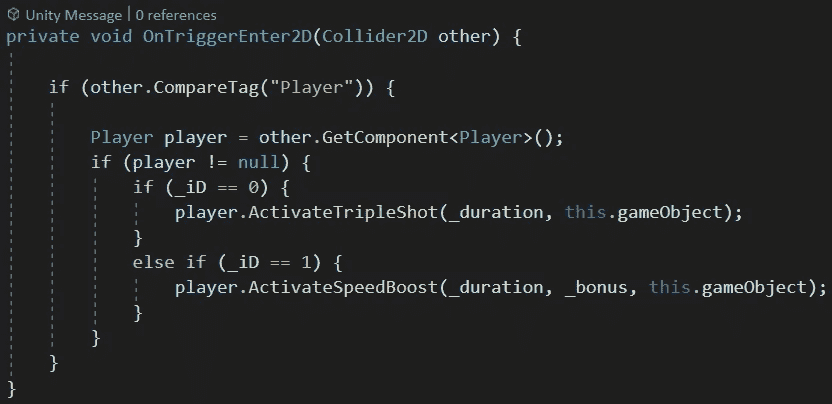
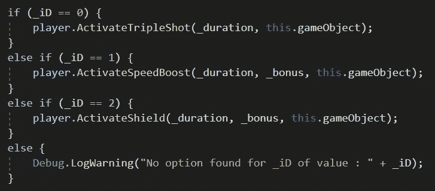
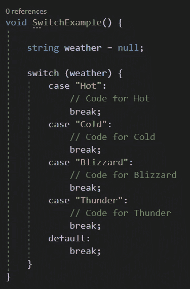

# Switch 语句—c#中的“干净”If/Else If 语句

> 原文：<https://medium.com/nerd-for-tech/switch-statements-the-clean-if-else-if-statements-in-c-b20b2c577e6c?source=collection_archive---------12----------------------->

当试图基于 C#中某个变量的内容触发某个代码时，If/Else If 语句是实现这一点的一种快速而简单的方法——正如我的上一篇文章中所展示的

简单的 If/Else If 语句

然而，随着潜在选项的增加，代码可能很快变得难以阅读和令人困惑。要求我们为每个新项目添加一个全新的条件比较，例如—

虽然还不算太糟，但是想想看，如果有 20 个、50 个或 100 个不同的选项，每个块中有几行代码，这会是什么样子……唉！

幸运的是，C#给了我们一个很好的方法，以一种很好的、干净的、可读的方式过滤变量的内容。

switch 语句—

啊…切换！

上面的两个代码片段实现了完全相同的结果，但是上面的 switch 语句更清晰，可读性更好。

switch 语句可用于与任何变量类型进行任何直接比较，例如—

字符串的 Switch 语句

使用括号中声明的要过滤的变量，语法非常简单

> switch (varName) {cases}

随后是包含所有用于比较的“案例”的代码块。

> 案例[条件]:

每种情况都需要从 switch 语句中“退出”,因为每次通过 switch 进行迭代时，只会运行一种情况。

> 打破；

您希望基于该 case 条件运行的任何代码都放在分号之后和分隔符之前。

如果您需要捕捉所有内容并运行默认代码，或者只是在出现错误时发出通知，那么最后一个可选的默认情况是可用的。

> 案例默认值:

或者只是

> 默认值:

默认情况下也需要跟一个 break。

虽然这确实使代码更容易阅读，但我要提到的是，与 If 语句相比，它确实有一些限制

> 不能在单个 switch 语句中比较多个变量，
> 
> 您不能与多个条件或一系列值进行比较，
> 
> 你只能*直接比较——即*等于*这个吗，*
> 
> 但是，您可以使用默认的 case 来捕获不符合特定标准的所有内容，这与在 If/Else If 语句的末尾使用 Else 是一样的。