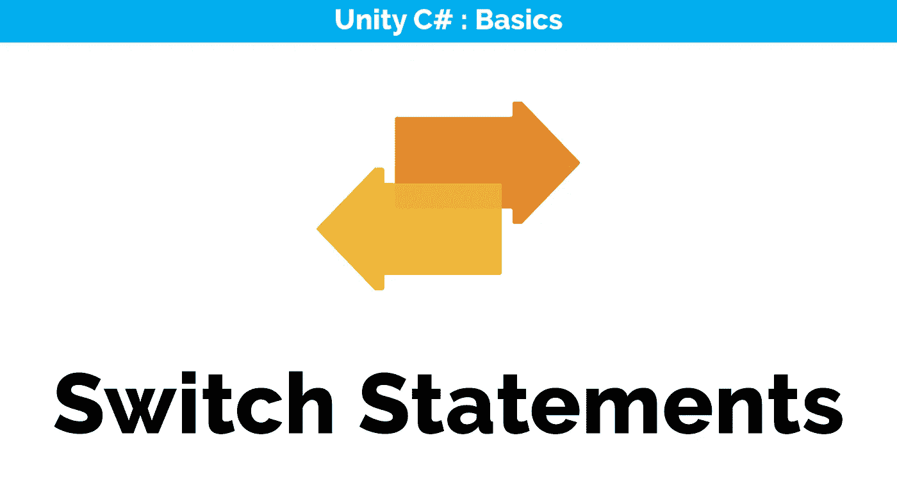
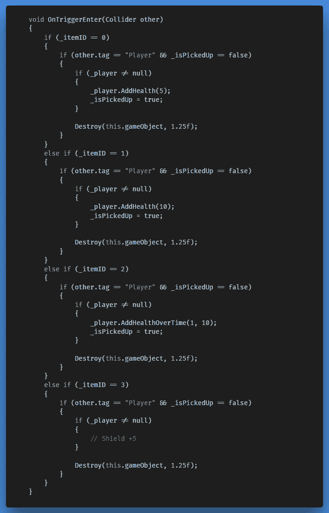
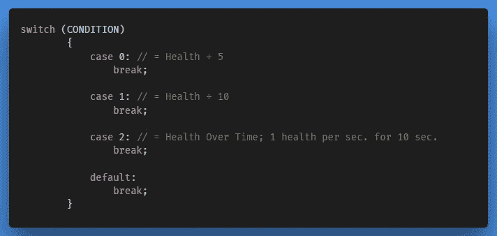
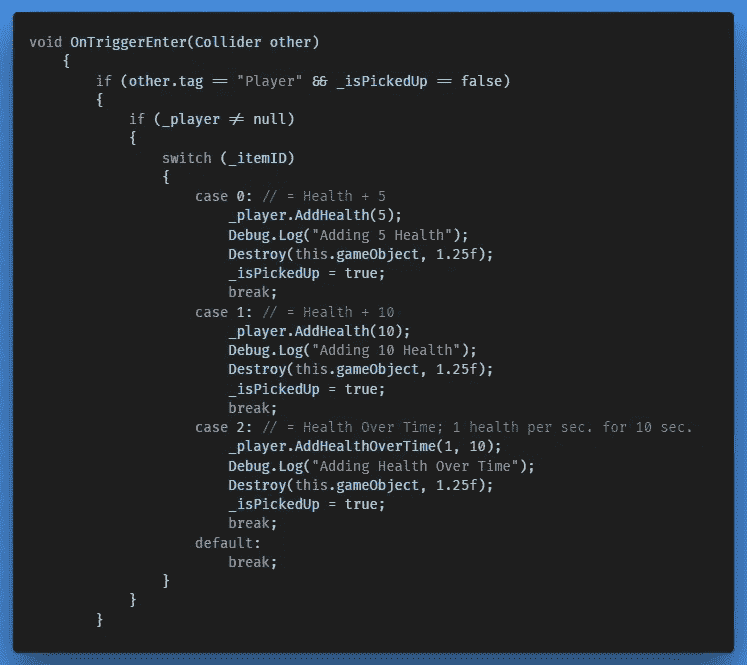

# 将陈述转换为救援

> 原文：<https://medium.com/nerd-for-tech/switch-statements-to-the-rescue-945c1f491736?source=collection_archive---------10----------------------->

这是我们的 *Item.cs* 脚本上当前的 ***OnTriggerEnter()*** 方法。之前我们介绍了一个模块化的物品系统，这就是当玩家飞进一个掉落的物品时会发生的事情。如果你不完全熟悉这段代码，我很欢迎你从这里[开始阅读。](https://gert-coppens100.medium.com/adding-a-modular-power-up-system-d1d683519752)

想象一下，我们拥有的物品数量是现在的十倍。现在想象用代码来写。嗯，我想你明白了…幸运的是，我们提供了一种特殊的方法，可以简化这种重复逻辑的编写。

## **开关语句**

> 与 if 和 else 属于同一家族，Switch 语句是一个条件语句。它将代码流路由到许多可能的代码块中的一个，并提供了一种有效的方法来根据表达式的值将执行转移到代码的不同部分。

if 语句对于真/假测试很有用，而 switch 语句在针对一组预期情况测试变量持有的值或表达式计算返回的值时更有效。

让我们看看它的语法；

对于每一个可能的结果，我们初始化一个案例(条件)并以一个中断结束。类似于 if 语句后面的可选 else 块，当没有满足指定的条件时，开关可以执行默认的代码块。

将它应用到我们自己的脚本中，我们会得到这样的结果:

如您所见，这更短，也更方便我们以后引入新的电源。

需要记住的是，Switch 语句只能返回包含整数、字符、字符串、布尔值、枚举、空数据类型**的结果，而不能返回浮点数**。

接下来，我们将看看如何使我们更容易在检查器中进行调整，并确保如果我们的球员完全健康，我们就不能再拿起物品。

← [上一个](https://gert-coppens.medium.com/updating-the-item-behaviour-af675212f308) | [下一个](/nerd-for-tech/adding-a-simple-drop-down-field-in-the-inspector-a3b4dc9da64f) →