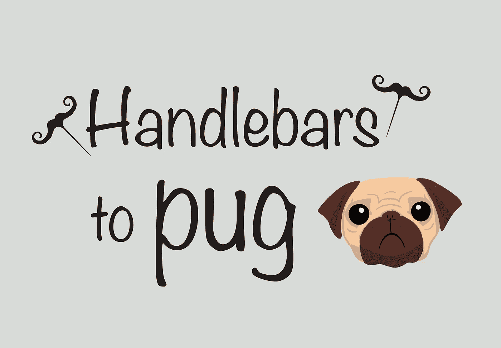
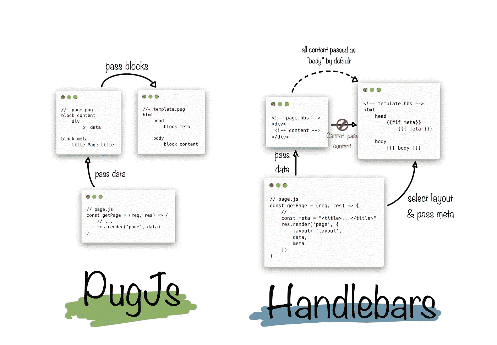
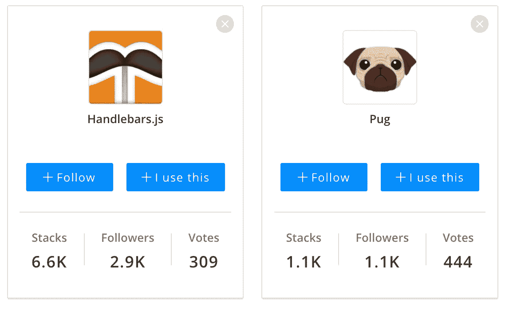
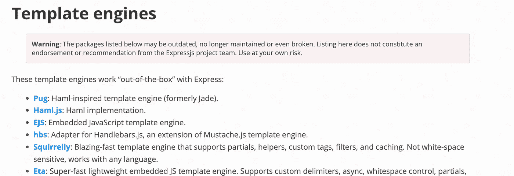

# 从车把切换到哈巴狗

> 原文：<https://medium.com/nerd-for-tech/switching-from-handlebars-to-pug-416693e1cb76?source=collection_archive---------1----------------------->



当创建[japapps.com](https://japapps.com)的时候，我想要一个最小且简单的方法来从文章数据库中生成 HTML。我选择从[手柄开始](https://handlebarsjs.com/)。

直到最近，这种方式一直运转良好。我想为每个页面定义 [OpenGraph](https://www.opengraph.xyz/) 数据，以便在社交网站上分享时更好地展开，并改善页面 SEO。

HandlebarsJS 在渲染单个 HTML 时非常好用，但当你想使用布局时，我发现这种体验很难。这是非常有限的，这就是为什么我选择改用 [PugJS](https://pugjs.org/) 的原因。

## HandlebarsJS 页面只将内容传递给布局

当我向站点添加页面时，我还为特色图片和标题添加了 OpenGraph meta 标记。只是很好的 SEO 管家真的。

但是对于 HandlebarsJS，我必须将它作为变量传递给布局，以便将它们添加到标题中。为了添加更多的标题内容，比如一个脚本标签或图像大小的元数据，我被迫扩展父模板，进一步影响所有其他页面，或者从 Javascript 代码中传递纯 HTML。


编辑 opengraph 元数据前后来自 [opengraph.xyz](https://www.opengraph.xyz/url/https%3A%2F%2Fjapapps.com%2Fjwords-beta) 的预览

这个网站上的大部分内容都是由数据库中的数据呈现的。对于这些页面，将数据作为变量传递很好，因为它们已经是变量了。

将数据从页面传递到模板以进行呈现

但是，对于我编写的任何静态页面，必须在 javascript 中添加一个控制器方法来服务页面，以便将带有标题和特征图像的对象传递给模板，这是一种代码味道。这意味着将内容拆分到两个地方，使维护变得困难。

这不是一个大问题，但它随着我需要添加的每个文件而增长。

## 使用 PugJS 将所有页面内容保存在一个文件中

在 PugJS 中，您可以覆盖布局的块，而不是传递数据，这使得它既是可选的，又允许您将内容从子页面传递到模板，而不必依赖控制器方法。

甚至可以在`pug`文件中选择布局，这是我用 javascript 为 HandlebarsJS 做的事情。

```
extends layouts/main.pug
```

块覆盖如下所示，在父模板中提及块，然后同一个块可以定义子文件中的内容。

```
//- template.pug
html
  head
    block meta //- page.pug
block meta
  title Japapps - JWords Beta
  meta(name='description' content='Sign up for the beta of our new Japanese learning app JWords. A spin off of a popular word puzzle.')
  ...
```

默认情况下， [PugJS 块](https://pugjs.org/language/inheritance.html)替换父布局内容，因此，在我的父布局中，我可以定义默认 meta 标签，并且只有需要替换这些标签的页面才能这样做。



比较如何在 HandlebarsJS 和 PugJS 中将数据传递给模板

我对新的建筑非常满意。另外，在切换到 PugJS 之后，我可以用一个处理程序方法替换不需要任何动态数据的文件的每个控制器。它只是确认是否有一个 pug 模板存在并为之服务。

## 用 PugJS 很容易重写

由于 HandlebarsJS 是带有扩展的 HTML，所以很容易使用 [html-to-pug](https://html-to-pug.com/) 转换成 PugJS。

转换完 HTML 后，我重写了所有条件、变量插值和迭代器的引用。

```
HandlebarsJS variable interpolation:
<p>published {{ publishedAt }} by {{ author }}</p>PugJS variable interpolation:
p published #{publishedAt} by #{author}
```

## HandlebarsJS vs PugJS 受欢迎程度

我不记得我一开始选择 HandlebarsJS 的确切原因，但我相信可能是因为它是我为 ExpressJS 找到的最受欢迎的库。



数据来自 https://stackshare.io/stackups/handlebars-vs-pug

PugJS 以前是著名的 library Jade，但是由于商标问题，它被重新命名。我猜他们因此失去了一些意识点。

至于什么时候使用哪种框架，我认为 PugJS 是对 ExpressJS 的完美补充。它甚至被提到了清单的首位。他们还为[如何将 PugJS 安装到 ExpressJS](http://expressjs.com/en/guide/using-template-engines.html#using-template-engines-with-express) 提供了指导。



[express js 支持的模板引擎列表](https://expressjs.com/en/resources/template-engines.html)

另一方面，HandlebarsJS 甚至在他们自己的文档中声明，它非常适合在服务器端或 CLIs 中呈现纯内容。

 [## 何时(不)使用车把？把手

### 这一节应该给你一个车把优点和缺点的概述。理想情况下，它使您能够…

handlebarsjs.com](https://handlebarsjs.com/installation/when-to-use-handlebars.html) 

有趣的是，我发现其他服务对这两种模板引擎都有不同的支持。 [Codepen](https://codepen.io/) 支持 PugJS，而 [carbon.now.sh](https://carbon.now.sh/) 只有 HandlebarsJS 的语法高亮。

## PugJS 对我来说非常有用

PugJS 允许我使用单个文件在需要的地方呈现页面，或者在需要的时候传递数据。文件大小缩小了很多，在不增加任何复杂性的情况下，可读性更好。

顾名思义，PugJS 是 Javascript 的。不过有 Python 的 [Jade 库](https://pypi.org/project/python-jade/)和 Ruby 的[Haml](https://haml.info/docs.html)。

我希望这能帮助你决定什么最适合你的项目，感谢你的阅读！


作为最后的款待，这里有一个赛博朋克哈巴狗使用[中途](https://www.midjourney.com/)生成