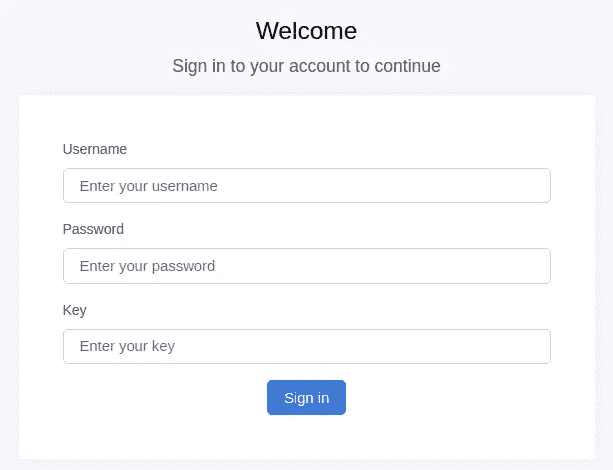

# Symfony / Doctrine —数据库加密

> 原文：<https://medium.com/nerd-for-tech/symfony-doctrine-database-encryption-50d7e01d8f69?source=collection_archive---------5----------------------->

*用* ***主义*** *和* ***Symfony*** 加密数据库


虽然个人资料应该保密，但在极少数情况下，由于某种原因，我们必须在公共服务中访问这些资料。我有自己的私人项目来管理个人数据(源代码可以在这里[访问](https://github.com/Volmarg/personal-management-system))，但是由于我即将到来的移动性，我不得不**在其他地方**访问我的个人信息。

对于这样的问题，自然没有什么解决方法，我立刻想到了 2:

*   移动笔记本电脑上的文件/信息，
*   通过互联网访问数据，

由于少数情况，我选择了第二个选项:

*   我不必记得更新存储上的数据(crons 会这么做)，
*   我不会总是使用笔记本电脑等(我可以通过手机访问数据)，
*   我想更好/更熟悉 **Vue.js** (那么这是一个机会)，

> *“然而，所选择的解决方案有一个很大的缺点需要解决，那就是数据泄露的可能性”*

P保护个人资料

老实说，我已经变得有点痴迷于保护我的数据免受潜在的泄露(*风险总是存在，但你可以降低它，使其接近零*)。

带着我所有实现的想法，我开始问自己“如果数据库会泄露怎么办？”。

这个问题的解决方案几乎立刻就出现了，因为我已经在我的私人项目中部分依赖于它:“**数据库加密**”。

虽然我已经看到了一些带有**教义**的 **Symfony** 的加密包，但我将只关注我一直使用的那个(实际上有一个小问题，但很容易解决):

*   encrypt bundle([mogilvie](https://github.com/mogilvie/EncryptBundle)—**我依赖的那个**)，
*   DoctrineEncryptBundle([givemealyourats](https://github.com/GiveMeAllYourCats/DoctrineEncryptBundle)—带有一些修复的 fork)，

两个软件包共享相同的基本功能，即使用特殊密钥加密/解密数据库单元，然而 **DoctrineEncryptBundle** 附带 CLI 命令，允许一次性处理整个数据库——这是一个非常好的特性。

我继续使用我已经使用的**加密包**，并且我已经为它生成了加密密钥，因此我将能够在内部/外部项目之间共享一个密钥。

How 事功

使用 **EncryptBundle** 非常简单直观。首先，自然地，必须通过 composer 将包添加到项目中，然后我们需要生成我们的加密密钥(就像最初的 Readme " [这里的](https://github.com/mogilvie/EncryptBundle#step-2-configure-the-bundle)"中描述的那样)。

我们的服务 Yaml 现在将包含这个新部分:

此外，我们需要向实体列添加特殊的注释，如下所示:

这个包支持教义事件，所以这就是全部了——不需要更多。

> "没有注释可以处理加密吗？"

是的。我不知道这个包处理教条事件，因此我在这个包的基础上做了自己的手动处理数据加密的方法。

> *如果提供了不正确的密钥，加密数据会是什么样子？*

这只是一个实际上很酷的空字符串，因为在我的例子中，我不在乎是否抛出异常或显示错误的数据——目标已经实现——数据是安全的。

我必须调试这个包，所以我可以说它依赖于名为 **OpenSSL** 的 PHP:

*   [https://www.php.net/manual/en/book.openssl.php](https://www.php.net/manual/en/book.openssl.php)

E **ven 更安全**

因为我希望我的数据可以通过互联网访问，所以我必须找到一种方法*“不要将密钥存储在服务器上”*基本上是这样的:


现在，这就是我在开始时描述的问题——我使用的包不允许添加加密密钥`on-fly`,因为 yaml 参数丢失导致异常——因此，目前我已经硬编码了它，但似乎解决方案正在路上(由作者自己准备)—即使没有，也可以手动实现。非引导内核也有小问题(但我刚刚错过了引导检查)。

我没有将密钥放在 mat 下面，而是扩展了我的登录表单:



加密密钥的密钥字段

我的总体解决方案是:

*   正在创建 **OnBeforeSetKey，**
*   正在创建**加密密钥**文件，
*   读取每个请求的文件并设置键`on-fly`(替换占位符`000000000...`)，
*   有一个 cronjobs，它检查最后一次用户活动，如果用户不在，就从服务器中删除密钥(通过将密钥存储在会话中而不是文件中，这可能更安全，但是我也在用户注销时删除文件，所以我将坚持我的方法，因为所有 IP 过滤等都很好)。

工作起来很有魅力——没有被优化(说文件每次都被打开),但是我不需要它用于我的小个子项目。

现在数据库中的单元格看起来像这样:

```
3DDOXwqZAEEDPJDK8/LI4wDsftqaNCN2kkyt8+QWr8E=<ENC>
```

**个人笔记**

在我的例子中，我没有注意到任何性能法令，在获取/处理大量数据的情况下，它肯定会影响性能——它肯定会影响性能——不知道它会影响多少，但由于我们现在需要处理加密，每次它都可能会产生明显的影响。

尽管我对加密不太熟悉，但从逻辑上说，这很可能取决于所用的算法。