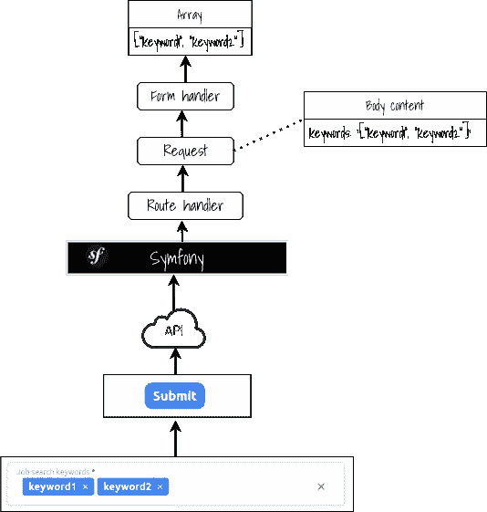

# Symfony 表单— JsonType

> 原文：<https://medium.com/nerd-for-tech/symfony-form-jsontype-ddc7a086ff4e?source=collection_archive---------2----------------------->

处理 Json 输入


Use 案例

想象通过表单(通过前端的编码数组)发送整个 **JSON** 的用例:



数据发送和处理

**相关文章** : [在 Symfony 中处理 Vue.js 表单](/nerd-for-tech/vue-js-and-symfony-forms-ba5139f77f5f)

T何一期

**Symfony** 表单处理程序允许使用不同的输入类型，如`*TextType*`、`*ArrayChoiceList*`、`*ChoiceType*`等。当使用基于类型的`*Array*`时，结果是一个空数组。唯一的一个工作案例是`*TextType*`,但是它仍然只产生原始的 JSON——但是这不是我们想要的结果。

J **sonType**

经过一番努力，我找到的唯一可行的解决方案是提供新的输入类型(`JsonType`)和新的`DataTransformer`，就像这样:

**数据转换器**

```
*<?php

namespace* App\Form\DataTransformer;

*use* Symfony\Component\Form\DataTransformerInterface;

*/**
 * Handles transforming json to array and backward
 */
class* JsonTransformer *implements* DataTransformerInterface
{

    */**
     ** ***@inheritDoc*** **/
    public function* reverseTransform($value): *mixed* {
        *if* (*empty*($value)) {
            *return* [];
        }

        *return json_decode*($value);
    }

    */**
     ** ***@ihneritdoc*** **/
    public function* transform($value): *mixed* {
        *if* (*empty*($value)) {
            *return json_encode*([]);
        }

        *return json_encode*($value);
    }
}
```

**JsonType**

```
*<?php

namespace* App\Form\Type;

*use* App\Form\DataTransformer\JsonTransformer;
*use* Symfony\Component\Form\AbstractType;
*use* Symfony\Component\Form\Extension\Core\Type\TextType;
*use* Symfony\Component\Form\FormBuilderInterface;
*use* Symfony\Component\Serializer\SerializerInterface;

*/**
 * Handles json based input (for example multiselect tag)
 * Will only transform the json to array (and back),
 *
 * If necessary, could probably accept custom options (className) which would be used to
 * transform the data into given class via {****@see*** *SerializerInterface}
 */
class* JsonType *extends* AbstractType
{
    */**
     ** ***@inheritDoc*** **/
    public function* getParent(): *string* {
        *return* TextType::*class*;
    }

    */**
     ** ***@inheritDoc*** **/
    public function* buildForm(FormBuilderInterface $builder, *array* $options): *void* {
        $builder->addModelTransformer(*new* JsonTransformer());
    }
}
```

**总结**

最终结果是一个从 json 转换而来的数组。