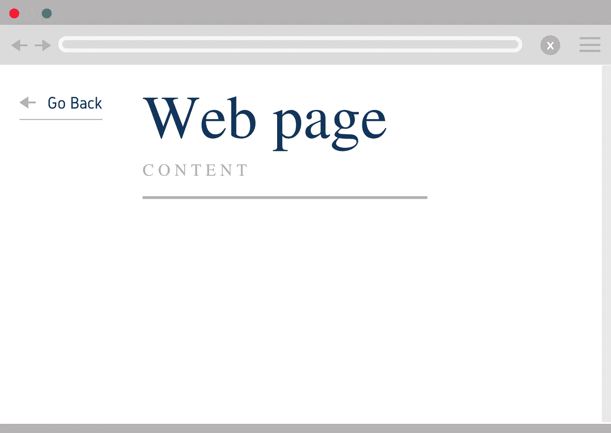
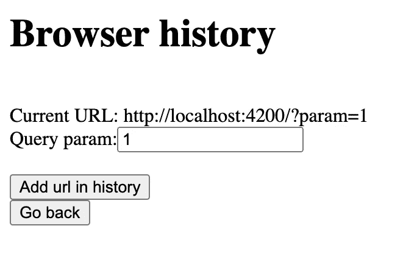

# 同步浏览器的“返回”按钮和页面上的“返回”按钮。

> 原文：<https://medium.com/nerd-for-tech/synchronize-the-browser-go-back-button-and-go-back-button-on-the-page-404f2168830d?source=collection_archive---------2----------------------->

目前，SPA 非常受欢迎。如果我们认为这对用户体验更好。而不是每次都更新页面，一遍又一遍地获取略有不同的数据。我们发出一个小请求，并更新 UI 的一小部分。

但是有时一些 SPA 在一个页面上有太多不同的 UI 部分。这可能会给用户一个错误的想法，他改变了网址。在用户按下“后退”或“前进”按钮之前，这不是什么大事。之后，用户不明白发生了什么。很可能，许多开发人员通过在页面上添加他们自己的“返回”按钮来解决这个问题。它工作得很好。我认为最好的解决方案是同步浏览器中的“返回”按钮和页面上的“返回”按钮。这样，用户选择点击哪个按钮并不重要。用户将得到相同的结果。

如何同步 SPA 和浏览器历史记录？我们可以访问对象 window.history。我们不能获得 URL，但我们使用方法:back、forward 和 pushState。

我们最感兴趣的是方法推送状态。通过使用这种方法，我们可以在浏览器历史中添加一个新的 URL。

SPA 的主要思想是我们使用同一个页面。我们要在浏览器历史中写些什么？我们将使用查询参数来写入 SPA 的状态。假设我们的页面上有 3 个选项卡。每次当用户改变标签时，我们将添加一个带有不同查询参数的新 URL。

理论够了，举个例子吧。我们将制作一个小页面，有两个按钮“返回”，“添加新的网址”和一个输入字段来设置查询参数。

我们为查询参数填充一个输入。通过点击“添加 URL”按钮，我们创建了一个新的 URL 并将其保存在浏览器历史记录中。重要的一点是，在构造函数中，我们订阅了路由更改。当我们按下“返回”按钮时，此订阅会通知我们。

如果你需要仔细看看这个项目[，这里是链接](https://github.com/8Tesla8/browser-history)。

*原载于 2021 年 11 月 10 日*[*【http://tomorrowmeannever.wordpress.com】*](https://tomorrowmeannever.wordpress.com/2021/11/10/synchronize-the-browser-go-back-button-and-go-back-button-on-the-page/)*。*