# 同步过场动画的音频和视频| Unity

> 原文：<https://medium.com/nerd-for-tech/synchronizing-audio-visuals-for-cutscenes-unity-2839947296f9?source=collection_archive---------9----------------------->

## 统一指南

## 关于如何在 Unity 中使用时间轴同步视频和音频的快速指南

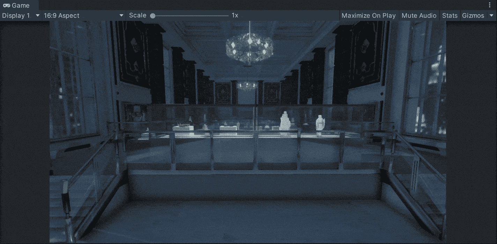

**目标**:使用 Unity 中的时间轴同步过场动画的音频和动画。

在上一篇文章中，我介绍了[如何用时间轴](/nerd-for-tech/handle-animations-with-timeline-unity-a49429fa7beb)处理动画。现在，是时候使用时间轴将动画和过场动画的音频与 Unity 同步了。

# 新过场动画

首先，让我们看看我们的新过场动画。这个过场动画展示了我们游戏的介绍。我们有演员的游戏对象，虚拟摄像机(用 Cinemachine)，小车轨道和音频。正如你在下一张 gif 中看到的，我们已经将摄像机放置到位，并为过场动画制作了动画。剩下唯一要做的就是添加和同步各自的音频:

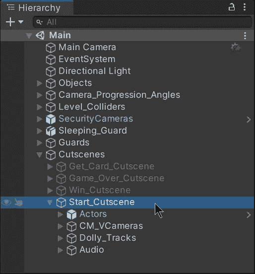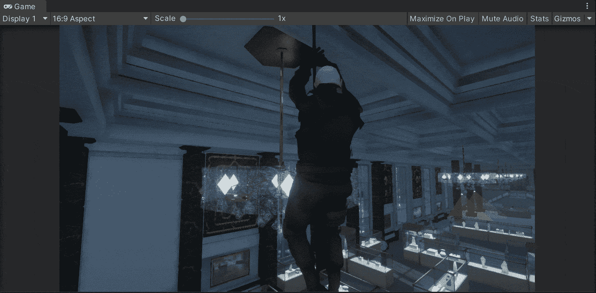

正如我们在以前的帖子中所做的，我们使用了几个 previs 元素来构建过场动画:

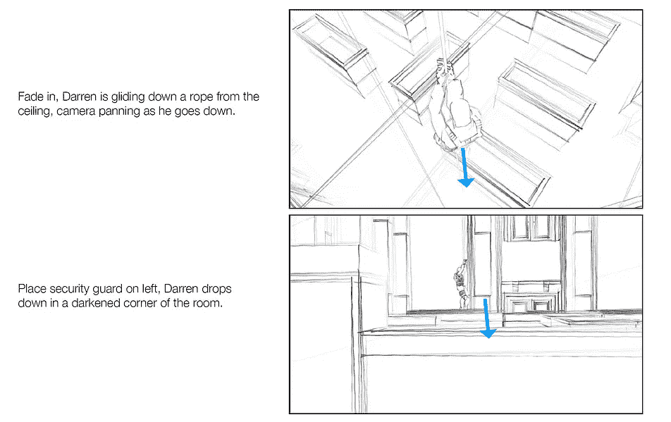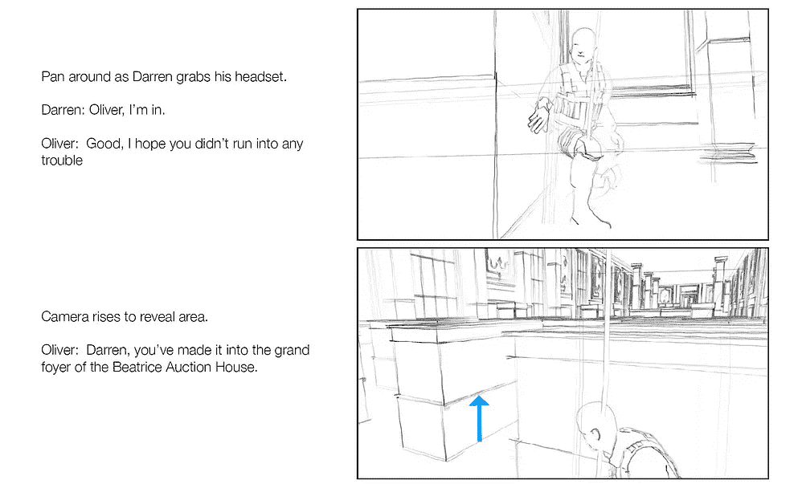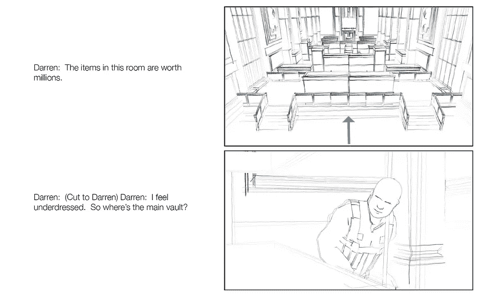

如果你不知道什么是 previs 元素以及它们在过场动画中是如何工作的，你可以查看这些旧帖子:

 [## 使用 previs 元素和 Unity

### 关于使用 previs 元素和 Unity 的快速回顾

medium.com](/nerd-for-tech/working-with-previs-elements-unity-89aa8103007c)  [## 在 Unity 中合成过场动画

### 关于在 Unity 中构建过场动画的快速指南

fas444.medium.com](https://fas444.medium.com/composing-a-cutscene-in-unity-330bc8b99d4c) 

因此，为了同步过场动画的视觉和音频，我们将使用时间轴窗口。现在，我们只能控制摄像机和动画:

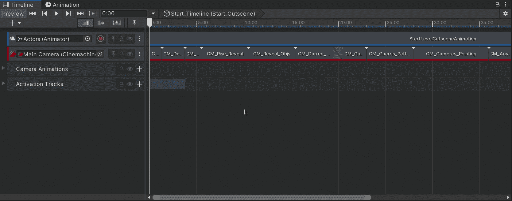

要打开时间线窗口，您可以点击 ***窗口>时序>时间线***

为了开始在我们的过场动画中实现音频，让我们选择将包含音频的游戏对象，并为每个对象添加一个**音频源**组件。我们的过场动画中将播放两个音频:

*   背景音乐。
*   音频上的声音。

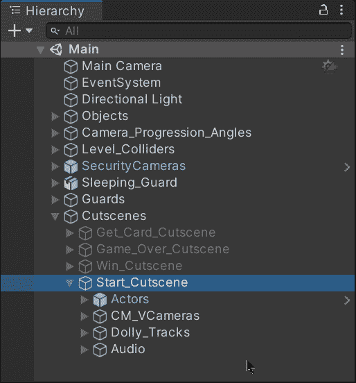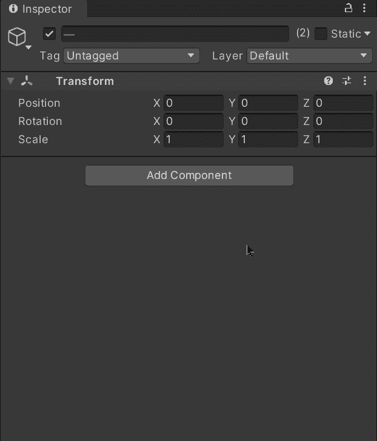

现在，要添加音频源，让我们将各自的游戏对象拖动到时间线窗口，并选择 ***添加音轨*** :

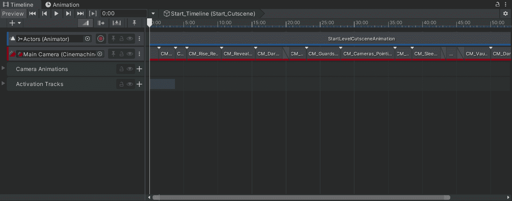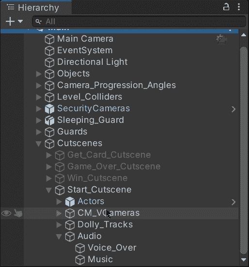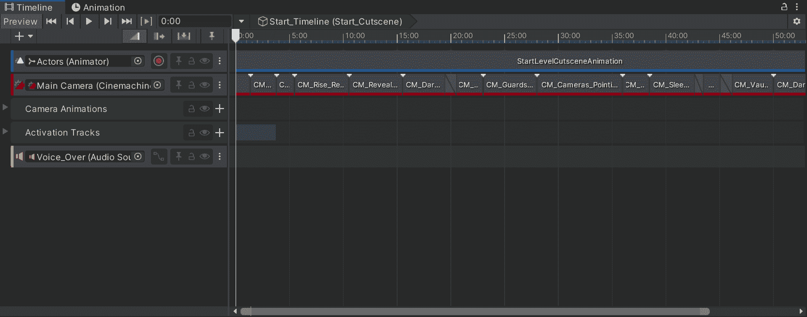

现在，要分配将在过场动画中播放的音频文件，让我们将相应的文件从项目文件夹中拖到相应的音频轨道中:

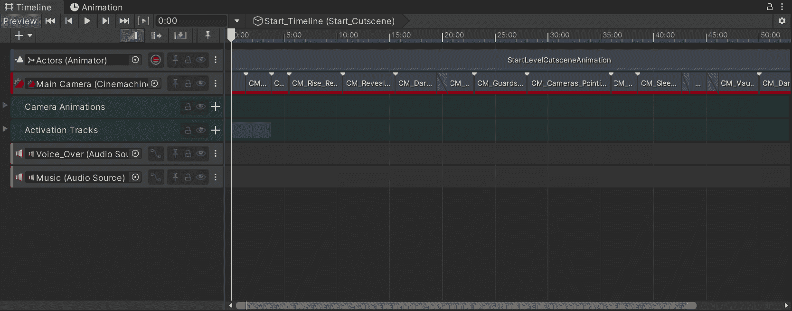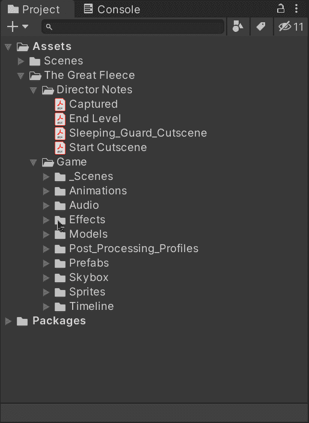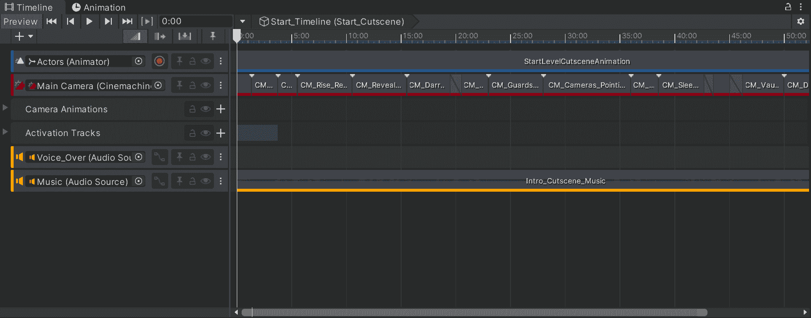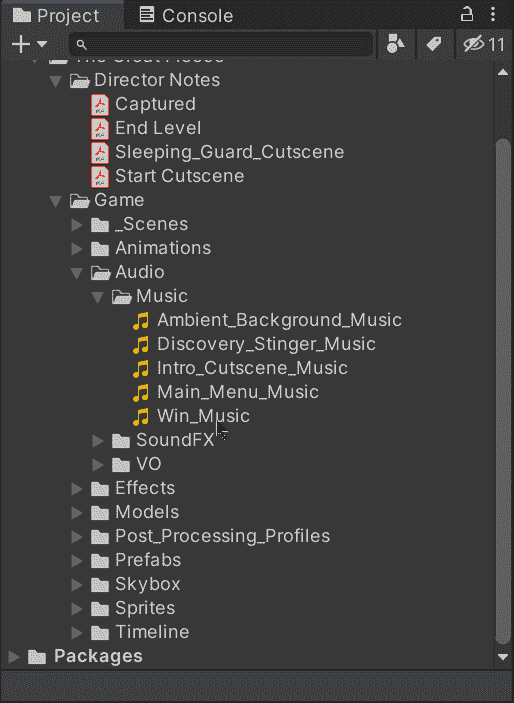

如果您想要避免时间线混乱，您可以创建一个新的轨道组，并将音频轨道拖到其中:

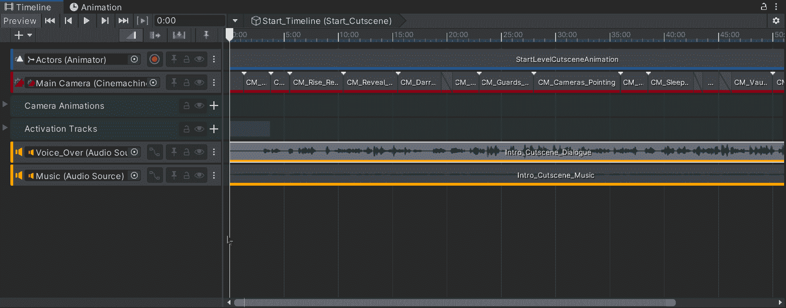

最后，为了同步音频和动画，我们可以使用白色箭头精确地选择秒或帧，并修改每个摄像机花费的时间。一个简单但有用的技巧是查看音量并修改动画以匹配时间线:

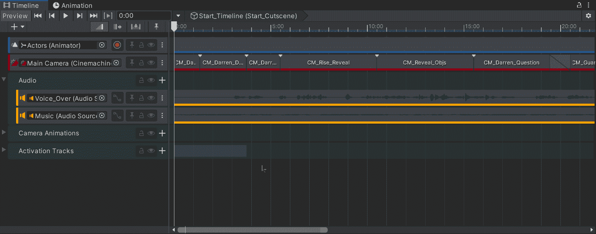

这样，我们就能够将动画(摄像机和演员)与过场动画中的音频同步:

就这样，我们可以在 Unity 中同步我们过场动画的音频和动画！:d .我会在下一篇文章中看到你，在那里我将展示如何通过简单的点击来移动我们的球员。

> *如果你想更多地了解我，欢迎登陆*[***LinkedIn***](https://www.linkedin.com/in/fas444/)**或访问我的* [***网站***](http://fernandoalcasan.com/) *:D**