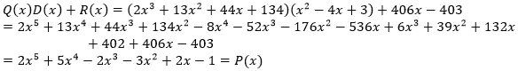
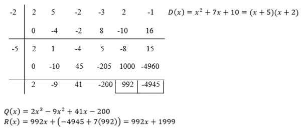
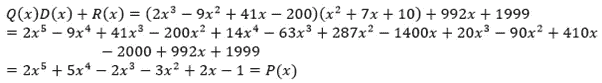
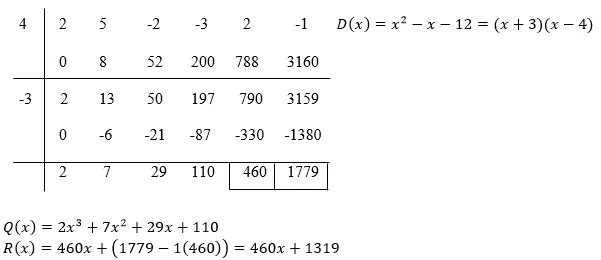
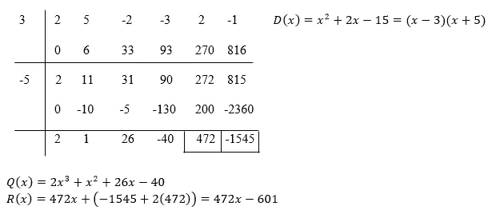
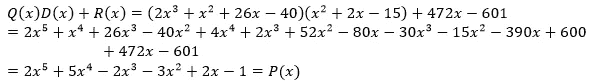

# 重建一种方法

> 原文：<https://medium.com/nerd-for-tech/synthetic-division-with-a-monic-factorizable-quadratic-divisor-2-0-2897b151c009?source=collection_archive---------21----------------------->

页（page 的缩写）列车员:NIST

## 一种进一步发展的方法[一个新的发现](/nerd-for-tech/synthetic-division-with-a-monic-factorizable-quadratic-divisor-f6cca12cb93e)。

嘿伙计们，欢迎回来！之前的那篇文章让我思考，“我怎样才能改变规则，让它们更容易记忆？”所以，我开始工作。夜深人静时，我突然有了灵感。一种改进的方法，这种方法更容易记忆。这是:

你还记得这部分规则吗:

> 余数是 472x+z。要计算 z，我们需要使用以下规则:
> 
> 设右下角的数字，这里是-1545，是 m，左边的数字，这里是 472，是 l。
> 
> 如果具有较大幅度的根是正的，那么:z=m-yl
> 
> 如果具有较大幅度的根是负的，那么:z=m+yl
> 
> 为了计算 y，我们需要使用其他一些规则:
> 
> 设这两个根，这里是 3 和-5，是 a 和 b。
> 
> 如果 a 和 b 有相同的符号+或-，那么:y=||a|+|b||
> 
> 如果 a 和 b 有不同的符号，+和-或-和+，那么:y=||a|- |b||

所有这些规则都是为了计算余数，老实说，这是这个方法中最复杂的部分。但是现在，我有一个更简单的方法，它更短更容易。

*如果你对这一切从何而来感到困惑，请查看我的旧文章* [*这里*](https://srivishnuvusirikala.medium.com/synthetic-division-with-a-monic-factorizable-quadratic-divisor-f6cca12cb93e?source=friends_link&sk=e781397590622edb99b13fb29aa58ab1) *。*

当我们计算 z 时，新规则是:

z = m-yl

而要计算 y，我们只要把 a 和 b 这两个根相加就行了！

y = a+b

就是这样！现在让我们用同样的例子来验证这一点。

两个根都是正的:

验证:

两个根都是负的:

-yl 变成+yl，因为-被-从根的和中抵消掉了

验证:

一个根为正，另一个为负，较大的根为正:

验证:

一个根为正，另一个为负，较大的根为负:

-yl 变成+yl，因为-被-从根的和中抵消掉了

验证:

我们发现这种新方法同样有效！这种方法也比旧方法快得多，而且在解决问题时更容易记住。这可以大大提高解决此类问题的效率。

要看我以前关于这方面的文章，可以去[用一元可分解二次因子进行综合除法](https://srivishnuvusirikala.medium.com/synthetic-division-with-a-monic-factorizable-quadratic-divisor-f6cca12cb93e?source=friends_link&sk=e781397590622edb99b13fb29aa58ab1)。