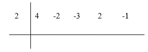
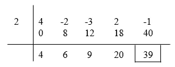
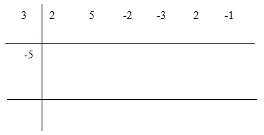
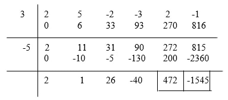
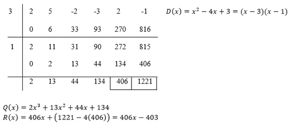

# 新发现

> 原文：<https://medium.com/nerd-for-tech/synthetic-division-with-a-monic-factorizable-quadratic-divisor-f6cca12cb93e?source=collection_archive---------5----------------------->

页（page 的缩写）列车员:NIST

## 合成师 101

综合除法是一种用一元线性多项式除任意多项式的方法。monic 是什么意思？monic 的意思是 x 的最大幂的系数是 1。所以，对于那些不知道什么是合成除法的人来说，它是如何工作的:作为一个例子，让我们把除数取为 x-2，被除数取为 4x⁴-2x -3x +2x-1。首先你必须把 x 的值，使除数等于 0，这里是 2，放在网格的左边。

然后，我们必须把被除数的所有项的系数:4，2，-3，2 和-1，放在网格的右边。

接下来，我们应该在第一个系数 4 上加 0，并写出下面的和。然后，我们应该把这个和乘以 2，放在下一个数下面，再加一次。这个过程应该重复，直到最后一个系数，-1。

现在，这个除法的商，4x⁴-2x -3x +2x-1 除以 x-2，就是 4x +6x +9x+20。并且，余数是 39。合成除法也可以用于二次除数，但是这个方法对我来说有点复杂，并不是每次都有效。因此，我开发了一种更简单的方法(在我看来),对一元可因式分解的二次除数使用合成除法。这是:

注意:这个方法只有在二次型是可因式分解的情况下才有效。

让我们取多项式为 2x⁵+5x⁴-2x -3x +2x-1，除数为 x +2x-15。首先要因式分解除数。它因式分解为(x-3)(x+5)。

接下来，我们要画一个网格，就像上一个一样，两个网格重叠在一起。然后，我们应该把被除数的系数放在右边，把根以任何顺序一个接一个地垂直放在左边。

然后，我们执行与之前相同的步骤，只执行两次。

现在，商是 2x +x +26x-40。余数是 472x+z。要计算 z，我们需要使用以下规则:

设右下角的数字，这里是-1545，是 m，左边的数字，这里是 472，是 l。

如果具有较大幅度的根是正的，那么:z=m-yl

如果具有较大幅度的根是负的，那么:z=m+yl

为了计算 y，我们需要使用其他一些规则:

设这两个根，这里是 3 和-5，是 a 和 b。

如果 a 和 b 有相同的符号+或-，那么:y=||a|+|b||

如果 a 和 b 有不同的符号，+和-或-和+，那么:y=||a|- |b||

所以，对于这个问题，余数会是:472x+(-1545+2(472))=472x-601。

现在，让我们验证这是否正确:

我们知道公式:P(x)=Q(x)D(x)+R(x)，其中 P(x)是被除数，Q(x)是商，D(x)是除数，R(x)是余数。使用这个公式，我们可以检查我们得到的结果是否正确:

q(x)d(x)+r(x)=(2x+x+26x-40)(x +2x-15)+(472x-601)=2x⁵+x⁴+26x-40x +4x⁴+2x+52x-80x-30x-15x -390x+600+472x-601=2x⁵+5x⁴-2x-3x+2x-1 = p(x)

这说明我们的方法是正确的！这里是另外 3 个例子，我们使用的根都是正的，都是负的，其中一个根的符号相反，但幅度较大的根是正的(为了简单起见，我们将使用相同的被除数):

两个根都是正的:

验证:

两个根都是负的:

验证:

一个正的，一个负的，较大幅度的根是正的:

验证:

我们可以看到我的方法奏效了！尽管记住这些规则似乎很费力，但是一旦你知道了它们，整个问题就会很快解决，比长除法快得多！很漂亮吧？好了，这篇文章到此结束。下次见，再见！

本文在[重建途径](https://srivishnuvusirikala.medium.com/synthetic-division-with-a-monic-factorizable-quadratic-divisor-2-0-2897b151c009?source=friends_link&sk=55d9c190b1f5dd89a0bbeafa82415027)中继续。

如果你喜欢读这篇文章，请看看[这个看似困难的问题](/nerd-for-tech/a-deceptively-difficult-problem-6dd014f99eb3)。