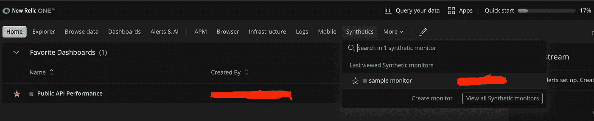
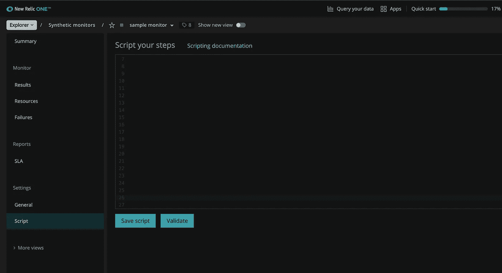
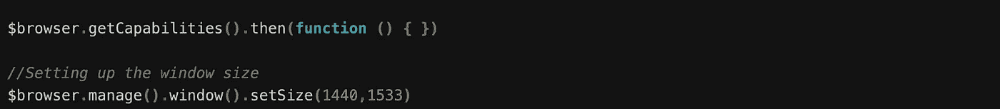
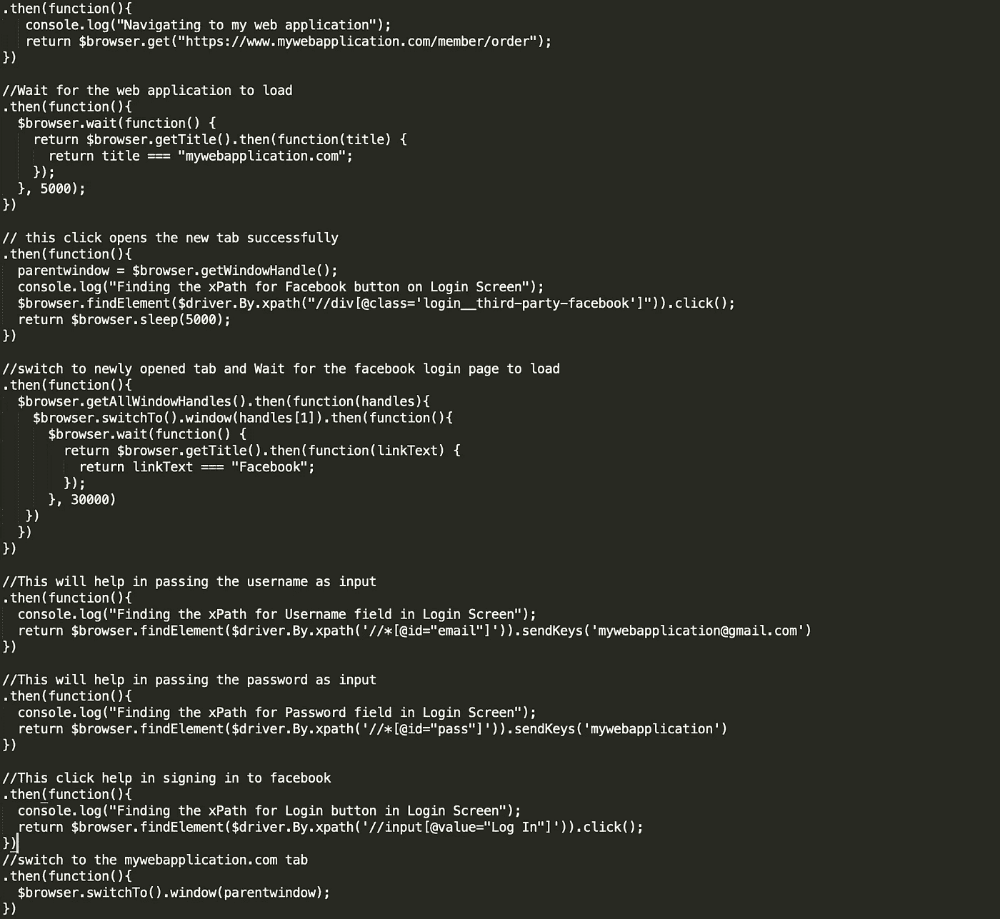
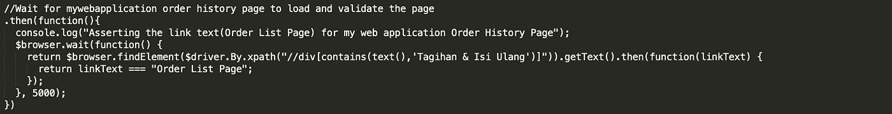
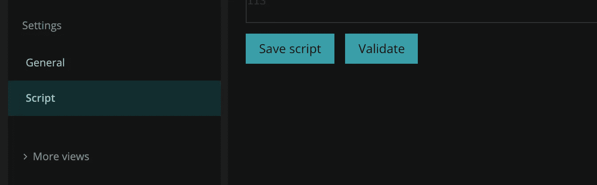
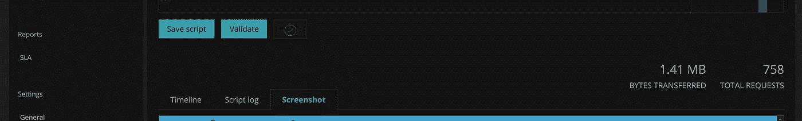

# 合成脚本或监控

> 原文：<https://medium.com/nerd-for-tech/synthetic-scripts-never-heard-of-it-359f137224cf?source=collection_archive---------10----------------------->

## 没听说过！！！

贝南·诺鲁齐在 [Unsplash](https://unsplash.com?utm_source=medium&utm_medium=referral) 上的照片

智能浏览器监控是一种通过模拟用户动作来监控应用程序的方法。我们使用[*Selenium web driver js*](https://seleniumhq.github.io/selenium/docs/api/javascript/index.html)*库创建一个 JavaScript 代码片段，通过脚本化的浏览器虚拟地执行用户操作。它还提供了有关业务事务的正常运行时间和性能的信息，或者您的应用程序中最常用的部分。*

*   合成脚本可用于测试业务关键的最终用户流程、功能，还有助于检查特定元素和资源是否出现在用户界面上。
*   测试脚本可以被安排在特定的时间和不同的地理位置执行。
*   易于识别关键最终用户流程中的不完整部分。
*   通过了解 web 应用程序响应时间慢的地方，有助于提高性能。

下面是一个合成脚本可以做什么的例子:

1.  访问并登录 web 应用程序。
2.  尝试导航到您的订单或购买列表。
3.  检查您的订单是否存在。

你能看到你的订单吗？如果是的话，对你有好处。如果没有，你我都很难过，因为连我都无法看到它们。感谢 New Relic 的合成监视器帮助我监视这个问题，并在一个客户认识到它之前修复它。因此，我遵循以下几个步骤来开发我的脚本。

步骤 1:在 New Relic 中创建一个样本合成监视器。

样品监视器

第二步:从侧边栏进入设置中的脚本。

第三步:将窗口大小设置为类似于你的网页大小。

> ***$browser*** 是 selenium-webdriver 的合成监控实例。WebDriver()。它公开了一些 web 驱动 API，如 get()和 findElement()。更多信息请参考下面的链接。

[https://docs . new relic . com/docs/synthetics/synthetic-monitoring/scripting-monitors/synthetics-scripted-browser-reference-monitor-versions-050/# structure](https://docs.newrelic.com/docs/synthetics/synthetic-monitoring/scripting-monitors/synthetics-scripted-browser-reference-monitor-versions-050/#structure)

第 4 步:访问并登录我的 web 应用程序。

> **T1。然后()**—JS 中处理异步调用的方式是用回调。假设我们必须多次调用服务器，一个接一个地设置应用程序。这变成了嵌套回调地狱。所以有一个概念叫 Promise API。它被设计用来解决嵌套问题。“then()”函数返回 promise 对象，该对象支持对服务器的多个调用的链接。
> 
> ***$driver*** —提供 selenium-webdriver 模块的所有导出。更多信息请参考:[https://docs . new relic . com/docs/synthetics/synthetic-monitoring/scripting-monitors/synthetics-scripted-browser-reference-monitor-versions-050/# locators](https://docs.newrelic.com/docs/synthetics/synthetic-monitoring/scripting-monitors/synthetics-scripted-browser-reference-monitor-versions-050/#locators)

步骤 5:验证我的 web 应用程序的订单或采购列表页面。

步骤 6:保存脚本并验证。

问:不知道这个监视器将如何验证脚本？

回答:New Relic 创建了一个完全虚拟化的 Selenium 驱动的 Google Chrome 浏览器，它可以导航您的网站，并遵循脚本的每个步骤。

> **一旦脚本验证完成。检查输出的时间线、脚本日志和屏幕截图。**

输出

# ***你呢？***

您现在可以查看您的订单列表页面吗？

# 参考资料:

*   新遗迹— [综合文档](https://docs.newrelic.com/docs/synthetics/)
*   App Dynamics — [综合文档](https://docs.appdynamics.com/21.6/en/end-user-monitoring/browser-monitoring/browser-synthetic-monitoring)